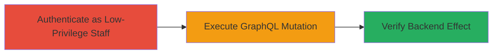

---
tags:
  - shopify
  - graphql
  - authorization-bypass
  - notification-subscription
  - improper-authorization
type: attack_chain
tools: []
tactics:
  - '[[Persistence]]'
  - '[[Collection]]'
verified: false
platforms:
  - Web
  - Shopify
submitted: true
complexity: medium
created_at: '2023-10-01T00:00:00Z'
procedures:
  - '[[procedures/Authenticate-as-Staff-with-Settings-Permission]]'
  - '[[procedures/Execute-staffOrderNotificationSubscriptionCreate-Mutation]]'
  - '[[procedures/Verify-Notification-Subscription-Creation]]'
step_count: 3
techniques:
  - '[[Additional Cloud Credentials]]'
  - '[[Valid Accounts]]'
updated_at: '2025-12-14T17:29:29.010Z'
description: >-
  Attack chain exploiting improper authorization in Shopify's GraphQL API to
  allow low-privilege staff to add unauthorized email recipients to order
  notifications, enabling potential disclosure of sensitive order data.
skill_level: intermediate
impact_level: medium
id: 355204f8-1740-4968-9edf-9ac406d8c759
validated: true
mitre_tactics:
  - '[[Persistence]]'
  - '[[Collection]]'
mitre_techniques:
  - '[[Additional Cloud Credentials]]'
  - '[[Valid Accounts]]'
---
# Unauthorized Order Notification Subscription via Improper Authorization in Shopify GraphQL API

Multi-stage attack chain demonstrating exploitation of improper authorization in Shopify's GraphQL API, where a staff member with only 'Settings' permission can create order notification subscriptions despite access denial errors, leading to unauthorized access to order information via email.

## Chain Metrics Dashboard

| Metric | Value |
|--------|-------|
| Chain Status | Unverified |
| Total Steps | 3 |
| Execution Time | ~5 minutes |
| Skill Level | Intermediate |
| Complexity | Medium |
| Impact Level | Medium |

## Attack Flow Visualization



## Prerequisites & Requirements

### Required Tools

- Web browser for authentication
- [[commands/curl-graphql-mutation]] for API interaction (or equivalent HTTP client)

### Target Environment

- Shopify admin panel
- GraphQL API endpoint
- Staff account with 'Settings' permission only

### Initial Access Requirements

- Valid Shopify staff credentials limited to 'Settings' permission
- Access to the Shopify admin URL (e.g., https://yoursubdomain.myshopify.com/admin)
- No prior admin access needed for exploitation, but admin access for verification

## Detailed Attack Procedures

### Step 1: Authenticate as Low-Privilege Staff
procedure: [[procedures/Authenticate-as-Staff-with-Settings-Permission]]

**Objective**: Gain access to the Shopify admin as a staff user with only 'Settings' permission to test API endpoints.

**Instructions**: Log in to the Shopify admin panel using credentials that grant exclusively the 'Settings' permission. This establishes a session for subsequent API calls.

**Expected Output**: Successful login to the admin dashboard, with limited permissions visible (no 'Orders' access).

**Success Indicators**:
- Admin dashboard loads without errors
- Permission check confirms only 'Settings' access

### Step 2: Execute GraphQL Mutation
procedure: [[procedures/Execute-staffOrderNotificationSubscriptionCreate-Mutation]]

**Objective**: Attempt to create a staff order notification subscription using the GraphQL mutation, exploiting the improper authorization to add an unauthorized email recipient.

**Instructions**: With the authenticated session, send a POST request to the GraphQL endpoint using [[commands/curl-graphql-mutation]] to execute the 'staffOrderNotificationSubscriptionCreate' mutation. Replace the subdomain and email as needed.

```bash
curl -X POST 'https://yoursubdomain.myshopify.com/admin/internal/web/graphql/core?operation=SwitcherNoStores' \
  -H 'Content-Type: application/json' \
  -H 'X-Shopify-Access-Token: YOUR_SESSION_TOKEN' \
  -d '{"query": "mutation{staffOrderNotificationSubscriptionCreate(notificationRecipientIdentifier:\"testingforshopify@ngailong.com\",notificationRecipientType:EMAIL){staffOrderNotificationSubscription{id}}}"}'
```

**Expected Output**: JSON response with 'Access denied for staffOrderNotificationSubscription field. Required access: read_notification_settings access scope. Also: User must have access to orders.', but the backend creates the subscription anyway.

**Success Indicators**:
- API response shows access denied
- No immediate error in request execution

### Step 3: Verify Subscription Creation
procedure: [[procedures/Verify-Notification-Subscription-Creation]]

**Objective**: Confirm the unauthorized subscription was created by checking the admin notification settings.

**Instructions**: As an admin user (or if possible with escalated access), navigate to the notifications settings page to inspect the order notifications list.

**Expected Output**: The added email (e.g., 'testingforshopify@ngailong.com') appears in the order notifications recipients list.

**Success Indicators**:
- Email added to notifications despite low-privilege execution
- Potential receipt of order emails confirming data disclosure

## Attack Chain Summary

### Key Achievements

1. Bypassed authorization checks in GraphQL API using low-privilege account
2. Created persistent notification subscription for unauthorized email
3. Enabled potential exfiltration of sensitive order data via email notifications

## Technique & Tactic Coverage

### MITRE ATT&CK Techniques

- [[Additional Cloud Credentials]]
- [[Valid Accounts]]

### MITRE ATT&CK Tactics

- [[Persistence]]
- [[Collection]]

---
*Last updated: 2023-10-01T00:00:00Z*
