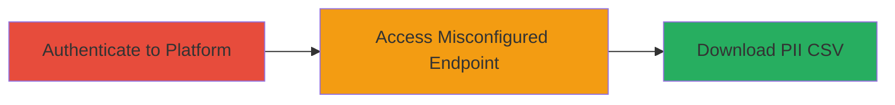

---
tags:
  - information-disclosure
  - pii-leak
  - misconfiguration
  - access-control-bypass
  - hackerone
type: attack_chain
tools: []
tactics:
  - '[[Initial Access]]'
  - '[[Discovery]]'
  - '[[Collection]]'
verified: false
platforms:
  - Web
submitted: true
complexity: low
created_at: '2023-10-01T00:00:00Z'
procedures:
  - '[[procedures/Authenticate-to-HackerOne-Platform]]'
  - '[[procedures/Download-Vetting-Acceptance-CSV]]'
step_count: 2
techniques:
  - '[[Exploit Public-Facing Application]]'
  - '[[Account Discovery]]'
updated_at: '2025-12-14T17:25:18.093Z'
description: >-
  Attack chain demonstrating unauthorized access to CSV files containing PII of
  HackerOne users who accepted Advanced Vetting terms, due to access control
  misconfiguration.
skill_level: intermediate
impact_level: high
id: b0346b1a-409d-446b-9243-161e1b9f990f
validated: true
mitre_tactics:
  - '[[Initial Access]]'
  - '[[Discovery]]'
  - '[[Collection]]'
mitre_techniques:
  - '[[Exploit Public-Facing Application]]'
  - '[[Account Discovery]]'
---
# Unauthorized PII Disclosure via Misconfigured Vetting CSV Files in HackerOne

Multi-stage attack chain demonstrating unauthorized access to sensitive PII in HackerOne's Advanced Vetting process through a misconfigured endpoint that allowed public downloads of CSV files containing user names, usernames, addresses, countries, and acceptance dates.

## Chain Metrics Dashboard

| Metric | Value |
|--------|-------|
| Chain Status | Unverified |
| Total Steps | 2 |
| Execution Time | ~2 minutes |
| Skill Level | Intermediate |
| Complexity | Low |
| Impact Level | High |

## Attack Flow Visualization



## Prerequisites & Requirements

### Required Tools

- Web browser or [[tools/curl]]

### Target Environment

- HackerOne web platform
- No specific ports required (HTTPS/443 implied)
- Internet access to hackerone.com

### Initial Access Requirements

- Valid HackerOne account credentials (any logged-in user)
- No prior program access needed

## Detailed Attack Procedures

### Step 1: Authenticate to HackerOne Platform
procedure: [[procedures/Authenticate-to-HackerOne-Platform]]

**Objective**: Gain authenticated session to the HackerOne platform to enable access to restricted endpoints.

**Instructions**: Log in using valid credentials via the HackerOne login page. This establishes a session cookie necessary for subsequent requests.

**Expected Output**: Successful login redirect to the dashboard, with authentication cookies set in the browser.

**Success Indicators**:
- Dashboard accessible
- Session cookie (e.g., _hackerone_session) present in browser dev tools

### Step 2: Download Vetting Acceptance CSV
procedure: [[procedures/Download-Vetting-Acceptance-CSV]]

**Objective**: Exploit misconfiguration to download CSV files containing PII of users who accepted Advanced Vetting terms, even without program permissions.

**Instructions**: After authentication, construct and send an HTTP GET request to the vulnerable endpoint using a tool like curl, replacing placeholders with actual program handles. For example, use [[commands/curl-download-hackerone-vetting-csv]]:

```bash
curl -H "Cookie: _hackerone_session=XXXXX" -H "User-Agent: Mozilla/5.0 (Macintosh; Intel Mac OS X 10_15_7) AppleWebKit/537.36 (KHTML, like Gecko) Chrome/122.0.0.0 Safari/537.36" "https://hackerone.com/program_handle/terms_acceptance_data.csv" -o vetting_data.csv
```

Alternatively, navigate directly to the URL in the authenticated browser session, such as https://hackerone.com/█████/terms_acceptance_data.csv.

**Expected Output**: CSV file downloaded with columns including 'Name of Finder', 'Username', 'Advanced Finder Vetting', 'Address (optional)', 'Finder's Country', 'Date signed', containing real PII for vetted researchers.

**Success Indicators**:
- CSV file downloads without errors
- File contains PII entries (e.g., names and addresses)
- Access granted despite lacking program permissions

## Attack Chain Summary

### Key Achievements

1. Authenticated access to HackerOne without program-specific permissions
2. Downloaded sensitive PII CSV files exposing vetted researchers' details
3. Demonstrated impact of access control misconfiguration leading to privacy violations

## Technique & Tactic Coverage

### MITRE ATT&CK Techniques

- [[Exploit Public-Facing Application]] Exploit Public-Facing Application
- [[Account Discovery]] Account Discovery

### MITRE ATT&CK Tactics

- [[Initial Access]] Initial Access
- [[Discovery]] Discovery
- [[Collection]] Collection

---

*Last updated: 2023-10-01T00:00:00Z*
