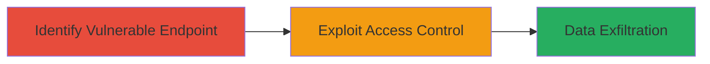

# Unauthorized Retrieval of Hidden Friends List via Improper Access Control in LINE Timeline API

Multi-stage attack chain demonstrating a complete attack workflow exploiting the LINE Timeline API to access hidden user data.

## Chain Metrics Dashboard

| Metric | Value |
|--------|-------|
| Chain Status | Unverified |
| Total Steps | 2 |
| Execution Time | ~5 minutes |
| Skill Level | Intermediate |
| Complexity | Low |
| Impact Level | High |

## Attack Flow Visualization



## Prerequisites & Requirements

### Required Tools

- None (uses standard HTTP clients like curl)

### Target Environment

- LINE Timeline API service
- Web or mobile API access
- No specific ports required (HTTPS/443 implied)

### Initial Access Requirements

- No credentials needed due to the access control flaw
- Public internet access to LINE API endpoints
- Knowledge of target user's internal ID

## Detailed Attack Procedures

### Step 1: Identify Vulnerable API Endpoint
procedure: [[procedures/Identify-Vulnerable-LINE-Timeline-API-Endpoint]]

**Objective**: Locate the LINE Timeline API endpoint responsible for retrieving hidden friends lists, which lacks proper access controls.

**Instructions**: Review LINE's API documentation or use network inspection tools to identify endpoints related to timeline functions. The vulnerable endpoint is typically structured as `/api/timeline/hidden_friends` or similar, allowing queries without authentication checks.

**Expected Output**: Confirmation of the endpoint URL and its response format, which returns JSON data without requiring user authentication.

**Success Indicators**:
- Endpoint responds to unauthenticated requests
- Response includes sample data structure for hidden friends

### Step 2: Retrieve Hidden Friends List Using Target User ID
procedure: [[procedures/Retrieve-Hidden-Friends-List-Using-Target-User-ID]]

**Objective**: Exploit the endpoint by supplying any target user's internal ID to fetch their hidden friends list, bypassing authorization.

**Instructions**: Obtain the target user's internal ID (e.g., via other public LINE features or enumeration). Send an HTTP GET request to the endpoint with the user ID parameter. For example, using curl:

```bash
curl -X GET "https://api.line.me/timeline/hidden_friends?user_id=TARGET_INTERNAL_ID" -H "Accept: application/json"
```

Parse the JSON response to extract the list of hidden contacts.

**Expected Output**: JSON array containing the target user's hidden friends, including user IDs and privacy details.

**Success Indicators**:
- Unauthorized access granted without errors
- Hidden friends data returned for the specified user
- Exposure of social connections not intended to be public

## Attack Chain Summary

### Key Achievements

1. Identified a public-facing API endpoint with flawed access controls
2. Retrieved sensitive privacy data for arbitrary users
3. Demonstrated potential for broader social graph mapping and privacy violations

## Technique & Tactic Coverage

### MITRE ATT&CK Techniques

- [[Exploit Public-Facing Application]]
- [[Account Discovery]]

### MITRE ATT&CK Tactics

- [[Initial Access]]
- [[Discovery]]

---
*Last updated: 2023-10-01T00:00:00Z*
