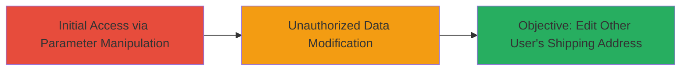

# Unauthorized Shipping Address Editing via Parameter Manipulation in Teavana Subscription System

Multi-stage attack chain demonstrating a complete attack workflow exploiting an improper authentication vulnerability in the teavana.com subscription editing endpoint.

## Chain Metrics Dashboard

| Metric | Value |
|--------|-------|
| Chain Status | Unverified |
| Total Steps | 1 |
| Execution Time | ~5 minutes |
| Skill Level | Intermediate |
| Complexity | Medium |
| Impact Level | High |

## Attack Flow Visualization

## Prerequisites & Requirements

### Required Tools

- [[tools/Burp-Suite]]

### Target Environment

- Web platform (teavana.com subscription management system)
- Required services/ports: HTTPS on port 443
- Network access requirements: Internet access to teavana.com

### Initial Access Requirements

- Valid user account on teavana.com (for initial login)
- Network position: External attacker with web access
- Prior access needed: None, but authenticated session helps in capturing requests

## Detailed Attack Procedures

### Step 1: Exploit Parameter Manipulation in Subscription Editing
procedure: [[procedures/Manipulate-Subscription-Editing-Parameters-for-Unauthorized-Access]]

**Objective**: Bypass authorization checks to edit another user's shipping address by manipulating subscription ID parameters in the editing endpoint.

**Instructions**: Log in to teavana.com with a valid account, navigate to subscription management, and use Burp Suite to intercept and modify the request parameters targeting another user's subscription ID. Replay the modified request to apply unauthorized changes.

**Expected Output**: Successful update confirmation from the server, with the targeted user's shipping address altered.

**Success Indicators**:
- Server responds with 200 OK and updated address details
- Verification by checking the affected user's order delivery details (if accessible)

## Attack Chain Summary

### Key Achievements

1. Bypassed improper authentication to access other users' subscription data
2. Modified sensitive shipping information, leading to privacy violations and potential delivery disruptions
3. Demonstrated impact on user privacy in e-commerce subscription systems

## Technique & Tactic Coverage

### MITRE ATT&CK Techniques

- [[Exploit Public-Facing Application]]

### MITRE ATT&CK Tactics

- [[Initial Access]]

---
*Last updated: 2023-10-01T00:00:00Z*
