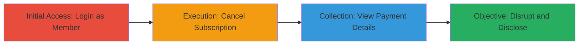

# Unauthorized Subscription Cancellation and Payment Information Disclosure in TaxJar

Multi-stage attack chain demonstrating a complete attack workflow exploiting improper access control in the TaxJar web application, allowing member users to perform admin-only actions such as canceling subscriptions and viewing sensitive payment information integrated with Stripe.

## Chain Metrics Dashboard

| Metric | Value |
|--------|-------|
| Chain Status | Unverified |
| Total Steps | 3 |
| Execution Time | ~5 minutes |
| Skill Level | Intermediate |
| Complexity | Medium |
| Impact Level | Medium |

## Attack Flow Visualization

## Prerequisites & Requirements

### Required Tools

- Web browser (e.g., Chrome or Firefox with developer tools)

### Target Environment

- Web platform
- TaxJar application (https://app.taxjar.com)
- Integrated Stripe payment services

### Initial Access Requirements

- Valid member-level credentials for TaxJar account
- Direct network access to the TaxJar web application
- No admin privileges required

## Detailed Attack Procedures

### Step 1: Initial Access
procedure: [[procedures/Access-TaxJar-as-Member-User]]

**Objective**: Gain access to the TaxJar dashboard using member permissions to establish a foothold for unauthorized actions.

**Instructions**: Open a web browser and navigate to the TaxJar login page at https://app.taxjar.com/login. Enter valid member credentials to authenticate and access the account dashboard.

**Expected Output**: Successful login redirecting to the user dashboard, confirming member-level access without errors.

**Success Indicators**:
- Dashboard loads with member-specific features visible
- No access denied messages

### Step 2: Execution
procedure: [[procedures/Cancel-Subscription-via-Unauthorized-Endpoint]]

**Objective**: Bypass admin restrictions to cancel the account subscription, disrupting service continuity.

**Instructions**: From the dashboard, directly navigate to or request the subscription cancellation endpoint at https://app.taxjar.com/account/subscription/cancel. Confirm the cancellation action if prompted; no additional admin verification is required due to the access control flaw.

**Expected Output**: Subscription cancellation confirmation page or message indicating successful unsubscribe, without requiring elevated privileges.

**Success Indicators**:
- Subscription status changes to canceled
- Account disruptions confirmed in dashboard

### Step 3: Collection
procedure: [[procedures/Disclose-Sensitive-Payment-Information]]

**Objective**: Access and extract sensitive payment details that should be admin-only, leading to information disclosure.

**Instructions**: While logged in as a member, navigate to subscription-related pages such as account settings or billing sections. Inspect the pages for exposed details like payment method information tied to Stripe integration.

**Expected Output**: Display of sensitive data including payment card details or transaction history not intended for member view.

**Success Indicators**:
- Payment information visible without authorization prompts
- Data extractable via browser inspection tools

## Attack Chain Summary

### Key Achievements

1. Unauthorized cancellation of TaxJar subscriptions using member access
2. Disclosure of sensitive payment information from Stripe integration
3. No victim interaction or admin privileges needed, enabling broad impact

## Technique & Tactic Coverage

### MITRE ATT&CK Techniques

- [[Exploit Public-Facing Application]]

### MITRE ATT&CK Tactics

- [[Initial Access]]
- [[Collection]]

---
*Last updated: 2023-10-01T00:00:00Z*
