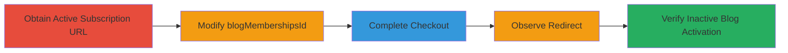

---
tags:
  - business-logic
  - url-manipulation
  - subscription-bypass
  - tumblr
  - post+
type: attack_chain
tools: []
tactics:
  - '[[Initial Access]]'
verified: false
platforms:
  - Web
submitted: true
complexity: low
created_at: '2023-10-01T00:00:00Z'
procedures:
  - '[[procedures/Exploit-Tumblr-Post-Subscription-Logic-Flaw]]'
step_count: 5
techniques:
  - '[[Exploit Public-Facing Application]]'
updated_at: '2025-12-14T17:29:20.204Z'
description: >-
  A business logic vulnerability in Tumblr's Post+ system allows attackers to
  subscribe to inactive or opted-out creators by altering the blogMembershipsId
  parameter in the payment URL, reactivating their pages without consent.
skill_level: intermediate
impact_level: low
id: 58fe2717-9ba4-4448-a738-2b5b668eac9d
validated: true
mitre_tactics:
  - '[[Initial Access]]'
mitre_techniques:
  - '[[Exploit Public-Facing Application]]'
---
# Unauthorized Subscription to Inactive Tumblr Post+ Creators via BlogMembershipsId Manipulation

Multi-stage attack chain demonstrating a complete attack workflow exploiting a business logic error in Tumblr's Post+ subscription system.

## Chain Metrics Dashboard

| Metric | Value |
|--------|-------|
| Chain Status | Unverified |
| Total Steps | 5 |
| Execution Time | ~5 minutes |
| Skill Level | Intermediate |
| Complexity | Low |
| Impact Level | Low |

## Attack Flow Visualization

## Prerequisites & Requirements

### Required Tools

- None (manual URL manipulation via browser or proxy)

### Target Environment

- Tumblr web platform
- Post+ subscription service
- WooCommerce-based payment flow

### Initial Access Requirements

- Access to an active Post+ subscription URL
- Knowledge of an inactive or opted-out Post+ creator's blogMembershipsId
- Valid payment method for checkout (self-inflicted impact)

## Detailed Attack Procedures

### Step 1: Obtain Active Post+ Subscription URL
procedure: [[procedures/Exploit-Tumblr-Post-Subscription-Logic-Flaw]]

**Objective**: Acquire a valid URL from an active Post+ blog to use as a base for manipulation.

**Instructions**: Navigate to an active Tumblr Post+ creator's page and initiate a subscription process to obtain the payment URL, such as from '██████.tumblr.com'.

**Expected Output**: A checkout URL containing the blogMembershipsId parameter, e.g., https://www.payment.tumblr.com/checkout/?token=<token>&blogMembershipsId=<active_id>.

**Success Indicators**:
- Valid subscription URL retrieved
- blogMembershipsId visible in URL

### Step 2: Replace the blogMembershipsId in the URL with that of an Inactive Post+ Blog
procedure: [[procedures/Exploit-Tumblr-Post-Subscription-Logic-Flaw]]

**Objective**: Substitute the ID to target an inactive creator's subscription.

**Instructions**: Identify the blogMembershipsId for an inactive or opted-out Post+ blog (e.g., via prior enumeration or testing). Modify the URL by replacing the active ID with the inactive one, resulting in a URL like 'https://███.payment.tumblr.com/checkout/?token=<token>&blogMembershipsId=<inactive_id>'.

**Expected Output**: Modified URL ready for checkout.

**Success Indicators**:
- URL updated with inactive blog's ID
- No immediate validation errors

### Step 3: Complete the Checkout Process as Normal
procedure: [[procedures/Exploit-Tumblr-Post-Subscription-Logic-Flaw]]

**Objective**: Process the payment using the tampered URL to trigger the logic flaw.

**Instructions**: Proceed through the WooCommerce payment flow with the modified URL, entering payment details and confirming the subscription.

**Expected Output**: Checkout completes, but may show UI inconsistencies like mismatched blog name or avatar.

**Success Indicators**:
- Payment processed successfully
- Subscription appears confirmed

### Step 4: Observe Redirect After Checkout
procedure: [[procedures/Exploit-Tumblr-Post-Subscription-Logic-Flaw]]

**Objective**: Monitor the post-checkout behavior to identify anomalies.

**Instructions**: After payment, follow the redirect, which should go back to the original active Post+ blog's creator page.

**Expected Output**: Redirect to active blog page, but the page fails to load properly due to the ID mismatch.

**Success Indicators**:
- Redirect occurs
- Page load failure observed

### Step 5: Verify Activation of the Inactive Blog
procedure: [[procedures/Exploit-Tumblr-Post-Subscription-Logic-Flaw]]

**Objective**: Confirm the exploit's success by checking the targeted inactive blog.

**Instructions**: Visit the previously inactive Post+ creator's page, e.g., 'https://www.tumblr.com/creator/█████', to see if it has been reactivated.

**Expected Output**: The inactive blog's creator page is now active with subscription enabled, despite the creator's opt-out status.

**Success Indicators**:
- Inactive page reactivated
- Subscription features visible

## Attack Chain Summary

### Key Achievements

1. Successful manipulation of blogMembershipsId to bypass enrollment checks
2. Unauthorized activation of an opted-out Post+ creator page
3. Demonstration of UI inconsistencies during checkout without system rejection

## Technique & Tactic Coverage

### MITRE ATT&CK Techniques

- [[Exploit Public-Facing Application]]

### MITRE ATT&CK Tactics

- [[Initial Access]]

---

*Last updated: 2023-10-01T00:00:00Z*
