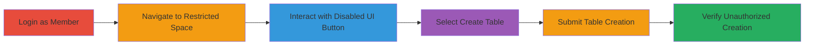

# Unauthorized Table Creation in Restricted Data Spaces via Improper Access Control in Dust

Multi-stage attack chain demonstrating a complete attack workflow exploiting improper access control in the Dust web application.

## Chain Metrics Dashboard

| Metric | Value |
|--------|-------|
| Chain Status | Unverified |
| Total Steps | 6 |
| Execution Time | ~5 minutes |
| Skill Level | Intermediate |
| Complexity | Low |
| Impact Level | High |

## Attack Flow Visualization

## Prerequisites & Requirements

### Required Tools

- Web browser (e.g., Chrome, Firefox)

### Target Environment

- Dust web application
- Restricted company data spaces
- Member-level user account

### Initial Access Requirements

- Valid member credentials for the Dust application
- Direct access to the web UI
- No prior admin access needed

## Detailed Attack Procedures

### Step 1: Log in as a Member User
procedure: [[procedures/Bypass-Access-Control-to-Create-Tables-in-Restricted-Spaces]]

**Objective**: Gain authenticated access to the Dust application using member-level credentials to initiate the bypass.

**Instructions**: Open a web browser and navigate to the Dust login page. Enter member credentials to authenticate.

**Expected Output**: Successful login redirect to the dashboard, with member permissions active.

**Success Indicators**:
- User session established
- Access to member features confirmed

### Step 2: Navigate to the Restricted Data Space
procedure: [[procedures/Bypass-Access-Control-to-Create-Tables-in-Restricted-Spaces]]

**Objective**: Access a company data space intended for admin-only write operations.

**Instructions**: From the dashboard, select and enter a restricted company data space via the UI navigation menu.

**Expected Output**: UI loads the restricted space, showing read-only views for members but with hidden write options.

**Success Indicators**:
- Restricted space UI visible
- No immediate access denial

### Step 3: Click the Visually Disabled “Add Data” Button
procedure: [[procedures/Bypass-Access-Control-to-Create-Tables-in-Restricted-Spaces]]

**Objective**: Bypass front-end visual restrictions to trigger data addition functionality.

**Instructions**: Locate the “Add Data” button, which appears disabled (grayed out), and click it despite the visual cue.

**Expected Output**: Dropdown or modal for data addition options appears, indicating client-side functionality is active.

**Success Indicators**:
- Button responds to click
- Add Data menu opens

### Step 4: Select “Create Table”
procedure: [[procedures/Bypass-Access-Control-to-Create-Tables-in-Restricted-Spaces]]

**Objective**: Choose the table creation option from available data methods.

**Instructions**: In the Add Data menu, select the “Create Table” option.

**Expected Output**: Form for table creation loads, prompting for details like name and schema.

**Success Indicators**:
- Table creation form visible
- No permission error on selection

### Step 5: Fill in Required Inputs and Click “Save”
procedure: [[procedures/Bypass-Access-Control-to-Create-Tables-in-Restricted-Spaces]]

**Objective**: Submit table creation details without server-side permission enforcement.

**Instructions**: Enter table name, columns, and other required fields in the form, then click “Save” to submit.

**Expected Output**: Success message or loading indicator, followed by table integration into the space.

**Success Indicators**:
- Form submission accepted
- No authorization error from server

### Step 6: Observe Successful Table Creation
procedure: [[procedures/Bypass-Access-Control-to-Create-Tables-in-Restricted-Spaces]]

**Objective**: Verify the unauthorized table appears in the restricted space.

**Instructions**: Refresh or check the data space listing to confirm the new table is present and editable.

**Expected Output**: New table listed in the restricted space, accessible to the member user.

**Success Indicators**:
- Table visible and functional
- Potential for further manipulation confirmed

## Attack Chain Summary

### Key Achievements

1. Bypassed front-end UI restrictions using a low-privileged account.
2. Created persistent data structures in admin-only spaces.
3. Demonstrated lack of server-side permission checks, enabling data tampering risks.

## Technique & Tactic Coverage

### MITRE ATT&CK Techniques

- [[Exploit Public-Facing Application]]

### MITRE ATT&CK Tactics

- [[Execution]]

---
*Last updated: 2023-10-01T00:00:00Z*
