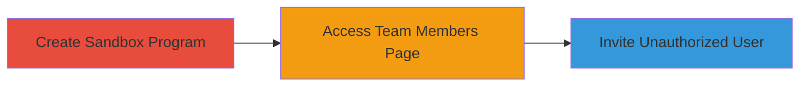

---
tags:
  - business-logic
  - access-control
  - hackerone
  - sandbox
type: attack_chain
tools: []
tactics:
  - '[[Persistence]]'
verified: false
platforms:
  - Web
submitted: true
complexity: low
created_at: '2023-10-01T00:00:00Z'
procedures:
  - '[[procedures/Create-HackerOne-Sandbox-Program]]'
  - '[[procedures/Access-Team-Members-Page-in-Sandbox]]'
  - '[[procedures/Invite-User-to-Sandbox-Program]]'
step_count: 3
techniques:
  - '[[Create Account]]'
updated_at: '2025-12-14T17:30:07.400Z'
description: >-
  Exploits a business logic error in HackerOne's Sandbox program to invite
  unauthorized team members, bypassing documented restrictions.
skill_level: low
impact_level: low
id: 9097941b-355b-4927-b1c1-8e249a6d6f6d
validated: true
mitre_tactics:
  - '[[Persistence]]'
mitre_techniques:
  - '[[Create Account]]'
---
# Unauthorized Team Member Invitation in HackerOne Sandbox Programs

Multi-stage attack chain demonstrating exploitation of a business logic vulnerability in HackerOne's Sandbox programs, allowing unauthorized invitations of team members despite official documentation prohibiting this feature.

## Chain Metrics Dashboard

| Metric | Value |
|--------|-------|
| Chain Status | Unverified |
| Total Steps | 3 |
| Execution Time | ~5 minutes |
| Skill Level | Low |
| Complexity | Low |
| Impact Level | Low |

## Attack Flow Visualization

## Prerequisites & Requirements

### Required Tools

- Web browser (e.g., Chrome or Firefox)

### Target Environment

- HackerOne platform
- Active HackerOne user account with permission to create sandbox programs (limited to 30 per user)

### Initial Access Requirements

- Valid HackerOne login credentials
- No special privileges beyond standard user access

## Detailed Attack Procedures

### Step 1: Create Sandbox Program
procedure: [[procedures/Create-HackerOne-Sandbox-Program]]

**Objective**: Establish a sandbox program to serve as the target for unauthorized invitations.

**Instructions**: Log in to HackerOne and use the platform interface to create a new sandbox program by selecting a product edition. This grants access to testing features but is intended for non-production use.

**Expected Output**: Successful creation of a sandbox program with a unique handle (e.g., {YOUR-PROGRAM}).

**Success Indicators**:
- Sandbox program appears in your HackerOne dashboard
- Program handle is generated and accessible

### Step 2: Access Team Members Page
procedure: [[procedures/Access-Team-Members-Page-in-Sandbox]]

**Objective**: Navigate to the invitation interface within the sandbox program.

**Instructions**: From the HackerOne dashboard, access the team members page using the URL format https://hackerone.com/{YOUR-PROGRAM}/team_members, replacing {YOUR-PROGRAM} with the handle from Step 1.

**Expected Output**: The team members invitation page loads without errors or restrictions.

**Success Indicators**:
- Page loads successfully
- Invitation form or button is visible and functional

### Step 3: Invite Unauthorized User
procedure: [[procedures/Invite-User-to-Sandbox-Program]]

**Objective**: Send an invitation to a new user, exploiting the lack of backend enforcement.

**Instructions**: On the team members page, enter the target user's HackerOne handle or email and submit the invitation. The process completes without any sandbox-specific blocks.

**Expected Output**: Invitation sent successfully, granting the invited user access to the sandbox program.

**Success Indicators**:
- Invitation confirmation message appears
- Invited user receives and can accept the invite, gaining program access

## Attack Chain Summary

### Key Achievements

1. Bypassed documented restrictions on sandbox program invitations
2. Enabled unauthorized access to testing features for additional users
3. Demonstrated low-severity business logic flaw with potential for misuse

## Technique & Tactic Coverage

### MITRE ATT&CK Techniques

- [[Create Account]]

### MITRE ATT&CK Tactics

- [[Persistence]]

---
*Last updated: 2023-10-01T00:00:00Z*
