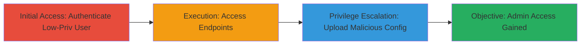

# UniFi Video Configuration Restore Privilege Escalation via Insufficient Privilege Checks

Multi-stage attack chain demonstrating a complete attack workflow exploiting insufficient privilege checks in the UniFi Video web interface's Configuration Restore functionality at the 'backup' and 'wizard' endpoints. Low-privileged users in PUBLIC_GROUP or CUSTOM_GROUP can access these endpoints to upload and restore modified configuration files, overwriting settings to create new administrative users and achieve privilege escalation. This was discovered by testing endpoint access with non-admin accounts, revealing the lack of authorization enforcement.

## Chain Metrics Dashboard

| Metric | Value |
|--------|-------|
| Chain Status | Unverified |
| Total Steps | 3 |
| Execution Time | ~5 minutes |
| Skill Level | Intermediate |
| Complexity | Medium |
| Impact Level | High |

## Attack Flow Visualization



## Prerequisites & Requirements

### Required Tools

- Web browser or HTTP client like curl

### Target Environment

- UniFi Video Server running on Windows
- Web interface accessible (typically port 7443 or 80/443)
- Network access to the UniFi Video web interface

### Initial Access Requirements

- Valid low-privileged credentials (PUBLIC_GROUP or CUSTOM_GROUP)
- Direct network access to the target UniFi Video instance
- No prior admin access needed

## Detailed Attack Procedures

### Step 1: Initial Access
procedure: [[procedures/Authenticate-as-Low-Privileged-User-in-UniFi-Video]]

**Objective**: Gain access to the UniFi Video web interface as a low-privileged user to establish a session for subsequent exploitation.

**Instructions**: Use a web browser or HTTP client to log in with low-privileged credentials. For example, navigate to the login page and submit credentials belonging to PUBLIC_GROUP or CUSTOM_GROUP.

**Expected Output**: Successful login redirect to the dashboard, with a session cookie or token established.

**Success Indicators**:
- Login successful without admin privileges
- Access to basic interface features granted, but no admin controls

### Step 2: Execution
procedure: [[procedures/Access-UniFi-Video-Configuration-Restore-Endpoints]]

**Objective**: Verify and access the vulnerable 'backup' and 'wizard' endpoints without triggering privilege checks.

**Instructions**: From the authenticated session, send HTTP requests to the 'backup' and 'wizard' endpoints. Use curl to test accessibility, for example:

```bash
curl -X GET -b "session_cookie=your_session" https://target-unifi-video/backup
curl -X GET -b "session_cookie=your_session" https://target-unifi-video/wizard
```

Replace 'session_cookie' with the actual cookie from login.

**Expected Output**: HTTP 200 response or endpoint data without authorization denial.

**Success Indicators**:
- Endpoints respond without 403 Forbidden errors
- No privilege enforcement observed

### Step 3: Privilege Escalation
procedure: [[procedures/Upload-Malicious-Configuration-for-Privilege-Escalation]]

**Objective**: Overwrite application configurations by uploading a modified file to escalate privileges, such as creating a new admin user.

**Instructions**: Prepare a modified configuration file (e.g., JSON or backup archive) that includes changes like adding a new administrative user. Then upload it via POST to the endpoints using curl:

```bash
curl -X POST -b "session_cookie=your_session" -F "file=@malicious_config.backup" https://target-unifi-video/backup/restore
curl -X POST -b "session_cookie=your_session" -F "config=@malicious_config.json" https://target-unifi-video/wizard/restore
```

The file should alter settings to grant admin access, such as modifying user groups or permissions.

**Expected Output**: Configuration restored successfully, with changes applied (e.g., new admin user created).

**Success Indicators**:
- New admin user appears in the user list
- Ability to log in as the new admin and access elevated features

## Attack Chain Summary

### Key Achievements

1. Authenticated as low-privileged user without detection
2. Accessed restricted endpoints due to missing checks
3. Escalated privileges by overwriting configs to gain admin control

## Technique & Tactic Coverage

### MITRE ATT&CK Techniques

- [[Exploitation for Privilege Escalation]]
- [[Exploit Public-Facing Application]]

### MITRE ATT&CK Tactics

- [[Privilege Escalation]]

---
*Last updated: 2023-10-01T00:00:00Z*
