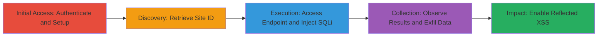

---
tags:
  - sqli
  - union-based
  - xss
  - web
  - database
type: attack_chain
tools: []
tactics:
  - '[[Initial Access]]'
  - '[[Collection]]'
verified: false
platforms:
  - Web
submitted: true
complexity: medium
created_at: '2023-10-01T00:00:00Z'
procedures:
  - '[[procedures/Authenticate-to-IntenseDebate-Platform]]'
  - '[[procedures/Create-New-Site-on-IntenseDebate]]'
  - '[[procedures/Retrieve-Site-ID-from-Dashboard]]'
  - '[[procedures/Access-Comment-History-Endpoint]]'
  - '[[procedures/Inject-Union-Based-SQL-Payload]]'
  - '[[procedures/Observe-SQL-Injection-Results]]'
step_count: 6
techniques:
  - '[[Exploit Public-Facing Application]]'
  - '[[JavaScript]]'
updated_at: '2025-12-14T03:15:05.490Z'
description: >-
  A multi-stage attack exploiting a union-based SQL injection vulnerability in
  the IntenseDebate platform's comment history endpoint to extract database
  information and enable reflected XSS attacks.
skill_level: intermediate
impact_level: high
id: 717db8f5-d1f8-4397-ac8a-50828a5b120a
validated: true
mitre_tactics:
  - '[[Initial Access]]'
  - '[[Collection]]'
mitre_techniques:
  - '[[Exploit Public-Facing Application]]'
  - '[[JavaScript]]'
---
# Union-Based SQL Injection in IntenseDebate Comment History Endpoint Leading to Database Access and Reflected XSS

Multi-stage attack chain demonstrating exploitation of a union-based SQL injection in the site ID parameter of the IntenseDebate comment history endpoint, allowing database version disclosure and potential extraction of sensitive user data, with chained reflected XSS for client-side attacks.

## Chain Metrics Dashboard

| Metric | Value |
|--------|-------|
| Chain Status | Unverified |
| Total Steps | 6 |
| Execution Time | ~10 minutes |
| Skill Level | Intermediate |
| Complexity | Medium |
| Impact Level | High |

## Attack Flow Visualization



## Prerequisites & Requirements

### Required Tools

- Web browser for manual navigation
- [[commands/curl-intensedebate-sqli]] for payload injection (optional for automation)

### Target Environment

- Web platform: IntenseDebate (https://intensedebate.com)
- Services: MariaDB database backend
- Network access: Public internet access to the platform

### Initial Access Requirements

- Valid user credentials for IntenseDebate account (create if needed)
- No prior privileged access required

## Detailed Attack Procedures

### Step 1: Authenticate to Platform
procedure: [[procedures/Authenticate-to-IntenseDebate-Platform]]

**Objective**: Gain access to the IntenseDebate dashboard to set up a test site.

**Instructions**: Open a web browser and navigate to https://intensedebate.com. Enter your username and password to log in.

**Expected Output**: Redirected to the user dashboard.

**Success Indicators**:
- Successful login confirmation
- Access to dashboard features

### Step 2: Create New Site
procedure: [[procedures/Create-New-Site-on-IntenseDebate]]

**Objective**: Establish a site to obtain a vulnerable site ID for testing.

**Instructions**: From the dashboard, navigate to the install section at https://intensedebate.com/install and complete the site creation form with basic details like site name and URL.

**Expected Output**: Confirmation of site creation and addition to your site list.

**Success Indicators**:
- New site appears in dashboard
- Site ID becomes available

### Step 3: Retrieve Site ID
procedure: [[procedures/Retrieve-Site-ID-from-Dashboard]]

**Objective**: Identify the numeric site ID required for the vulnerable endpoint.

**Instructions**: In the dashboard at https://intensedebate.com/user-dashboard, view the site list on the right, select your new site, and click 'Overview' to redirect to https://intensedebate.com/dash/$YourSiteId. Note the $YourSiteId value from the URL.

**Expected Output**: URL containing the site ID, e.g., https://intensedebate.com/dash/12345.

**Success Indicators**:
- Site ID extracted (numeric value)
- Dashboard overview loads successfully

### Step 4: Access Endpoint
procedure: [[procedures/Access-Comment-History-Endpoint]]

**Objective**: Reach the vulnerable comment history page to prepare for injection.

**Instructions**: Construct and visit the URL https://intensedebate.com/commenthistory/$YourSiteId, replacing $YourSiteId with the retrieved ID.

**Expected Output**: Page loads showing comment history (or empty if no comments).

**Success Indicators**:
- Page renders without errors
- Site ID parameter accepted

### Step 5: Inject SQL Payload
procedure: [[procedures/Inject-Union-Based-SQL-Payload]]

**Objective**: Exploit the lack of input sanitization to inject a union select query and leak database information.

**Instructions**: Modify the URL to include the payload: https://intensedebate.com/commenthistory/$YourSiteId%20union%20select%201,2,@@VERSION%23. Use [[commands/curl-intensedebate-sqli]] for automated testing if desired:

```bash
curl "https://intensedebate.com/commenthistory/$YourSiteId%20union%20select%201,2,@@VERSION%23"
```

**Expected Output**: Response includes database version in the page content.

**Success Indicators**:
- Injection payload executes without syntax errors
- Database details appear in output

### Step 6: Observe and Analyze Results
procedure: [[procedures/Observe-SQL-Injection-Results]]

**Objective**: Confirm exploitation and assess potential for data exfiltration or XSS chaining.

**Instructions**: Inspect the page source or response body for injected results. Test further payloads for data extraction or XSS by injecting script tags via similar unions.

**Expected Output**: Database version '10.1.32-MariaDB' displayed, with opportunities for broader queries.

**Success Indicators**:
- Version leaked confirming SQLi
- Potential for user data access or XSS execution

## Attack Chain Summary

### Key Achievements

1. Successful authentication and site setup on IntenseDebate
2. Identification of vulnerable site ID parameter
3. Union-based SQL injection revealing MariaDB version and enabling data access
4. Chained potential for reflected XSS attacks on users

## Technique & Tactic Coverage

### MITRE ATT&CK Techniques

- [[Exploit Public-Facing Application]] Exploit Public-Facing Application
- [[JavaScript]] JavaScript (for chained XSS)

### MITRE ATT&CK Tactics

- [[Initial Access]] Initial Access
- [[Collection]] Collection

---
*Last updated: 2023-10-01T00:00:00Z*
