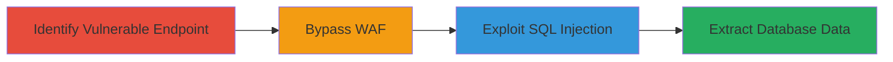

# Union-Based SQL Injection with WAF Bypass on Zomato Web Endpoint

Multi-stage attack chain demonstrating the discovery and exploitation of a SQL injection vulnerability on www.zomato.com by circumventing the Web Application Firewall (WAF) to perform union-based queries for unauthorized database access.

## Chain Metrics Dashboard

| Metric | Value |
|--------|-------|
| Chain Status | Unverified |
| Total Steps | 3 |
| Execution Time | ~15 minutes |
| Skill Level | Intermediate |
| Complexity | Medium |
| Impact Level | High |

## Attack Flow Visualization



## Prerequisites & Requirements

### Required Tools

- [[tools/Burp-Suite]]
- [[tools/sqlmap]]

### Target Environment

- Web platform with SQL database backend
- Exposed HTTP/HTTPS endpoints
- No specific ports required beyond standard web (80/443)

### Initial Access Requirements

- Public network access to www.zomato.com
- No credentials needed for initial probing
- Basic knowledge of web requests and SQL syntax

## Detailed Attack Procedures

### Step 1: Identify Vulnerable Endpoint

procedure: [[procedures/Identify-SQL-Injection-Endpoint]]

**Objective**: Locate an endpoint susceptible to SQL injection by testing user inputs for error responses or anomalous behavior.

**Instructions**: Use Burp Suite to intercept and modify requests to various endpoints on www.zomato.com, injecting single quotes or basic payloads like ' OR 1=1 -- to check for SQL errors.

**Expected Output**: Database error messages or unexpected responses indicating injection points.

**Success Indicators**:
- SQL syntax errors in responses
- Delayed responses suggesting query execution

### Step 2: Bypass WAF

procedure: [[procedures/Bypass-WAF-for-SQL-Injection-Exploitation]]

**Objective**: Circumvent the WAF rules to allow malicious SQL payloads to reach the backend database.

**Instructions**: Employ encoding techniques or payload variations in Burp Suite. For example, use case variations like UnIoN instead of UNION, or comment insertions to evade pattern matching.

Execute a test request using [[commands/curl-waf-bypass-test]]:

```bash
curl -X GET "https://www.zomato.com/endpoint?param=UnIoN/**/SeLeCt" -H "User-Agent: Mozilla/5.0"
```

Then refine with [[commands/sqlmap-waf-bypass]]:

```bash
sqlmap -u "https://www.zomato.com/endpoint?param=*" --tamper=space2comment --level=3
```

**Expected Output**: Successful payload delivery without WAF blocking, confirmed by response changes.

**Success Indicators**:
- No WAF block page returned
- Payload reaches application layer

### Step 3: Exploit SQL Injection

procedure: [[procedures/Exploit-Union-Based-SQL-Injection]]

**Objective**: Perform union-based queries to extract database schema and data.

**Instructions**: Once bypassed, use union select statements to dump information. Start with database version using [[commands/sqlmap-union-extract]]:

```bash
sqlmap -u "https://www.zomato.com/endpoint?param=*" --dbms=mysql --technique=U --union-cols=5 --dump
```

Follow up by enumerating tables and extracting sensitive data.

**Expected Output**: Database contents, such as table names, user data, or schema details.

**Success Indicators**:
- Retrieved database records
- Confirmation of unauthorized access

## Attack Chain Summary

### Key Achievements

1. Successful WAF bypass enabling SQL payload delivery
2. Union-based exploitation leading to database information disclosure
3. Report resolution with $1,000 bounty, highlighting medium severity impact

## Technique & Tactic Coverage

### MITRE ATT&CK Techniques

- [[Exploit Public-Facing Application]]
- [[Disable or Modify Tools]]

### MITRE ATT&CK Tactics

- [[Initial Access]]
- [[Collection]]

---
*Last updated: 2023-10-01T00:00:00Z*
