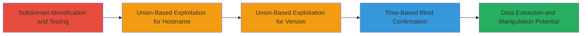

---
tags:
  - sqli
  - web
  - mssql
  - injection
  - database-exfiltration
type: attack_chain
tools:
  - '[[tools/curl]]'
  - '[[tools/time]]'
tactics:
  - '[[Initial Access]]'
verified: false
platforms:
  - Web
  - Microsoft SQL Server
submitted: true
complexity: medium
created_at: '2023-10-01T00:00:00Z'
procedures:
  - '[[procedures/Test-for-SQL-Injection-Vulnerability-on-Subdomain]]'
  - '[[procedures/Exploit-Union-Based-SQLi-for-Database-Hostname]]'
  - '[[procedures/Exploit-Union-Based-SQLi-for-Database-Version]]'
  - '[[procedures/Confirm-SQLi-with-Time-Based-Blind-Technique]]'
step_count: 4
techniques:
  - '[[Exploit Public-Facing Application]]'
updated_at: '2025-12-14T03:46:26.078Z'
description: >-
  Exploits SQL Injection vulnerability in the /api/river/observed-data/ endpoint
  to extract database information and confirm vulnerability using union-based
  and time-based techniques.
skill_level: intermediate
impact_level: high
id: 21104cca-dae8-468a-b85c-c85bca1c6223
validated: true
mitre_tactics:
  - '[[Initial Access]]'
mitre_techniques:
  - '[[Exploit Public-Facing Application]]'
---
# Union-Based and Time-Based SQL Injection on TVA SOA Subdomain

Multi-stage attack chain demonstrating SQL Injection exploitation on the soa-accp.glbx.tva.gov subdomain to extract database details and confirm vulnerability.

## Chain Metrics Dashboard

| Metric | Value |
|--------|-------|
| Chain Status | Unverified |
| Total Steps | 4 |
| Execution Time | ~5 minutes |
| Skill Level | Intermediate |
| Complexity | Medium |
| Impact Level | High |

## Attack Flow Visualization



## Prerequisites & Requirements

### Required Tools

- [[tools/curl]]
- [[tools/time]]

### Target Environment

- Web platform with Microsoft SQL Server backend
- Accessible subdomain (e.g., soa-accp.glbx.tva.gov)
- No authentication required for the endpoint

### Initial Access Requirements

- Network access to the target subdomain
- No prior credentials needed
- Basic knowledge of SQL syntax and injection payloads

## Detailed Attack Procedures

### Step 1: Subdomain Identification and SQLi Testing
procedure: [[procedures/Test-for-SQL-Injection-Vulnerability-on-Subdomain]]

**Objective**: Identify the vulnerable subdomain and test the /api/river/observed-data/ endpoint for SQL Injection flaws using parameter manipulation.

**Instructions**: Manually probe the subdomain soa-accp.glbx.tva.gov for injection points in the /api/ path, focusing on parameters like 'GVDA1' in the endpoint URL.

**Expected Output**: Error responses or unexpected behavior indicating unsanitized input.

**Success Indicators**:
- Anomalous server responses to injected payloads
- Confirmation of parameter vulnerability

### Step 2: Union-Based Exploitation for Database Hostname
procedure: [[procedures/Exploit-Union-Based-SQLi-for-Database-Hostname]]

**Objective**: Use union-based SQLi to extract the database hostname from the vulnerable endpoint.

**Instructions**: Inject a union select payload into the endpoint parameter to append and retrieve the HOST_NAME() function result.

**Expected Output**: Server response containing the database hostname.

**Success Indicators**:
- Hostname leaked in the response
- Successful union query execution without errors

### Step 3: Union-Based Exploitation for Database Version
procedure: [[procedures/Exploit-Union-Based-SQLi-for-Database-Version]]

**Objective**: Extend union-based SQLi to dump the database version information.

**Instructions**: Modify the union payload to select @@version and inject it into the same endpoint.

**Expected Output**: Response revealing Microsoft SQL Server version details.

**Success Indicators**:
- Version string extracted
- Confirmation of MSSQL backend

### Step 4: Time-Based Blind SQLi Confirmation
procedure: [[procedures/Confirm-SQLi-with-Time-Based-Blind-Technique]]

**Objective**: Verify the SQLi vulnerability using a time-based blind technique to observe delays.

**Instructions**: Execute [[commands/time-curl-sql-delay-test]] to introduce a WAITFOR DELAY and measure response time.

```bash
time curl -k "https://soa-accp.glbx.tva.gov/api/river/observed-data/-GVDA1'+WAITFOR+DELAY+'0:0:10'--+-"
```

**Expected Output**: Command execution delayed by approximately 10 seconds.

**Success Indicators**:
- Response time increased by 10 seconds
- No immediate data leak but confirmed injection

## Attack Chain Summary

### Key Achievements

1. Identified and confirmed SQLi in a government subdomain endpoint
2. Extracted database hostname and version via union-based techniques
3. Validated vulnerability with time-based blind SQLi for stealthy confirmation
4. Demonstrated potential for broader data manipulation and extraction

## Technique & Tactic Coverage

### MITRE ATT&CK Techniques

- [[Exploit Public-Facing Application]]

### MITRE ATT&CK Tactics

- [[Initial Access]]

---

*Last updated: 2023-10-01T00:00:00Z*
