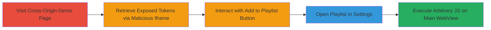

---
tags:
  - xss
  - uxss
  - brave-browser
  - ios
  - token-exposure
  - information-disclosure
  - javascript-injection
type: attack_chain
tools: []
tactics:
  - '[[Execution]]'
  - '[[Initial Access]]'
verified: false
platforms:
  - iOS
  - WebView
submitted: true
complexity: medium
created_at: '2023-10-01T00:00:00Z'
procedures:
  - '[[procedures/Retrieve-Brave-Playlist-Security-Tokens]]'
  - '[[procedures/Trigger-Brave-Playlist-UXSS]]'
step_count: 5
techniques:
  - '[[JavaScript]]'
  - '[[Unsecured Credentials]]'
updated_at: '2025-12-13T23:52:33.364Z'
description: >-
  A multi-stage attack exploiting token exposure in Brave iOS Playlist
  JavaScript files and unsafe concatenation in Swift code to achieve universal
  cross-site scripting (UXSS) on arbitrary domains.
skill_level: intermediate
impact_level: high
id: 2b58ef3b-27ae-4ff0-91ea-29e46394d7da
validated: true
mitre_tactics:
  - '[[Execution]]'
  - '[[Initial Access]]'
mitre_techniques:
  - '[[JavaScript]]'
  - '[[Unsecured Credentials]]'
---
---

# Universal XSS in Brave iOS via Playlist Feature Token Exposure and Unsafe String Concatenation

Multi-stage attack chain demonstrating a complete attack workflow exploiting vulnerabilities in the Brave iOS browser's Playlist feature.

## Chain Metrics Dashboard

| Metric | Value |
|--------|-------|
| Chain Status | Unverified |
| Total Steps | 5 |
| Execution Time | ~2 minutes |
| Skill Level | Intermediate |
| Complexity | Medium |
| Impact Level | High |

## Attack Flow Visualization

## Prerequisites & Requirements

### Required Tools

- None (relies on hosting a simple malicious page and user interaction with Brave iOS app)

### Target Environment

- Brave iOS browser (affected versions prior to patch)
- iOS device with WebView support
- No specific services/ports required; attack occurs within the app's WebView

### Initial Access Requirements

- User must visit a cross-origin page (e.g., Google Sites) hosting the malicious iframe
- No credentials needed; exploits built-in browser features
- Attacker controls a remote server to host the malicious iframe (e.g., https://csrf.jp/brave/playlist.php)

## Detailed Attack Procedures

### Step 1: Visit the Demonstration Page

procedure: [[procedures/Retrieve-Brave-Playlist-Security-Tokens]]

**Objective**: Load a cross-origin page that embeds a malicious iframe to initiate token retrieval.

**Instructions**: Open Brave iOS and navigate to the attacker's demonstration page hosted on a site like Google Sites.

**Expected Output**: The page loads, embedding an iframe from the attacker's domain (e.g., https://csrf.jp/brave/playlist.php).

**Success Indicators**:
- Page loads without errors
- Iframe is invisible or blended into the page content

### Step 2: Retrieve Exposed Security Tokens

procedure: [[procedures/Retrieve-Brave-Playlist-Security-Tokens]]

**Objective**: Exploit exposed tokens in Playlist.js and WindowRenderHelper.js from within the malicious iframe.

**Instructions**: The iframe automatically executes JavaScript to read the securityToken from Playlist.js (line 353, embedded in HTMLVideoElement.prototype.setAttribute) and messageHandlerToken from WindowRenderHelper.js (line 12, embedded in postMessage). These tokens are extracted and used to craft a message for the playlistHelper.

**Expected Output**: Tokens are silently retrieved and prepared for payload crafting; no visible user action required.

**Success Indicators**:
- Tokens successfully read (verifiable via console logs in a debug setup)
- Crafted message includes the malicious nodeTag payload

### Step 3: Interact with the Brave Playlist Feature

procedure: [[procedures/Trigger-Brave-Playlist-UXSS]]

**Objective**: Trigger the unsafe string concatenation in PlaylistHelper.swift by adding content to the playlist, injecting the malicious payload.

**Instructions**: On the loaded page, push the 'Add to Brave Playlist' button. This invokes PlaylistHelper.swift (line 228), which concatenates user-supplied nodeTag (e.g., tagId in JS as '');alert(document.location);//') directly into executed JavaScript on the mainframe WebView without sanitization.

**Expected Output**: The playlist action is queued, but the payload is prepared for execution.

**Success Indicators**:
- Button press registers without errors
- No immediate alert (payload executes on next step)

### Step 4: Finalize Playlist Action

procedure: [[procedures/Trigger-Brave-Playlist-UXSS]]

**Objective**: Execute the injected JavaScript payload by opening the playlist.

**Instructions**: Navigate to the Brave settings menu and push the 'Open' button for the playlist item. This finalizes the action, running the concatenated JavaScript on the main WebView frame.

**Expected Output**: Arbitrary JavaScript executes cross-origin on the main frame.

**Success Indicators**:
- Settings menu opens successfully
- Payload triggers on mainframe

### Step 5: Observe the Impact

**Objective**: Verify universal XSS execution on an arbitrary domain.

**Instructions**: After opening the playlist, an alert dialog should pop up displaying the current domain (e.g., on sites.google.com).

**Expected Output**: Alert box with 'https://sites.google.com/view/nishimunea-brave-uxss1/page' or similar, confirming UXSS.

**Success Indicators**:
- Alert appears on the victim domain
- Demonstrates execution across origins

## Attack Chain Summary

### Key Achievements

1. Exposed security tokens retrieved from JavaScript files without authentication
2. Unsafe concatenation in Swift code allows arbitrary JS injection
3. Achieved universal XSS affecting any domain loaded in Brave iOS WebView

## Technique & Tactic Coverage

### MITRE ATT&CK Techniques

- [[JavaScript]]
- [[Unsecured Credentials]]

### MITRE ATT&CK Tactics

- [[Execution]]
- [[Initial Access]]

---

*Last updated: 2023-10-01T00:00:00Z*
