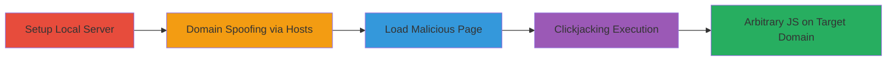

# Universal XSS in Kaspersky URL Advisor via postMessage Injection and Clickjacking

Multi-stage attack chain demonstrating exploitation of a universal XSS vulnerability in Kaspersky Internet Security's URL Advisor component, allowing arbitrary JavaScript execution in the context of any website due to lack of origin validation in postMessage handling and unsanitized link targets.

## Chain Metrics Dashboard

| Metric | Value |
|--------|-------|
| Chain Status | Unverified |
| Total Steps | 4 |
| Execution Time | ~5 minutes |
| Skill Level | Intermediate |
| Complexity | Medium |
| Impact Level | High |

## Attack Flow Visualization



## Prerequisites & Requirements

### Required Tools

- [[tools/Python-3]]
- [[tools/server.py]]
- [[tools/universal_xss.html]]
- [[tools/Microsoft-Edge]]

### Target Environment

- Windows OS with Kaspersky Internet Security installed
- Microsoft Edge browser
- URL Advisor service enabled (default in KIS)
- Ports: 5000 (local server)

### Initial Access Requirements

- Local administrator privileges to edit hosts file
- Kaspersky Internet Security running with URL Advisor active
- No network restrictions for localhost access

## Detailed Attack Procedures

### Step 1: Setup Local Server
procedure: [[procedures/Host-Malicious-POC-Server-with-Python]]

**Objective**: Host the proof-of-concept files locally to serve the malicious HTML that interacts with the URL Advisor frame.

**Instructions**: Download the server.py script and universal_xss.html file. Execute [[commands/python-server-start]] to launch the HTTP server on localhost:5000.

```bash
python server.py
```

**Expected Output**: Server logs indicating HTTP server running on port 5000, ready to serve files.

**Success Indicators**:
- Local server accessible at http://localhost:5000/
- universal_xss.html loads when accessed

### Step 2: Domain Spoofing via Hosts
procedure: [[procedures/Configure-Hosts-File-for-Domain-Spoofing]]

**Objective**: Map a google.com-like domain to localhost to trigger the URL Advisor on a simulated high-value domain.

**Instructions**: Edit the hosts file as administrator using [[commands/hosts-file-modify]] to add the mapping for www.google.example.com.

```bash
echo "127.0.0.1 www.google.example.com" >> %WINDIR%\sysnative\drivers\etc\hosts
```

**Expected Output**: Domain www.google.example.com resolves to 127.0.0.1 when pinged.

**Success Indicators**:
- Ping www.google.example.com returns 127.0.0.1
- URL Advisor activates on navigation to the spoofed domain

### Step 3: Load Malicious Page
procedure: [[procedures/Load-Universal-XSS-POC-in-Microsoft-Edge]]

**Objective**: Navigate to the PoC page in Edge to initiate postMessage interaction with the URL Advisor frame.

**Instructions**: Open Microsoft Edge and visit the spoofed domain with the PoC path: http://www.google.example.com:5000/universal_xss.html. The page sends unvalidated postMessage to the URL Advisor frame.

**Expected Output**: Page loads, URL Advisor balloon appears, and postMessage is sent without origin check.

**Success Indicators**:
- Malicious page renders in Edge
- URL Advisor frame is injected as first-party content
- No errors in browser console for postMessage

### Step 4: Trigger XSS via Clickjacking
procedure: [[procedures/Trigger-XSS-via-Clickjacking-Interaction]]

**Objective**: Use clickjacking to force a click on the injected javascript: URL, executing arbitrary JS in the target domain's context.

**Instructions**: Move the mouse over the page and click as prompted by the clickjacking overlay. This sets the link target to javascript:alert('Hi, this JavaScript code is running on ' + document.domain) in the URL Advisor frame.

**Expected Output**: Alert box pops up showing the execution context (e.g., www.google.com), confirming XSS.

**Success Indicators**:
- JavaScript alert executes in google.com context
- Potential for data exfiltration (e.g., document.cookie or fetch requests)

## Attack Chain Summary

### Key Achievements

1. Bypassed origin validation in postMessage for universal context injection
2. Executed arbitrary JavaScript on any domain via clickjacking
3. Demonstrated data exfiltration potential from sites like google.com

## Technique & Tactic Coverage

### MITRE ATT&CK Techniques

- [[JavaScript]]
- [[Drive-by Compromise]]

### MITRE ATT&CK Tactics

- [[Execution]]
- [[Collection]]

---

*Last updated: 2023-10-01T00:00:00Z*
