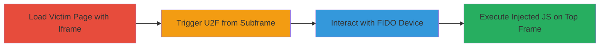

---
tags:
  - xss
  - uxss
  - fido
  - u2f
  - brave
  - ios
type: attack_chain
tools:
  - '[[tools/YubiKey-5Ci]]'
tactics:
  - '[[Initial Access]]'
  - '[[Execution]]'
commands: []
platforms:
  - iOS
  - Web
complexity: medium
procedures:
  - '[[procedures/Load-Victim-Page-with-Cross-Origin-Iframe]]'
  - '[[procedures/Trigger-U2F-Registration-from-Subframe]]'
  - '[[procedures/Interact-with-FIDO-Device]]'
  - '[[procedures/Execute-Injected-JavaScript-on-Top-Frame]]'
step_count: 4
techniques:
  - '[[Drive-by Compromise]]'
  - '[[JavaScript]]'
description: >-
  A multi-stage attack exploiting weaknesses in Brave's iOS FIDO U2F
  implementation to achieve universal XSS by injecting arbitrary JavaScript into
  the top frame from a cross-origin subframe.
skill_level: intermediate
impact_level: high
id: 31f8c10a-4226-4efd-869c-527c154a6062
created_at: '2025-12-14T03:47:12.894Z'
updated_at: '2025-12-14T03:47:12.894Z'
verified: false
validated: true
submitted: true
mitre_tactics:
  - '[[Initial Access]]'
  - '[[Execution]]'
mitre_techniques:
  - '[[Drive-by Compromise]]'
  - '[[JavaScript]]'
---
# Universal XSS via Cross-Origin FIDO U2F Registration in Brave iOS

Multi-stage attack chain demonstrating a complete attack workflow exploiting Brave's iOS FIDO U2F implementation to bypass origin checks, mislead users via modals, and inject arbitrary JavaScript for universal XSS.

## Chain Metrics Dashboard

| Metric | Value |
|--------|-------|
| Chain Status | Unverified |
| Total Steps | 4 |
| Execution Time | ~5 minutes |
| Skill Level | Intermediate |
| Complexity | Medium |
| Impact Level | High |

## Attack Flow Visualization

## Prerequisites & Requirements

### Required Tools

- [[tools/YubiKey-5Ci]]

### Target Environment

- Target OS/Platform: iOS (Brave browser)
- Required services/ports: Web browser with FIDO U2F support
- Network access requirements: Ability to load web pages with iframes

### Initial Access Requirements

- Credential requirements: None (victim interaction required)
- Network position: Attacker controls a malicious cross-origin domain
- Prior access needed: Victim must visit attacker's page embedding victim site

## Detailed Attack Procedures

### Step 1: Load Victim Page with Cross-Origin Iframe
procedure: [[procedures/Load-Victim-Page-with-Cross-Origin-Iframe]]

**Objective**: Set up the attack by loading a victim page that embeds a malicious cross-origin iframe, positioning the subframe to initiate unauthorized actions.

**Instructions**: Open the victim page in Brave iOS browser, such as https://alice.csrf.jp/brave/uxss_victim.php, which loads an iframe from the attacker's domain (e.g., evil.csrf.jp). This establishes the cross-origin context without alerting the user.

**Expected Output**: Victim page loads with embedded iframe; no errors or warnings displayed.

**Success Indicators**:
- Page loads successfully in Brave iOS
- Iframe content from cross-origin domain is visible or functional

### Step 2: Trigger U2F Registration from Subframe
procedure: [[procedures/Trigger-U2F-Registration-from-Subframe]]

**Objective**: Bypass origin validation by invoking u2f.register() directly from the subframe using U2F.postMessage, initiating a fake registration process.

**Instructions**: From the subframe (evil.csrf.jp), execute JavaScript to call U2F.postMessage with a crafted message invoking u2f.register(). This triggers the FIDO modal without proper subframe origin checks. A 'Ready to Scan' dialog appears, but it misleadingly shows the top frame origin (alice.csrf.jp).

**Expected Output**: FIDO modal pops up displaying the top frame's origin, prompting for device interaction.

**Success Indicators**:
- Modal appears with incorrect origin displayed
- No origin validation error occurs

### Step 3: Interact with FIDO Device
procedure: [[procedures/Interact-with-FIDO-Device]]

**Objective**: Complete the fake registration by authenticating with a physical FIDO device, advancing the exploit to the injection phase.

**Instructions**: Insert a compatible FIDO U2F device, such as YubiKey 5Ci, into the iOS device and touch it to confirm the registration prompt in the Brave browser.

**Expected Output**: Registration completes; the browser processes the response, embedding the malicious payload.

**Success Indicators**:
- Device touch is accepted
- No authentication failure; process proceeds to JS evaluation

### Step 4: Execute Injected JavaScript on Top Frame
procedure: [[procedures/Execute-Injected-JavaScript-on-Top-Frame]]

**Objective**: Exploit the unescaped 'version' parameter in evaluateJavaScript to inject and run arbitrary code on the top frame, achieving universal XSS.

**Instructions**: During the U2F response handling in U2FExtensions.swift, the unescaped 'version' from postMessage is inserted into evaluateJavaScript, executing injected JS (e.g., alert('XSS') or more malicious payloads) on the top-level origin (alice.csrf.jp).

**Expected Output**: Arbitrary JavaScript executes on the top frame, such as popping an alert or stealing data.

**Success Indicators**:
- Alert or injected code runs on victim origin
- Access to top frame's DOM and sensitive data confirmed

## Attack Chain Summary

### Key Achievements

1. Bypassed cross-origin restrictions in FIDO U2F to initiate actions from subframes
2. Misled user with incorrect origin in modals, enabling phishing-like deception
3. Achieved universal XSS via unescaped parameter injection, allowing full code execution on any origin

## Technique & Tactic Coverage

### MITRE ATT&CK Techniques

- [[Drive-by Compromise]]
- [[JavaScript]]

### MITRE ATT&CK Tactics

- [[Initial Access]]
- [[Execution]]

---
*Last updated: 2023-10-01*
