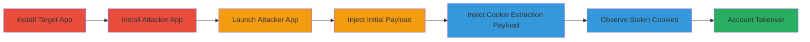

# Universal XSS via Exported SMFeedbackActivity in Exness Social Trading App Leading to Cookie Theft and Account Takeover

Multi-stage attack chain demonstrating exploitation of an improperly exported SMFeedbackActivity from the SurveyMonkey SDK in the Exness Social Trading Android app (version 2.45.8-release). The vulnerability allows any installed app to launch the activity and inject malicious Intent Extras, loading arbitrary HTML into a WebView with a spoofed baseURL. This enables universal cross-site scripting (XSS) that accesses shared cookie storage, stealing session cookies (including JWT tokens) from sites like my.exness.asia, leading to account takeovers, unauthorized trading, and potential financial losses.

## Chain Metrics Dashboard

| Metric | Value |
|--------|-------|
| Chain Status | Unverified |
| Total Steps | 6 |
| Execution Time | ~30 seconds |
| Skill Level | Intermediate |
| Complexity | Medium |
| Impact Level | High |

## Attack Flow Visualization

## Prerequisites & Requirements

### Required Tools

- [[tools/Custom-Attacker-App]]

### Target Environment

- Android device or emulator (API level compatible with app version 2.45.8-release)
- Exness Social Trading app installed from Google Play Store
- No root required; attacker app runs in user space

### Initial Access Requirements

- Physical or emulated Android device access
- Ability to install APKs (sideloading enabled)
- No network position or prior access needed beyond app installation

## Detailed Attack Procedures

### Step 1: Install Exness Social Trading App
procedure: [[procedures/Install-Exness-Social-Trading-App]]

**Objective**: Ensure the vulnerable target app is installed and ready for exploitation.

**Instructions**: Download and install the latest version of the Exness Social Trading app from the Google Play Store. Verify installation by launching the app briefly to confirm it runs without issues.

**Expected Output**: App icon appears on home screen; app launches successfully.

**Success Indicators**:
- App version 2.45.8-release confirmed via app settings or package manager
- No installation errors

### Step 2: Install Custom Attacker App
procedure: [[procedures/Install-Custom-Attacker-App]]

**Objective**: Deploy the malicious app designed to exploit the vulnerability by launching intents.

**Instructions**: Sideload the custom attacker APK onto the device. Enable unknown sources in settings if prompted, then install via file manager or ADB.

**Expected Output**: Attacker app installs without errors; icon visible on device.

**Success Indicators**:
- Installation completes successfully
- App launches without crashing

### Step 3: Launch Attacker App
procedure: [[procedures/Launch-Attacker-App-to-Trigger-Initial-Payload]]

**Objective**: Start the attacker app to initiate the intent-based exploit sequence.

**Instructions**: Open the custom attacker app from the home screen. The app will automatically handle launching the target via getLaunchIntentForPackage and startActivity.

**Expected Output**: Attacker app starts; after delays, it triggers the Exness app.

**Success Indicators**:
- Attacker app UI appears
- No permission denials during launch

### Step 4: Launch SMFeedbackActivity with Initial Payload
procedure: [[procedures/Launch-SMFeedbackActivity-with-Initial-Exploit-Payload]]

**Objective**: Inject an initial HTML payload to confirm exploitation and redirect within the WebView.

**Instructions**: The attacker app, after an 8-second delay, launches SMFeedbackActivity with Intent extras: smSPageHTML='<h1>Exploited</h1>' and smSPageURL='https://my.exness.asia/r/'. Set class name to com.exness.investments/.SMFeedbackActivity.

**Expected Output**: Exness app opens to the vulnerable fragment; WebView loads the payload, displaying "Exploited" and redirecting.

**Success Indicators**:
- WebView shows injected HTML
- JavaScript executes without errors

### Step 5: Relaunch SMFeedbackActivity for Cookie Extraction
procedure: [[procedures/Relaunch-SMFeedbackActivity-for-Cookie-Extraction]]

**Objective**: Inject a second payload to extract and display cookies from shared storage.

**Instructions**: After a 20-second delay, the attacker app relaunches SMFeedbackActivity with extras: smSPageHTML='<h1>Exploited</h1>' and smSPageURL='https://my.exness.asia/r/'.

**Expected Output**: WebView displays the victim's cookies, including JWT tokens for logged-in sessions.

**Success Indicators**:
- Cookies visible in WebView output
- Sensitive data like auth tokens exposed

### Step 6: Observe and Utilize Exposed Cookies
procedure: [[procedures/Observe-and-Utilize-Exposed-Cookies]]

**Objective**: Capture stolen cookies for further exploitation, such as account takeover.

**Instructions**: Note the displayed cookies from the WebView. Use them to authenticate to my.exness.asia endpoints, enabling unauthorized access to trading portfolios.

**Expected Output**: Cookies copied; successful replay in browser or tool leads to session hijack.

**Success Indicators**:
- Cookies include valid JWT/session IDs
- Account takeover confirmed via unauthorized actions

## Attack Chain Summary

### Key Achievements

1. Bypassed access controls by exploiting exported Android activity
2. Achieved universal XSS in WebView via unvalidated Intent Extras
3. Stolen cookies from shared storage across app WebViews, enabling full account compromise

## Technique & Tactic Coverage

### MITRE ATT&CK Techniques

- [[JavaScript]] JavaScript (XSS execution in WebView)
- [[Credentials In Files]] Credentials In Files (cookie theft from shared storage)

### MITRE ATT&CK Tactics

- [[Execution]] Execution (payload injection and JS execution)
- [[Collection]] Collection (gathering cookies for exfiltration)

---
*Last updated: 2023-10-01T00:00:00Z*
