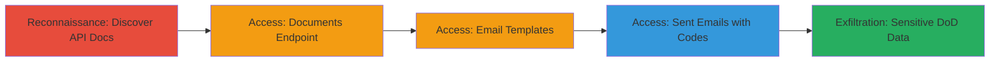

---
tags:
  - api-exposure
  - auth-bypass
  - sensitive-data-leak
  - dod
type: attack_chain
tools:
  - '[[tools/Swagger]]'
  - '[[tools/curl]]'
tactics:
  - '[[Initial Access]]'
  - '[[Discovery]]'
verified: false
platforms:
  - Web
submitted: true
complexity: low
created_at: '2023-10-01T00:00:00Z'
procedures:
  - '[[procedures/Discover-Exposed-API-Documentation-via-Manual-Reconnaissance]]'
  - '[[procedures/Access-Document-Listing-Endpoint-Without-Authentication]]'
  - '[[procedures/Access-and-Manipulate-Email-Templates-Endpoint]]'
  - '[[procedures/Retrieve-Sent-Emails-Including-Authentication-Codes]]'
step_count: 4
techniques:
  - '[[Exploit Public-Facing Application]]'
  - '[[File and Directory Discovery]]'
updated_at: '2025-12-14T17:32:01.603Z'
description: >-
  Multi-stage attack exploiting an unauthenticated test API in the Seaport Bid
  proposal system to discover endpoints via Swagger documentation and access
  sensitive documents emails and authentication codes potentially compromising
  DoD data.
skill_level: beginner
impact_level: high
id: 2c6a3d8e-5cf7-4a1f-affb-bf78e5961649
validated: true
mitre_tactics:
  - '[[Initial Access]]'
  - '[[Discovery]]'
mitre_techniques:
  - '[[Exploit Public-Facing Application]]'
  - '[[File and Directory Discovery]]'
---
# Unprotected API Access Exposing Sensitive DoD Documents Emails and Authentication Codes

Multi-stage attack chain demonstrating exploitation of an unprotected test/integration API in the Seaport Bid proposal system leading to unauthorized access to sensitive DoD documents email templates and authentication codes.

## Chain Metrics Dashboard

| Metric | Value |
|--------|-------|
| Chain Status | Unverified |
| Total Steps | 4 |
| Execution Time | ~5 minutes |
| Skill Level | Beginner |
| Complexity | Low |
| Impact Level | High |

## Attack Flow Visualization



## Prerequisites & Requirements

### Required Tools

- [[tools/curl]]
- [[tools/Swagger]]

### Target Environment

- Web platform with exposed RESTful API
- Services: Document storage/retrieval, Email template storage, Email generation, PDF generation, Seaport Bid proposal system
- Tech stack: RESTful API (Swagger-documented)
- No authentication required on test/integration endpoints

### Initial Access Requirements

- Public internet access to the target domain
- No credentials needed due to lack of authentication
- Manual reconnaissance capabilities (browser or curl)

## Detailed Attack Procedures

### Step 1: Discover Exposed API Documentation
procedure: [[procedures/Discover-Exposed-API-Documentation-via-Manual-Reconnaissance]]

**Objective**: Identify public API endpoints through Swagger documentation to map the attack surface.

**Instructions**: Perform manual reconnaissance on the target domain to locate Swagger UI. Use a browser to navigate to suspected paths like /swagger or /api-docs. Review the documentation for endpoints related to documents emails and proposals.

**Expected Output**: Interactive Swagger UI displaying API routes such as /api/1_0/Documents /api/1_0/EmailTemplates and /api/1_0/EmailMessages.

**Success Indicators**:
- Swagger documentation accessible without login
- Endpoints for sensitive operations revealed

### Step 2: Access Document Listing Endpoint
procedure: [[procedures/Access-Document-Listing-Endpoint-Without-Authentication]]

**Objective**: Retrieve a list of stored sensitive documents without authentication.

**Instructions**: Use [[commands/curl-get-documents-endpoint]] to make an unauthenticated GET request to the documents endpoint:

```bash
curl -X GET "https://target/api/1_0/Documents"
```

Review the JSON response for document listings including metadata and potentially sensitive DoD proposal files.

**Expected Output**: JSON array of documents with IDs names and storage details.

**Success Indicators**:
- Response code 200 OK
- List of documents returned without auth prompt

### Step 3: Access and Manipulate Email Templates
procedure: [[procedures/Access-and-Manipulate-Email-Templates-Endpoint]]

**Objective**: View add modify or delete email templates used in the proposal system.

**Instructions**: Execute [[commands/curl-get-email-templates-endpoint]] for retrieval:

```bash
curl -X GET "https://target/api/1_0/EmailTemplates"
```

For manipulation test POST to add a template or PUT to modify:

```bash
curl -X POST "https://target/api/1_0/EmailTemplates" -H "Content-Type: application/json" -d '{"template": "test"}'
```

**Expected Output**: JSON list of templates or confirmation of modification.

**Success Indicators**:
- Templates listed or altered successfully
- No authentication errors

### Step 4: Retrieve Sent Emails Including Authentication Codes
procedure: [[procedures/Retrieve-Sent-Emails-Including-Authentication-Codes]]

**Objective**: Extract sent emails containing authentication codes for the proposal system.

**Instructions**: Use [[commands/curl-get-email-messages-endpoint]] to fetch all sent emails:

```bash
curl -X GET "https://target/api/1_0/EmailMessages"
```

Parse the response for codes like '373A51' that enable login to https://target/Bid/.

**Expected Output**: JSON of email messages with content including auth codes.

**Success Indicators**:
- Emails retrieved including sensitive codes
- Potential for account compromise validated

## Attack Chain Summary

### Key Achievements

1. Discovered unprotected API via Swagger exposing full endpoint structure
2. Accessed and listed sensitive documents without credentials
3. Manipulated email templates demonstrating full control
4. Exfiltrated authentication codes enabling proposal system takeover and DoD data breach

## Technique & Tactic Coverage

### MITRE ATT&CK Techniques

- [[Exploit Public-Facing Application]]
- [[File and Directory Discovery]]

### MITRE ATT&CK Tactics

- [[Initial Access]]
- [[Discovery]]

---
*Last updated: 2023-10-01T00:00:00Z*
