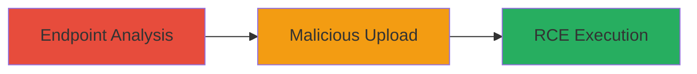

# Unrestricted File Upload Leading to RCE on Starbucks Mobile Site

Multi-stage attack chain demonstrating exploitation of an unrestricted file upload vulnerability on the .ashx endpoint of mobile.starbucks.com.sg, allowing arbitrary file uploads intended for images but leading to remote code execution (RCE).

## Chain Metrics Dashboard

| Metric | Value |
|--------|-------|
| Chain Status | Unverified |
| Total Steps | 2 |
| Execution Time | ~5 minutes |
| Skill Level | Intermediate |
| Complexity | Medium |
| Impact Level | High |

## Attack Flow Visualization



## Prerequisites & Requirements

### Required Tools

- [[tools/Burp-Suite]]

### Target Environment

- Web platform with ASP.NET
- Publicly accessible .ashx endpoint
- No authentication required for upload

### Initial Access Requirements

- Network access to mobile.starbucks.com.sg
- No prior credentials needed
- Basic web proxy setup for interception

## Detailed Attack Procedures

### Step 1: Analyze Endpoint for File Upload
procedure: [[procedures/Analyze-Endpoint-for-File-Upload]]

**Objective**: Identify the .ashx endpoint and confirm it allows unrestricted file uploads without type validation.

**Instructions**: Use [[tools/Burp-Suite]] to intercept requests to the mobile site and analyze the upload functionality. Send a test image file to the endpoint and inspect the response for any validation bypass opportunities.

**Expected Output**: Server accepts the file without errors, confirming lack of type checks.

**Success Indicators**:
- File upload succeeds for non-image types
- No validation errors in response

### Step 2: Exploit Unrestricted File Upload for RCE
procedure: [[procedures/Exploit-Unrestricted-File-Upload-for-RCE]]

**Objective**: Upload a malicious file (e.g., ASPX webshell) to the server and execute code remotely.

**Instructions**: Craft a malicious ASPX file with RCE payload. Use [[commands/curl-upload-file]] to POST the file to the .ashx endpoint:

```bash
curl -X POST -F "file=@malicious.aspx" https://mobile.starbucks.com.sg/upload.ashx
```

Then access the uploaded file via browser or curl to trigger execution:

```bash
curl https://mobile.starbucks.com.sg/uploads/malicious.aspx?cmd=whoami
```

**Expected Output**: Server executes the command and returns output, such as the web server user.

**Success Indicators**:
- Malicious file uploaded successfully
- Command execution response received
- Evidence of RCE, like system info leak

## Attack Chain Summary

### Key Achievements

1. Identified vulnerable .ashx endpoint allowing arbitrary uploads
2. Bypassed file type restrictions to upload executable code
3. Achieved remote code execution on the Starbucks mobile server

## Technique & Tactic Coverage

### MITRE ATT&CK Techniques

- [[Exploit Public-Facing Application]]
- [[Remote File Copy]]

### MITRE ATT&CK Tactics

- [[Initial Access]]
- [[Execution]]

---
*Last updated: 2023-10-01T12:00:00Z*
