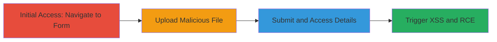

---
tags:
  - unrestricted-upload
  - xss
  - rce
  - file-upload
  - web-vulnerability
type: attack_chain
tools:
  - '[[tools/Malicious-HTML-Payload-for-XSS-and-PHP-Shell]]'
tactics:
  - '[[Initial Access]]'
  - '[[Execution]]'
verified: false
platforms:
  - Web
submitted: true
complexity: medium
created_at: '2023-10-01T00:00:00Z'
procedures:
  - '[[procedures/Access-and-Fill-Request-Form]]'
  - '[[procedures/Upload-Malicious-HTML-Payload]]'
  - '[[procedures/Submit-Request-and-Access-Details]]'
  - '[[procedures/Trigger-XSS-and-Observe-PHP-Shell]]'
step_count: 4
techniques:
  - '[[Remote File Copy]]'
  - '[[JavaScript]]'
updated_at: '2025-12-14T03:46:37.465Z'
description: >-
  Exploits an unrestricted file upload vulnerability in a web request form to
  upload malicious HTML containing XSS payloads and PHP shell code, enabling
  stored XSS execution and potential remote code execution upon file access.
skill_level: intermediate
impact_level: high
id: 062dd339-e9e0-41fd-8d9c-1bda398b9d89
validated: true
mitre_tactics:
  - '[[Initial Access]]'
  - '[[Execution]]'
mitre_techniques:
  - '[[Remote File Copy]]'
  - '[[JavaScript]]'
---
# Unrestricted File Upload Leading to Stored XSS and Potential RCE

Multi-stage attack chain demonstrating exploitation of an unrestricted file upload in a web-based request form, allowing upload of HTML files with embedded XSS JavaScript and PHP shell code. This leads to stored XSS execution when the file is viewed and potential remote code execution if the server processes the PHP code.

## Chain Metrics Dashboard

| Metric | Value |
|--------|-------|
| Chain Status | Unverified |
| Total Steps | 4 |
| Execution Time | ~5 minutes |
| Skill Level | Intermediate |
| Complexity | Medium |
| Impact Level | High |

## Attack Flow Visualization

## Prerequisites & Requirements

### Required Tools

- [[tools/Malicious-HTML-Payload-for-XSS-and-PHP-Shell]]

### Target Environment

- Web platform with XPages (.xsp) and PHP support
- Access to the /request?openform endpoint
- No authentication required for initial form access

### Initial Access Requirements

- Direct network access to the target web application
- Browser for manual interaction
- Prepared malicious HTML file

## Detailed Attack Procedures

### Step 1: Access and Fill Request Form
procedure: [[procedures/Access-and-Fill-Request-Form]]

**Objective**: Gain entry to the vulnerable file upload form by navigating and providing basic details.

**Instructions**: Open a web browser and navigate to the request form endpoint. Fill in the required fields on the initial page, submit to proceed to the next page, and enter additional details including any necessary form data.

**Expected Output**: Redirection to the second form page with upload option visible.

**Success Indicators**:
- Form loads successfully
- Submission redirects without errors

### Step 2: Upload Malicious HTML Payload
procedure: [[procedures/Upload-Malicious-HTML-Payload]]

**Objective**: Select and upload the HTML file containing XSS and PHP shell code to the form.

**Instructions**: On the form page, locate the file upload field near the bottom, click 'browse', and select the prepared malicious HTML file (e.g., unsure1.html) with embedded JavaScript for XSS and PHP code for shell functionality.

**Expected Output**: File selected and ready for submission.

**Success Indicators**:
- File upload field accepts the HTML file
- No immediate validation errors

### Step 3: Submit Request and Access Details
procedure: [[procedures/Submit-Request-and-Access-Details]]

**Objective**: Submit the form to store the file and retrieve the request details using the document number.

**Instructions**: Click 'submit request' to process the upload. Note the 14-digit Document Number generated. Navigate to the modification page (e.g., ModifyRequest.xsp) and enter the document number to view the request details page.

**Expected Output**: Request details page loads, showing the uploaded file link at the bottom.

**Success Indicators**:
- Submission succeeds
- Document number is generated and details page accessible

### Step 4: Trigger XSS and Observe PHP Shell
procedure: [[procedures/Trigger-XSS-and-Observe-PHP-Shell]]

**Objective**: Access the uploaded file to execute the stored XSS payload and check for PHP shell processing.

**Instructions**: On the request details page, scroll to the bottom and click the uploaded file link (unsure1.html). Alternatively, access the direct URL to the file (e.g., /4f4d0c69ea2b33a58525858a001e2b8c/$FILE/unsure1.html) to trigger the payload.

**Expected Output**: XSS JavaScript executes (e.g., alert or session hijacking attempt), and if server processes PHP, shell interface appears.

**Success Indicators**:
- XSS payload triggers (e.g., JavaScript alert)
- PHP shell code is interpreted for RCE potential

## Attack Chain Summary

### Key Achievements

1. Successful upload of malicious HTML bypassing file type restrictions
2. Stored XSS execution leading to potential session hijacking
3. Establishment of PHP shell for remote code execution if server misconfiguration allows

## Technique & Tactic Coverage

### MITRE ATT&CK Techniques

- [[Remote File Copy]] Ingress Tool Transfer
- [[JavaScript]] JavaScript

### MITRE ATT&CK Tactics

- [[Initial Access]] Initial Access
- [[Execution]] Execution

---
*Last updated: 2023-10-01T00:00:00Z*
