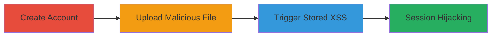

---
tags:
  - unrestricted-file-upload
  - stored-xss
  - web-vulnerability
type: attack_chain
tools: []
tactics:
  - '[[Execution]]'
verified: false
platforms:
  - Web
submitted: true
complexity: medium
created_at: '2024-01-01T00:00:00Z'
procedures:
  - '[[procedures/Create-User-Account-on-Web-Application]]'
  - '[[procedures/Upload-Malicious-HTML-File-as-Certificate]]'
  - '[[procedures/Access-Uploaded-File-to-Execute-XSS-Payload]]'
step_count: 3
techniques:
  - '[[Remote File Copy]]'
  - '[[JavaScript]]'
updated_at: '2025-12-14T03:15:41.710Z'
description: >-
  A multi-stage attack exploiting an unrestricted file upload vulnerability in a
  web application's certificate feature to store and trigger malicious HTML
  containing JavaScript, resulting in stored XSS for session hijacking.
skill_level: intermediate
impact_level: high
id: 6150860c-d68a-4920-8b52-2268788fb82c
validated: true
mitre_tactics:
  - '[[Execution]]'
mitre_techniques:
  - '[[Remote File Copy]]'
  - '[[JavaScript]]'
---
# Unrestricted File Upload Leading to Stored XSS in Certificate Upload Feature

Multi-stage attack chain demonstrating a complete attack workflow exploiting a web application's certificate upload feature.

## Chain Metrics Dashboard

| Metric | Value |
|--------|-------|
| Chain Status | Unverified |
| Total Steps | 3 |
| Execution Time | ~5 minutes |
| Skill Level | Intermediate |
| Complexity | Medium |
| Impact Level | High |

## Attack Flow Visualization

## Prerequisites & Requirements

### Required Tools

- Web browser (e.g., Chrome, Firefox)

### Target Environment

- Web application with certificate upload feature
- Accessible registration and login endpoints
- No specific ports required beyond standard HTTPS (443)

### Initial Access Requirements

- Public access to the web application
- No prior credentials needed
- Internet connection for browser-based actions

## Detailed Attack Procedures

### Step 1: Create Account
procedure: [[procedures/Create-User-Account-on-Web-Application]]

**Objective**: Gain initial access to the application by registering a new user account, enabling navigation to the certificate upload section.

**Instructions**: Open a web browser and navigate to the registration endpoint. Fill out the basic information form with valid details such as name, email, and password. Submit the form to complete registration.

**Expected Output**: Successful registration confirmation and redirection to the login page or dashboard.

**Success Indicators**:
- Account creation success message
- Ability to log in with new credentials

### Step 2: Upload Malicious File
procedure: [[procedures/Upload-Malicious-HTML-File-as-Certificate]]

**Objective**: Exploit the unrestricted file upload by submitting a malicious HTML file disguised as a certificate, which gets stored on the server without validation.

**Instructions**: Log in to the application using the newly created credentials. Navigate to the 'certification' tab. Prepare an HTML file named 'xss.html' containing ``. Click the upload button and select the malicious file as the certificate attachment. Submit the upload form.

**Expected Output**: Upload success message, with the file stored and listed in the certification section.

**Success Indicators**:
- File appears in the certification tab attachments
- No error on upload despite invalid file type

### Step 3: Trigger XSS
procedure: [[procedures/Access-Uploaded-File-to-Execute-XSS-Payload]]

**Objective**: Access the stored malicious file to execute the embedded JavaScript payload, demonstrating stored XSS that could steal cookies or perform other actions in the victim's browser context.

**Instructions**: In the certification tab, locate the uploaded 'xss.html' attachment. Right-click or use the open option to view it in a new browser tab. The file will be served from the application's file endpoint, executing the JavaScript.

**Expected Output**: Alert box displaying document cookies, confirming XSS execution.

**Success Indicators**:
- JavaScript alert pops up with cookie data
- Potential for further exploitation like session theft if viewed by other users

## Attack Chain Summary

### Key Achievements

1. Bypassed file upload restrictions to store arbitrary HTML on the server
2. Achieved stored XSS execution in the context of authenticated users
3. Demonstrated potential for cookie theft and session hijacking

## Technique & Tactic Coverage

### MITRE ATT&CK Techniques

- [[Remote File Copy]] Ingress Tool Transfer
- [[JavaScript]] JavaScript

### MITRE ATT&CK Tactics

- [[Execution]] Execution

---

*Last updated: 2024-01-01T00:00:00Z*
