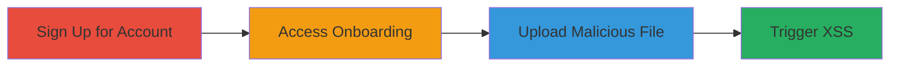

# Unrestricted File Upload Leading to Stored XSS in Uber Eats Restaurant Onboarding

Multi-stage attack chain demonstrating exploitation of an unrestricted file upload vulnerability in the Uber Eats restaurant signup and onboarding process to achieve stored cross-site scripting (XSS).

## Chain Metrics Dashboard

| Metric | Value |
|--------|-------|
| Chain Status | Unverified |
| Total Steps | 4 |
| Execution Time | ~10 minutes |
| Skill Level | Intermediate |
| Complexity | Medium |
| Impact Level | High |

## Attack Flow Visualization

## Prerequisites & Requirements

### Required Tools

- Web browser (e.g., Chrome, Firefox)

### Target Environment

- Web platform
- Uber Eats restaurant signup service at https://www.ubereats.com/restaurant/en-CA/signup
- No specific ports or services beyond standard HTTPS (443)

### Initial Access Requirements

- Public internet access
- No credentials required for initial signup
- Ability to complete basic registration form

## Detailed Attack Procedures

### Step 1: Sign Up for Uber Eats Restaurant Account
procedure: [[procedures/Sign-Up-for-Uber-Eats-Restaurant-Account]]

**Objective**: Create a new restaurant account to gain access to the onboarding process.

**Instructions**: Navigate to the signup page and fill out the registration form with basic details such as restaurant name, email, and phone number. Submit the form to complete initial registration.

**Expected Output**: Confirmation of account creation and redirection to the onboarding dashboard.

**Success Indicators**:
- Account signup successful
- Access granted to onboarding features

### Step 2: Access the Onboarding Process and Menu Addition Feature
procedure: [[procedures/Access-Onboarding-Menu-Addition-Feature]]

**Objective**: Navigate to the menu addition section during onboarding to locate the file upload functionality.

**Instructions**: After signup, proceed through the onboarding wizard until reaching the menu setup area. Select the option to add menu items, which exposes the file upload interface for images or menu files.

**Expected Output**: Interface for uploading files as part of menu addition.

**Success Indicators**:
- Onboarding menu addition page loaded
- File upload endpoint accessible

### Step 3: Upload a Malicious HTML or SVG File
procedure: [[procedures/Upload-Malicious-HTML-or-SVG-File]]

**Objective**: Exploit the lack of file type validation to upload a file containing JavaScript payload.

**Instructions**: Prepare an HTML or SVG file with embedded JavaScript, such as one containing ``. Use the upload form to submit the file without any restrictions blocking HTML/SVG extensions.

**Expected Output**: Upload confirmation and the file stored on the server.

**Success Indicators**:
- File uploaded successfully
- No validation errors on file type

### Step 4: View the Uploaded File to Trigger XSS
procedure: [[procedures/View-Uploaded-File-to-Trigger-Stored-XSS]]

**Objective**: Access the uploaded content to execute the stored XSS payload in the browser.

**Instructions**: Navigate to the location where the uploaded file is served, such as the menu preview or file list. The server responds with Content-Disposition: inline, rendering the file directly in the browser and executing the JavaScript.

**Expected Output**: JavaScript alert or other payload execution, demonstrating XSS.

**Success Indicators**:
- Payload executes (e.g., alert box appears)
- Potential for session hijacking if targeting other users

## Attack Chain Summary

### Key Achievements

1. Successful account creation to access vulnerable features
2. Exploitation of unrestricted upload to inject malicious content
3. Triggering of stored XSS for client-side code execution
4. Potential for broader attacks like session theft

## Technique & Tactic Coverage

### MITRE ATT&CK Techniques

- [[Exploit Public-Facing Application]]
- [[JavaScript]]
- [[Remote File Copy]]

### MITRE ATT&CK Tactics

- [[Initial Access]]
- [[Execution]]

---
*Last updated: 2023-10-01T00:00:00Z*
