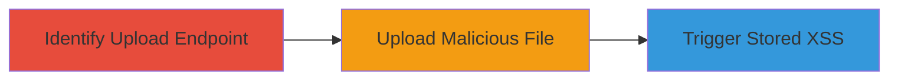

# Unrestricted File Upload Leading to Stored XSS on Starbucks Campaign Site

Multi-stage attack chain demonstrating exploitation of an unrestricted file upload vulnerability on the Starbucks Singapore campaign site to achieve stored XSS.

## Chain Metrics Dashboard

| Metric | Value |
|--------|-------|
| Chain Status | Unverified |
| Total Steps | 3 |
| Execution Time | ~5 minutes |
| Skill Level | Intermediate |
| Complexity | Medium |
| Impact Level | High |

## Attack Flow Visualization



## Prerequisites & Requirements

### Required Tools

- None (uses standard HTTP clients like curl or browser)

### Target Environment

- Web application (e.g., campaign.starbucks.com.sg)
- Accessible via HTTPS
- No authentication required for upload endpoint

### Initial Access Requirements

- Public network access to the target site
- No credentials needed
- Basic knowledge of web APIs

## Detailed Attack Procedures

### Step 1: Identify the File Upload Endpoint
procedure: [[procedures/Identify-Unrestricted-File-Upload-Endpoint]]

**Objective**: Locate and analyze the unrestricted file upload API endpoint to confirm lack of validation.

**Instructions**: Inspect the website's network traffic or documentation to find upload endpoints. Use browser developer tools or [[commands/curl-endpoint-probe]] to test the endpoint:

```bash
curl -X POST https://campaign.starbucks.com.sg/api/upload -F "file=@test.txt" -v
```

Analyze the response for success indicators like 200 OK without errors.

**Expected Output**: Server accepts the upload without rejecting the file type or content.

**Success Indicators**:
- Endpoint responds with success (e.g., 200 status)
- No validation errors for arbitrary files

### Step 2: Exploit Unrestricted File Upload
procedure: [[procedures/Exploit-Unrestricted-File-Upload-with-Malicious-Payload]]

**Objective**: Upload a malicious file containing an XSS payload to the server.

**Instructions**: Prepare a file with XSS payload (e.g., test.html with `<script>alert('XSS')</script>`). Upload using [[commands/curl-malicious-upload]]:

```bash
curl -X POST https://campaign.starbucks.com.sg/api/upload -F "file=@test.html" -v
```

Verify upload by checking server response or accessing the stored file path if returned.

**Expected Output**: File uploaded successfully, possibly with a storage path or ID.

**Success Indicators**:
- Upload succeeds without restrictions
- Malicious file is stored on the server

### Step 3: Trigger Stored XSS
procedure: [[procedures/Trigger-Stored-XSS-via-Uploaded-Content]]

**Objective**: Access the uploaded content to execute the stored XSS payload in users' browsers.

**Instructions**: Navigate to the page or resource where the uploaded file is rendered. If the path is known (e.g., from upload response), visit it directly. Use [[commands/curl-access-content]] to fetch and inspect:

```bash
curl https://campaign.starbucks.com.sg/path/to/uploaded/content -v
```

Observe JavaScript execution in the browser console or via alert.

**Expected Output**: XSS payload executes, e.g., alert box or console log.

**Success Indicators**:
- JavaScript from uploaded file runs in victim's context
- Potential for data theft or session hijacking

## Attack Chain Summary

### Key Achievements

1. Discovered unrestricted upload endpoint allowing arbitrary files.
2. Uploaded malicious HTML with XSS payload.
3. Achieved stored XSS impacting users viewing the content.

## Technique & Tactic Coverage

### MITRE ATT&CK Techniques

- [[Exploit Public-Facing Application]]
- [[JavaScript]]

### MITRE ATT&CK Tactics

- [[Initial Access]]
- [[Execution]]

---
*Last updated: 2023-10-01T00:00:00Z*
