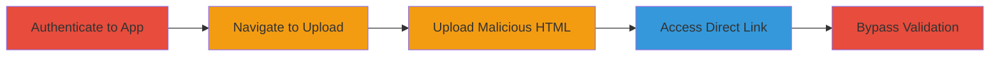

# Unrestricted File Upload Leading to XSS via Email Signature in Lemlist

Multi-stage attack chain demonstrating exploitation of a file upload vulnerability in Lemlist's email signature feature to upload and execute malicious HTML content.

## Chain Metrics Dashboard

| Metric | Value |
|--------|-------|
| Chain Status | Unverified |
| Total Steps | 5 |
| Execution Time | ~5 minutes |
| Skill Level | Intermediate |
| Complexity | Medium |
| Impact Level | High |

## Attack Flow Visualization

## Prerequisites & Requirements

### Required Tools

- Web browser (e.g., Chrome with developer tools)
- Valid Lemlist account credentials

### Target Environment

- Web application: https://app.lemlist.com
- Services: AWS S3 for file storage
- Network access: Direct internet access to the application

### Initial Access Requirements

- Authenticated user account on Lemlist
- No special privileges required beyond standard user access

## Detailed Attack Procedures

### Step 1: Authenticate to the Application
procedure: [[procedures/Exploit-Unrestricted-File-Upload-in-Lemlist]]

**Objective**: Gain authenticated access to the Lemlist dashboard to reach the upload feature.

**Instructions**: Open a web browser and navigate to https://app.lemlist.com. Enter valid credentials to log in.

**Expected Output**: Successful login redirect to the dashboard.

**Success Indicators**:
- Dashboard loads without errors
- User profile visible in the interface

### Step 2: Navigate to the File Upload Feature
procedure: [[procedures/Exploit-Unrestricted-File-Upload-in-Lemlist]]

**Objective**: Locate the email signature settings where the vulnerable upload functionality exists.

**Instructions**: From the dashboard, go to Settings > Email Signature. Click the 3 dots menu and select Upload File.

**Expected Output**: Upload interface appears, allowing file selection.

**Success Indicators**:
- Upload dialog opens
- No access restrictions encountered

### Step 3: Upload a Malicious File
procedure: [[procedures/Exploit-Unrestricted-File-Upload-in-Lemlist]]

**Objective**: Upload an HTML file containing malicious client-side code, such as JavaScript for XSS.

**Instructions**: Prepare a file named page.html with content like ``. Select and upload it via the interface.

**Expected Output**: File uploads successfully and appears in the signature list.

**Success Indicators**:
- Upload confirmation message
- File listed in the interface

### Step 4: Access the Uploaded File
procedure: [[procedures/Exploit-Unrestricted-File-Upload-in-Lemlist]]

**Objective**: Retrieve the direct link to the uploaded file and execute its content.

**Instructions**: Right-click the uploaded file in the interface to copy its direct link (an AWS S3 URL). Paste the link into a new browser tab and visit it to trigger the HTML execution.

**Expected Output**: The HTML content renders, executing any embedded scripts (e.g., alert popup for XSS).

**Success Indicators**:
- S3 URL accessible without authentication
- Malicious code executes client-side

### Step 5: Bypass Initial Fix by Spoofing Content-Type
procedure: [[procedures/Exploit-Unrestricted-File-Upload-in-Lemlist]]

**Objective**: Circumvent the post-fix API key check by modifying the upload request to disguise HTML as an image.

**Instructions**: Use browser developer tools or a proxy like Burp Suite to intercept the upload request. Change the Content-Type header to image/png while keeping the HTML payload. Replay the request.

**Expected Output**: File accepted and stored despite the fix, accessible via S3 link.

**Success Indicators**:
- Upload succeeds post-fix
- Direct link still serves executable HTML

## Attack Chain Summary

### Key Achievements

1. Successful upload of arbitrary HTML files without validation
2. Execution of client-side code via public S3 links
3. Bypass of initial mitigation using header spoofing

## Technique & Tactic Coverage

### MITRE ATT&CK Techniques

- [[Exploit Public-Facing Application]]
- [[JavaScript]]

### MITRE ATT&CK Tactics

- [[Initial Access]]
- [[Execution]]

---
*Last updated: 2023-10-01T00:00:00Z*
