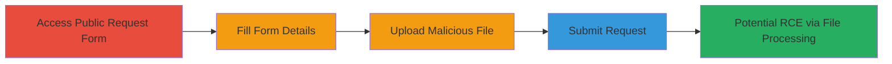

---
tags:
  - unrestricted-file-upload
  - rce
  - web-vulnerability
  - coldfusion
type: attack_chain
tools: []
tactics:
  - '[[Initial Access]]'
  - '[[Execution]]'
verified: false
platforms:
  - Web
  - ColdFusion
submitted: true
complexity: low
created_at: '2023-10-01T00:00:00Z'
procedures:
  - '[[procedures/Navigate-to-DoD-Request-Form]]'
  - '[[procedures/Enter-Email-and-Fill-Form]]'
  - '[[procedures/Access-Upload-Tab]]'
  - '[[procedures/Upload-Malicious-File]]'
  - '[[procedures/Submit-Request-with-Attachment]]'
step_count: 6
techniques:
  - '[[Exploit Public-Facing Application]]'
  - '[[Remote File Copy]]'
updated_at: '2025-12-14T05:32:10.275Z'
description: >-
  Multi-stage attack exploiting an unrestricted file upload vulnerability in the
  U.S. Department of Defense's public request submission system, allowing
  attachment of malicious executables or scripts to support requests,
  potentially enabling remote code execution if processed by staff.
skill_level: beginner
impact_level: high
id: 307cc0cf-ba61-4f34-8296-ef68b2d3bcf4
validated: true
mitre_tactics:
  - '[[Initial Access]]'
  - '[[Execution]]'
mitre_techniques:
  - '[[Exploit Public-Facing Application]]'
  - '[[Remote File Copy]]'
---
# Unrestricted File Upload in DoD Request Submission System Leading to Potential RCE

Multi-stage attack chain demonstrating exploitation of an unrestricted file upload in the DoD's public request submission system. Attackers can upload malicious files like executables (.exe) or PHP scripts without validation, attaching them to support requests. If a staff member opens the file or if it's web-accessible, it could lead to remote code execution or web shell deployment. The system limits uploads to 5MB but enforces no type restrictions.

## Chain Metrics Dashboard

| Metric | Value |
|--------|-------|
| Chain Status | Unverified |
| Total Steps | 6 |
| Execution Time | ~5 minutes |
| Skill Level | Beginner |
| Complexity | Low |
| Impact Level | High |

## Attack Flow Visualization

## Prerequisites & Requirements

### Required Tools

- Web browser (e.g., Chrome, Firefox)

### Target Environment

- Publicly accessible DoD request submission system
- ColdFusion-based web application
- No authentication required for initial access

### Initial Access Requirements

- Internet access to the public site
- No credentials needed
- Knowledge of the request form URL

## Detailed Attack Procedures

### Step 1: Navigate to New Request Page
procedure: [[procedures/Navigate-to-DoD-Request-Form]]

**Objective**: Gain access to the public request creation interface to begin the submission process.

**Instructions**: Open a web browser and navigate to the DoD public site request form. Click the button to create a new request.

**Expected Output**: The new request form loads, displaying fields for submission.

**Success Indicators**:
- Form page is accessible without errors
- 'Create a New Request' option is visible and clickable

### Step 2: Enter Email Address
procedure: [[procedures/Enter-Email-and-Fill-Form]]

**Objective**: Initiate the form by providing an email address to proceed to the full request details.

**Instructions**: In the initial form, enter a valid-looking email address (e.g., test@example.com) and submit to advance.

**Expected Output**: The form progresses to the detailed request fields.

**Success Indicators**:
- Email field accepts input
- Submission button works and loads the next page

### Step 3: Fill Out Request Form Fields
procedure: [[procedures/Enter-Email-and-Fill-Form]]

**Objective**: Complete the required fields to enable the file upload option.

**Instructions**: Fill in all mandatory fields such as request description, category, and any other details (specifics redacted for sensitivity). Ensure the form is valid to reach the upload stage.

**Expected Output**: Form fields are populated, and the 'Upload Files' tab becomes available.

**Success Indicators**:
- No validation errors on fields
- Upload tab is accessible before submission

### Step 4: Access Upload Files Tab
procedure: [[procedures/Access-Upload-Tab]]

**Objective**: Switch to the file attachment interface to prepare for malicious upload.

**Instructions**: Before submitting the form, click on the 'Upload Files' tab to open the file selection dialog.

**Expected Output**: Upload interface appears, allowing file selection.

**Success Indicators**:
- Tab switches without errors
- File browser dialog opens

### Step 5: Upload Malicious File
procedure: [[procedures/Upload-Malicious-File]]

**Objective**: Attach a potentially harmful file to the request without type restrictions.

**Instructions**: Select a test file under 5MB, such as a .exe installer or a PHP script containing malicious code (e.g., a simple web shell). Confirm the upload.

**Expected Output**: File is accepted and listed as attached to the request.

**Success Indicators**:
- Upload succeeds for non-standard types like .exe or .php
- No rejection message for file type
- File size limit (5MB) is the only check

### Step 6: Submit the Request
procedure: [[procedures/Submit-Request-with-Attachment]]

**Objective**: Finalize the submission to attach the malicious file to a support ticket.

**Instructions**: Review the form and click 'Submit' to send the request with the uploaded file.

**Expected Output**: Request is submitted successfully; file is attached (though deleted post-report in testing).

**Success Indicators**:
- Confirmation of submission
- No errors on file attachment
- Potential for file to be processed by DoD staff

## Attack Chain Summary

### Key Achievements

1. Successful upload of unrestricted file types to a government system
2. Attachment of executables and scripts to legitimate support requests
3. Demonstration of potential RCE vector through staff interaction or web access

## Technique & Tactic Coverage

### MITRE ATT&CK Techniques

- [[Exploit Public-Facing Application]] Exploit Public-Facing Application
- [[Remote File Copy]] Ingress Tool Transfer

### MITRE ATT&CK Tactics

- [[Initial Access]] Initial Access
- [[Execution]] Execution

---
*Last updated: 2023-10-01T00:00:00Z*
