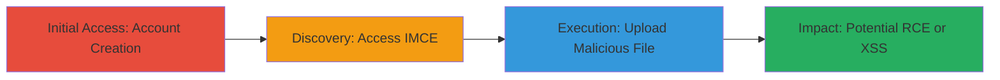

---
tags:
  - file-upload
  - unrestricted-upload
  - drupal
  - imce
  - php
  - rce
  - bypass
type: attack_chain
tools: []
tactics:
  - '[[Initial Access]]'
  - '[[Execution]]'
commands: []
platforms:
  - Web
complexity: medium
procedures:
  - '[[procedures/Create-User-Account-on-Acronis-Forum]]'
  - '[[procedures/Access-IMCE-File-Manager-via-Profile-Signature-Edit]]'
  - '[[procedures/Bypass-Extension-Validation-to-Upload-PHP-Shell]]'
step_count: 3
techniques:
  - '[[Exploit Public-Facing Application]]'
  - '[[Remote File Copy]]'
description: >-
  Authenticated unrestricted file upload vulnerability in the Drupal IMCE module
  on the Acronis forum, allowing bypass of extension checks to upload PHP shells
  disguised as images for potential remote code execution.
skill_level: intermediate
impact_level: high
id: dda1c998-02f8-4f0a-ae6b-5fd23683aca0
created_at: '2025-12-14T05:32:10.080Z'
updated_at: '2025-12-14T05:32:10.080Z'
verified: false
validated: true
submitted: true
mitre_tactics:
  - '[[Initial Access]]'
  - '[[Execution]]'
mitre_techniques:
  - '[[Exploit Public-Facing Application]]'
  - '[[Remote File Copy]]'
---
# Unrestricted File Upload in IMCE Leading to Arbitrary PHP Execution on Acronis Forum

## Overview

This attack chain exploits an unrestricted file upload vulnerability in the IMCE file manager module of a Drupal-based forum on Acronis.com. By creating an authenticated account and accessing the signature editor, an attacker can bypass file extension validation to upload arbitrary files, such as PHP shells disguised with allowed image extensions like .gif. If the uploaded file is processed by the server, it could lead to remote code execution, cross-site scripting (XSS), or other impacts like cryptojacking. The vulnerability stems from insufficient validation in the IMCE module (related to CVE-2006-7109), allowing authenticated users to insert malicious files into forum signatures.

## Chain Metrics Dashboard

| Metric | Value |
|--------|-------|
| Chain Status | Unverified |
| Total Steps | 3 |
| Execution Time | ~5 minutes |
| Skill Level | Intermediate |
| Complexity | Medium |
| Impact Level | High |

## Attack Flow Visualization

## Prerequisites & Requirements

### Required Tools

- Web browser (e.g., Firefox or Chrome with developer tools for inspection)

### Target Environment

- Web platform: Drupal-based forum at https://forum.acronis.com
- Required services/ports: HTTP/HTTPS on port 443
- Network access requirements: Internet access to the public forum

### Initial Access Requirements

- No prior credentials needed; account creation is open
- Attacker must be able to register a new user
- Basic understanding of web file upload mechanics

## Detailed Attack Procedures

### Step 1: Initial Access
procedure: [[procedures/Create-User-Account-on-Acronis-Forum]]

**Objective**: Gain authenticated access to the forum to enable profile editing and file upload features.

**Instructions**: Navigate to the forum registration page and complete the signup process with valid email and credentials. Verify the account via email if required.

**Expected Output**: Successful login and access to user profile.

**Success Indicators**:
- Account creation confirmation
- Ability to log in and view profile

### Step 2: Discovery
procedure: [[procedures/Access-IMCE-File-Manager-via-Profile-Signature-Edit]]

**Objective**: Locate and access the IMCE file manager through the forum's signature editing interface to prepare for file upload.

**Instructions**: Log in, navigate to profile edit, and select the signature section to invoke the IMCE interface for image insertion.

**Expected Output**: IMCE file manager window opens, allowing file selection.

**Success Indicators**:
- Signature editor loads with IMCE option
- Endpoint like /imce?sendto=... is accessible

### Step 3: Execution
procedure: [[procedures/Bypass-Extension-Validation-to-Upload-PHP-Shell]]

**Objective**: Upload a malicious PHP file by appending an allowed extension to bypass restrictions, potentially enabling code execution.

**Instructions**: In the IMCE interface, select a PHP file containing shell code (e.g., <?php system($_GET['cmd']); ?>) and rename it to end with .gif (e.g., shell.php.gif). Upload and insert into signature. Verify upload by checking if the file is stored and accessible.

**Expected Output**: File uploads successfully and appears in the signature preview.

**Success Indicators**:
- Upload completes without error
- File is served from the server (e.g., via direct URL access)
- If executable, test with parameter to confirm RCE

## Attack Chain Summary

### Key Achievements

1. Authenticated access to vulnerable upload endpoint
2. Bypass of file type restrictions for arbitrary file upload
3. Potential for remote code execution or script injection on the server

## Technique & Tactic Coverage

### MITRE ATT&CK Techniques

- [[Exploit Public-Facing Application]] Exploit Public-Facing Application
- [[Remote File Copy]] Ingress Tool Transfer

### MITRE ATT&CK Tactics

- [[Initial Access]] Initial Access
- [[Execution]] Execution

---
*Last updated: 2023-10-01*
