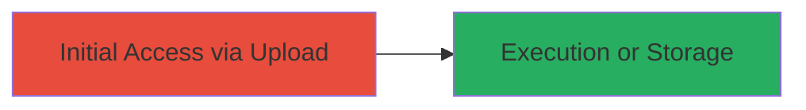

---
tags:
  - unrestricted-upload
  - file-upload
  - rce
  - web-vulnerability
type: attack_chain
tools: []
tactics:
  - '[[Initial Access]]'
  - '[[Execution]]'
verified: false
platforms:
  - Web
submitted: true
complexity: low
created_at: '2023-10-01T00:00:00Z'
procedures:
  - '[[procedures/Upload-Dangerous-Files-via-Linktree-Image-Endpoint]]'
step_count: 1
techniques:
  - '[[Exploit Public-Facing Application]]'
  - '[[Remote File Copy]]'
updated_at: '2025-12-14T05:32:13.332Z'
description: >-
  Attack chain exploiting the lack of file type validation in Linktree's image
  upload feature to upload executable files like PHP, APK, and ZIP, enabling
  potential remote code execution or arbitrary file storage.
skill_level: beginner
impact_level: high
id: 17fc29c5-626f-40c6-8b18-73445a277dd9
validated: true
mitre_tactics:
  - '[[Initial Access]]'
  - '[[Execution]]'
mitre_techniques:
  - '[[Exploit Public-Facing Application]]'
  - '[[Remote File Copy]]'
---
# Unrestricted File Upload in Linktree Image Feature Allowing Dangerous File Types

Multi-stage attack chain demonstrating a complete attack workflow.

## Chain Metrics Dashboard

| Metric | Value |
|--------|-------|
| Chain Status | Unverified |
| Total Steps | 1 |
| Execution Time | ~5 minutes |
| Skill Level | Beginner |
| Complexity | Low |
| Impact Level | High |

## Attack Flow Visualization



## Prerequisites & Requirements

### Required Tools

- Web browser or [[commands/curl-upload-file]]

### Target Environment

- Linktree web application
- Access to image upload feature
- No specific ports or services beyond standard HTTPS (443)

### Initial Access Requirements

- Valid user account on Linktree (authenticated session)
- Network access to Linktree's upload endpoint
- No prior access needed beyond registration

## Detailed Attack Procedures

### Step 1: Exploit Image Upload for Dangerous Files
procedure: [[procedures/Upload-Dangerous-Files-via-Linktree-Image-Endpoint]]

**Objective**: Upload non-image files such as PHP scripts, APK packages, or ZIP archives through the image upload feature to achieve potential code execution or unintended file storage.

**Instructions**: Authenticate to Linktree and navigate to the image upload section. Prepare a malicious file (e.g., a simple PHP webshell). Use [[commands/curl-upload-file]] to simulate the upload if testing manually, or use the web interface to select the file:

```bash
curl -X POST -F "file=@malicious.php" -H "Cookie: session=your_session" https://linktree.com/api/upload-image
```

Verify the upload by checking if the file is accessible via the returned URL or service storage.

**Expected Output**: Successful upload response with file URL or confirmation; file stored without rejection.

**Success Indicators**:
- File upload succeeds without error
- Uploaded file (e.g., .php) is retrievable and executable if PHP
- Service acts as unintended storage for APK/ZIP

## Attack Chain Summary

### Key Achievements

1. Bypassed file type validation to upload executable content
2. Enabled potential remote code execution via PHP files
3. Demonstrated misuse of service for arbitrary file storage

## Technique & Tactic Coverage

### MITRE ATT&CK Techniques

- [[Exploit Public-Facing Application]]
- [[Remote File Copy]]

### MITRE ATT&CK Tactics

- [[Initial Access]]
- [[Execution]]

---
*Last updated: 2023-10-01T00:00:00Z*
