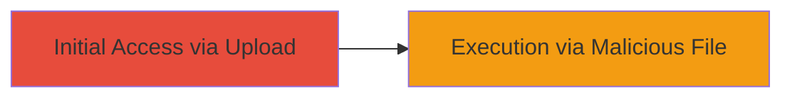

# Unrestricted File Upload in Linktree Image Feature Leading to RCE and Unauthorized Storage

Multi-stage attack chain demonstrating exploitation of Linktree's image upload vulnerability for uploading dangerous files.

## Chain Metrics Dashboard

| Metric | Value |
|--------|-------|
| Chain Status | Unverified |
| Total Steps | 1 |
| Execution Time | ~5 minutes |
| Skill Level | Beginner |
| Complexity | Low |
| Impact Level | High |

## Attack Flow Visualization



## Prerequisites & Requirements

### Required Tools

- Web browser or [[commands/curl-file-upload-test]]

### Target Environment

- Linktree web platform
- Access to user account with image upload permissions
- No specific ports or services beyond standard HTTPS

### Initial Access Requirements

- Valid Linktree user session (login required)
- Network access to Linktree's web interface
- No prior elevated access needed

## Detailed Attack Procedures

### Step 1: Exploit File Upload Vulnerability
procedure: [[procedures/Exploit-Linktree-Unrestricted-File-Upload]]

**Objective**: Upload malicious files such as PHP shells, APK, or ZIP archives through the image upload feature to achieve RCE or unauthorized storage.

**Instructions**: Navigate to the Linktree profile editor where image uploads are allowed. Instead of an image, select a malicious file (e.g., a PHP file with code execution payload). Submit the upload. If successful, the file is stored without validation, accessible via a direct URL for execution or download.

Use [[commands/curl-file-upload-test]] to simulate the upload via API if the endpoint is known:

```bash
curl -X POST -F "file=@malicious.php" -H "Cookie: session=your_session" https://linktree.com/api/upload-image
```

**Expected Output**: Server response confirming upload success, with file URL returned or accessible.

**Success Indicators**:
- File uploads without error despite non-image type
- Uploaded file accessible via URL (e.g., https://linktree.com/uploads/malicious.php)
- For PHP: Remote code execution by accessing the URL with parameters

## Attack Chain Summary

### Key Achievements

1. Successful upload of dangerous file types bypassing validation
2. Potential remote code execution on server via PHP upload
3. Unauthorized use of service as file storage for arbitrary files

## Technique & Tactic Coverage

### MITRE ATT&CK Techniques

- [[Remote File Copy]]
- [[Exploit Public-Facing Application]]

### MITRE ATT&CK Tactics

- [[Execution]]
- [[Initial Access]]

---
*Last updated: 2023-10-01T00:00:00Z*
