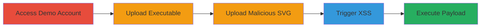

# Unrestricted File Upload in Nextcloud Contacts Leading to Stored XSS

Multi-stage attack chain demonstrating exploitation of the Nextcloud Contacts app's image upload feature, which lacks file type validation, allowing arbitrary file uploads including executables and malicious SVGs for stored XSS execution.

## Chain Metrics Dashboard

| Metric | Value |
|--------|-------|
| Chain Status | Unverified |
| Total Steps | 4 |
| Execution Time | ~5 minutes |
| Skill Level | Intermediate |
| Complexity | Medium |
| Impact Level | High |

## Attack Flow Visualization

## Prerequisites & Requirements

### Required Tools

- Web browser (e.g., Chrome or Firefox)

### Target Environment

- Nextcloud instance with Contacts app enabled
- Web platform
- No specific ports or services beyond standard HTTP/HTTPS

### Initial Access Requirements

- Access to a Nextcloud demo or user account
- No prior credentials needed for demo
- Network access to the Nextcloud instance

## Detailed Attack Procedures

### Step 1: Access Nextcloud Demo Account
procedure: [[procedures/Access-Nextcloud-Demo-Account]]

**Objective**: Gain initial access to a Nextcloud instance via the public demo to test the Contacts app.

**Instructions**: Navigate to the Nextcloud website and use the connection wizard to register with the demo provider.

**Expected Output**: Logged-in session in the Nextcloud demo environment, with access to the Contacts app.

**Success Indicators**:
- Successful login to demo account
- Contacts app visible in the interface

### Step 2: Upload Arbitrary Executable as Contact Image
procedure: [[procedures/Upload-Arbitrary-Executable-as-Contact-Image]]

**Objective**: Demonstrate unrestricted file upload by uploading an executable file as a contact image, bypassing intended image-only restrictions.

**Instructions**: Create or edit a contact, access the image upload popup, and select an executable file like SimpleCrackMe.exe for upload.

**Expected Output**: The executable file is accepted and stored as the contact's image without validation errors.

**Success Indicators**:
- File upload succeeds without type checks
- Executable appears as contact image thumbnail

### Step 3: Upload Malicious SVG for Stored XSS
procedure: [[procedures/Upload-Malicious-SVG-for-Stored-XSS]]

**Objective**: Upload a specially crafted SVG file containing JavaScript payload to store XSS in the contact image field.

**Instructions**: Prepare an SVG file with embedded script (e.g., evilsvgfile.svg), then upload it via the contact image popup.

**Expected Output**: Malicious SVG is stored and displayed as the contact image.

**Success Indicators**:
- SVG upload accepted
- No sanitization of embedded scripts during storage

### Step 4: Trigger Stored XSS in Contact Image
procedure: [[procedures/Trigger-Stored-XSS-in-Contact-Image]]

**Objective**: Execute the stored XSS payload by interacting with the uploaded image, leading to JavaScript execution in the browser.

**Instructions**: Open the contact, click the image, right-click, and select 'Open image in a new tab' to render the SVG and trigger the script.

**Expected Output**: JavaScript from the SVG executes, potentially alerting or performing malicious actions in the browser context.

**Success Indicators**:
- Script execution confirmed (e.g., alert popup)
- Potential for session hijacking or data theft if payload is advanced

## Attack Chain Summary

### Key Achievements

1. Bypassed file upload restrictions to store arbitrary executables in Nextcloud.
2. Exploited lack of SVG sanitization for stored XSS persistence.
3. Demonstrated impact on users viewing contacts, enabling browser-based attacks.

## Technique & Tactic Coverage

### MITRE ATT&CK Techniques

- [[Remote File Copy]]
- [[JavaScript]]

### MITRE ATT&CK Tactics

- [[Execution]]

---
*Last updated: 2023-10-01T00:00:00Z*
