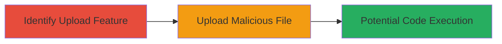

---
tags:
  - unrestricted-file-upload
  - malicious-upload
  - web-vulnerability
  - rce-risk
type: attack_chain
tools: []
tactics:
  - '[[Initial Access]]'
  - '[[Execution]]'
commands: []
platforms:
  - Web
complexity: low
procedures:
  - '[[procedures/Exploit-Unrestricted-File-Upload]]'
step_count: 2
techniques:
  - '[[Remote File Copy]]'
  - '[[Exploit Public-Facing Application]]'
description: >-
  Attack chain exploiting insufficient file extension validation in the
  Moneybird web application's attachment upload feature, allowing upload of
  potentially executable files like .exe or .php, leading to risks of code
  execution or other security breaches.
skill_level: beginner
impact_level: high
id: a617d323-3c42-499e-b415-99d937c763af
created_at: '2025-12-14T05:32:10.137Z'
updated_at: '2025-12-14T05:32:10.137Z'
verified: false
validated: true
submitted: true
mitre_tactics:
  - '[[Initial Access]]'
  - '[[Execution]]'
mitre_techniques:
  - '[[Remote File Copy]]'
  - '[[Exploit Public-Facing Application]]'
---
# Unrestricted File Upload of Malicious Extensions in Moneybird Attachments

Multi-stage attack chain demonstrating a complete attack workflow.

## Chain Metrics Dashboard

| Metric | Value |
|--------|-------|
| Chain Status | Unverified |
| Total Steps | 2 |
| Execution Time | ~5 minutes |
| Skill Level | Beginner |
| Complexity | Low |
| Impact Level | High |

## Attack Flow Visualization

## Prerequisites & Requirements

### Required Tools

- Web browser or HTTP client for file uploads

### Target Environment

- Web application with attachment upload functionality (e.g., Moneybird platform)
- No specific services/ports required beyond standard HTTPS (443)
- Network access to the target web application

### Initial Access Requirements

- Valid user account or public access to the upload feature
- No prior credentials needed if upload is unauthenticated
- Ability to interact with the web interface

## Detailed Attack Procedures

### Step 1: Identify and Test Attachment Upload Feature
procedure: [[procedures/Exploit-Unrestricted-File-Upload]]

**Objective**: Locate the file upload mechanism and test for extension validation weaknesses by attempting to upload files with dangerous extensions.

**Instructions**: Navigate to the attachment upload section in the web application. Prepare a test file renamed with a malicious extension such as .exe or .php (e.g., create a harmless text file and rename it to test.php). Use the browser's upload interface to submit the file.

**Expected Output**: The upload request is processed without error, and the file appears in the attachment list or is stored on the server.

**Success Indicators**:
- Upload succeeds without rejection
- No error messages about invalid file types
- File is accessible or downloadable post-upload

### Step 2: Upload Malicious File
procedure: [[procedures/Exploit-Unrestricted-File-Upload]]

**Objective**: Confirm the vulnerability by successfully uploading a file with a restricted extension, enabling potential exploitation such as code execution if the server processes the file.

**Instructions**: Using the same upload feature, submit a file with a confirmed malicious extension (e.g., a PHP webshell renamed to shell.php). Monitor the response for successful storage. If the application serves or executes uploaded files, attempt to access the file via a crafted URL to trigger execution.

**Expected Output**: File uploads without blocking, confirming lack of extension filtering; potential server-side execution if the file is processed.

**Success Indicators**:
- File stored on server without validation errors
- Ability to download or access the uploaded file
- Evidence of code execution (e.g., if .php, server-side script runs)

## Attack Chain Summary

### Key Achievements

1. Identified weak file upload validation in the attachment feature
2. Successfully bypassed restrictions to upload executable files
3. Demonstrated risk of remote code execution or malware distribution

## Technique & Tactic Coverage

### MITRE ATT&CK Techniques

- [[Remote File Copy]]
- [[Exploit Public-Facing Application]]

### MITRE ATT&CK Tactics

- [[Initial Access]]
- [[Execution]]

---
*Last updated: 2023-10-01*
