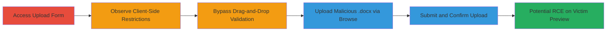

# Unrestricted File Upload on Salesforce Leading to Follina RCE

Multi-stage attack chain exploiting a lack of server-side file validation in Reddit's Salesforce-based advertising help form at https://reddit.secure.force.com/adhelp. Client-side JavaScript restricts uploads to image and PDF files during drag-and-drop, but the 'Click to browse' option bypasses this, allowing arbitrary file uploads. A malicious .docx file exploiting CVE-2022-30190 (Follina vulnerability) can be uploaded, leading to potential zero-click RCE if a victim (e.g., Reddit staff) previews it in Microsoft Word with Explorer details view enabled.

## Chain Metrics Dashboard

| Metric | Value |
|--------|-------|
| Chain Status | Unverified |
| Total Steps | 5 |
| Execution Time | ~5 minutes |
| Skill Level | Intermediate |
| Complexity | Medium |
| Impact Level | High |

## Attack Flow Visualization



## Prerequisites & Requirements

### Required Tools

- Web browser (e.g., Chrome) for initial access and testing
- Base64 encoder for preparing malicious .docx payload
- [[commands/curl-http-post-upload]]

### Target Environment

- Salesforce instance: https://reddit.secure.force.com/adhelp
- Services: Salesforce Apex (AdvertisingHelpController.uploadFile method)
- Tech Stack: JavaScript (client-side), Salesforce Apex (server-side)
- No authentication required for the form

### Initial Access Requirements

- Public internet access to the target URL
- No credentials needed; form is publicly accessible
- Prepare a malicious .docx file exploiting CVE-2022-30190 (Follina)

## Detailed Attack Procedures

### Step 1: Access the Advertising Help Form
procedure: [[procedures/Bypass-Client-Side-Validation-for-Malicious-File-Upload]]

**Objective**: Navigate to the vulnerable upload form and identify allowed file types.

**Instructions**: Open a web browser and visit https://reddit.secure.force.com/adhelp. Locate the file upload section in the advertising help form, which specifies allowed types: jpg, jpeg, gif, png, pdf.

**Expected Output**: Form loads with drag-and-drop area and 'Click to browse' option visible.

**Success Indicators**:
- Form accessible without errors
- Upload section displays client-side restrictions

### Step 2: Attempt Drag-and-Drop Upload of .docx File
procedure: [[procedures/Bypass-Client-Side-Validation-for-Malicious-File-Upload]]

**Objective**: Test client-side validation to confirm it blocks non-allowed file types during drag-and-drop.

**Instructions**: Prepare a test .docx file and drag it into the upload area. Observe the JavaScript validation blocking the upload.

**Expected Output**: Upload rejected with a client-side error message indicating invalid file type.

**Success Indicators**:
- Drag-and-drop blocked for .docx
- Validation message appears

### Step 3: Use 'Click to Browse' to Bypass Restriction
procedure: [[procedures/Bypass-Client-Side-Validation-for-Malicious-File-Upload]]

**Objective**: Bypass the drag-and-drop JavaScript restriction by using the alternative upload method.

**Instructions**: Click the 'Click to browse' button, select the .docx file, and initiate the upload process. This path lacks the same client-side checks.

**Expected Output**: File selection succeeds without immediate rejection; upload proceeds to submission.

**Success Indicators**:
- File selected via browse without validation error
- Upload interface allows progression

### Step 4: Submit the Malicious File Upload
procedure: [[procedures/Bypass-Client-Side-Validation-for-Malicious-File-Upload]]

**Objective**: Send the base64-encoded malicious .docx to the server via POST request.

**Instructions**: Use [[commands/curl-http-post-upload]] to send a POST request to /adhelp/apexremote with the JSON payload containing the base64-encoded .docx (exploiting Follina CVE-2022-30190), filename 'Dummy Data.docx', and other required parameters like CSRF token and visitor ID.

```bash
curl -X POST https://reddit.secure.force.com/adhelp/apexremote \
  -H "Content-Type: application/json" \
  -d '{"action":"AdvertisingHelpController","method":"uploadFile","data":["BASE64_ENCODED_DOCX_CONTENT","","Dummy Data.docx","5005c000017FCu8AAG","118.70.7.113"],"type":"rpc","tid":3,"ctx":{"csrf":"VmpFPSxNakF5TWkwd05pMHlNMVF3T0Rvek1qb3lOQzQ0TURCYSxPeVQ1SlZBcnRoajJZQlJFKVc3QVlvLE5HVXhPRGN6","vid":"0661J000003FS4V","ns":"","ver":41}}'
```

Replace BASE64_ENCODED_DOCX_CONTENT with the actual base64 of your malicious .docx. Obtain CSRF and VID from the form's initial load.

**Expected Output**: Request sent successfully.

**Success Indicators**:
- No client-side block
- Request transmitted to server

### Step 5: Receive Successful Upload Response
procedure: [[procedures/Bypass-Client-Side-Validation-for-Malicious-File-Upload]]

**Objective**: Confirm server-side upload without validation, indicating vulnerability success.

**Instructions**: Monitor the response from the POST request. The server lacks filetype checks, so it processes the upload.

**Expected Output**: HTTP/1.1 200 OK with JSON: {"statusCode":200, "result":"00P5c00001leROKEA2"}.

**Success Indicators**:
- 200 OK response
- Result ID returned (e.g., 00P5c00001leROKEA2)
- File uploaded; potential for victim RCE if previewed

## Attack Chain Summary

### Key Achievements

1. Bypassed client-side file type restrictions via 'Click to browse'
2. Uploaded arbitrary .docx exploiting Follina (CVE-2022-30190)
3. Demonstrated lack of server-side validation in Salesforce Apex
4. Enabled potential zero-click RCE on Microsoft Word preview

## Technique & Tactic Coverage

### MITRE ATT&CK Techniques

- [[Exploit Public-Facing Application]] Exploit Public-Facing Application
- [[Remote File Copy]] Ingress Tool Transfer
- [[Exploitation for Client Execution]] Exploitation for Client Execution

### MITRE ATT&CK Tactics

- [[Initial Access]] Initial Access
- [[Execution]] Execution

---

*Last updated: 2023-10-01T00:00:00Z*
