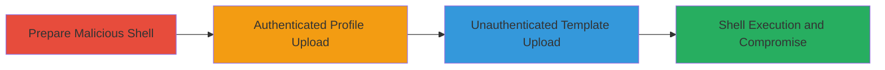

---
tags:
  - unrestricted-file-upload
  - web-shell
  - rce
  - php
type: attack_chain
tools:
  - '[[tools/r57-PHP-Web-Shell]]'
tactics:
  - '[[Initial Access]]'
  - '[[Execution]]'
verified: false
platforms:
  - Web
submitted: true
complexity: medium
created_at: '2023-10-01T00:00:00Z'
procedures:
  - '[[procedures/Prepare-Polyglot-PHP-Web-Shell-for-Upload]]'
  - '[[procedures/Exploit-Authenticated-File-Upload-in-Profile-Settings]]'
  - '[[procedures/Exploit-Unauthenticated-File-Upload-in-Template-Order]]'
step_count: 3
techniques:
  - '[[Exploit Public-Facing Application]]'
  - '[[Server Software Component]]'
updated_at: '2025-12-14T05:32:10.257Z'
description: >-
  Exploits unrestricted file upload vulnerabilities in Stripo's profile picture
  and template order features to upload and execute a PHP web shell, leading to
  web server compromise.
skill_level: intermediate
impact_level: high
id: 990c4dff-7304-4cd5-a5b6-bf70933ecf5f
validated: true
mitre_tactics:
  - '[[Initial Access]]'
  - '[[Execution]]'
mitre_techniques:
  - '[[Exploit Public-Facing Application]]'
  - '[[Server Software Component]]'
---
# Unrestricted File Upload to Deploy PHP Web Shell on Stripo Email Services

Multi-stage attack chain demonstrating unrestricted file upload vulnerabilities on Stripo Inc's platforms, allowing deployment of a PHP web shell for server compromise.

## Chain Metrics Dashboard

| Metric | Value |
|--------|-------|
| Chain Status | Unverified |
| Total Steps | 3 |
| Execution Time | ~10 minutes |
| Skill Level | Intermediate |
| Complexity | Medium |
| Impact Level | High |

## Attack Flow Visualization

## Prerequisites & Requirements

### Required Tools

- [[tools/r57-PHP-Web-Shell]]

### Target Environment

- Web platform with PHP backend
- Access to https://my.stripo.email and https://stripo.email
- No special ports or services beyond standard HTTP/HTTPS

### Initial Access Requirements

- Internet access
- For authenticated upload: Valid user account (can be created during attack)
- No prior credentials needed for unauthenticated path

## Detailed Attack Procedures

### Step 1: Prepare Malicious Shell
procedure: [[procedures/Prepare-Polyglot-PHP-Web-Shell-for-Upload]]

**Objective**: Create a polyglot file containing PHP web shell code disguised as an allowed file type to bypass extension checks.

**Instructions**: Download a PHP web shell like r57 and rename it with a .jpg or .txt extension using a text editor. Ensure the file starts with valid image or text headers followed by PHP code (e.g., <?php system($_GET['cmd']); ?>).

**Expected Output**: A file named shell.jpg or shell.txt that contains executable PHP code.

**Success Indicators**:
- File saves without errors
- Opening in a text editor shows both the disguise header and PHP payload

### Step 2: Authenticated Profile Upload
procedure: [[procedures/Exploit-Authenticated-File-Upload-in-Profile-Settings]]

**Objective**: Upload the disguised shell via the profile picture feature after creating an account, storing it on the server for later execution.

**Instructions**: Register a new account on https://my.stripo.email, navigate to profile settings, and upload the prepared shell.jpg as the profile picture. Confirm the upload success message.

**Expected Output**: Server response: 'User icon has been saved'.

**Success Indicators**:
- Upload completes without rejection
- Profile picture updates, indicating file storage on server
- Access the uploaded file URL to verify (e.g., attempt to execute via ?cmd=whoami if MIME type allows)

### Step 3: Unauthenticated Template Upload
procedure: [[procedures/Exploit-Unauthenticated-File-Upload-in-Template-Order]]

**Objective**: Upload the shell via the public template order page without authentication, enabling direct server access.

**Instructions**: Visit https://stripo.email/template-order/, use the 'Click or Drop file here' section to upload shell.jpg or shell.txt. Confirm acceptance.

**Expected Output**: File upload succeeds without errors.

**Success Indicators**:
- File is accepted and stored
- Retrieve the file path and test execution (e.g., access with PHP parameters to run commands)
- Server compromise indicators like command output from shell

## Attack Chain Summary

### Key Achievements

1. Bypassed file type restrictions using polyglot files
2. Deployed PHP web shell on both authenticated and unauthenticated endpoints
3. Enabled full web server takeover, including command execution and file manipulation

## Technique & Tactic Coverage

### MITRE ATT&CK Techniques

- [[Exploit Public-Facing Application]]
- [[Server Software Component]]

### MITRE ATT&CK Tactics

- [[Initial Access]]
- [[Execution]]

---
*Last updated: 2023-10-01T00:00:00Z*
