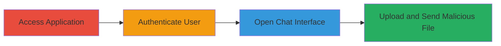

---
tags:
  - unrestricted-file-upload
  - rce
  - web-vulnerability
  - intercom
type: attack_chain
tools: []
tactics:
  - '[[Initial Access]]'
  - '[[Execution]]'
verified: false
platforms:
  - Web
submitted: true
complexity: low
created_at: '2023-10-01T00:00:00Z'
procedures:
  - '[[procedures/Unrestricted-File-Upload-via-OWOX-Chat]]'
step_count: 4
techniques:
  - '[[Exploit Public-Facing Application]]'
  - '[[Remote File Copy]]'
updated_at: '2025-12-14T05:32:10.586Z'
description: >-
  Multi-stage attack exploiting unrestricted file upload in the OWOX chat
  interface to upload dangerous file types like .php or .rb, potentially leading
  to server-side code execution or other exploits via third-party hosting.
skill_level: beginner
impact_level: high
id: e43ade91-6bea-4f02-92a2-0e82e92424e8
validated: true
mitre_tactics:
  - '[[Initial Access]]'
  - '[[Execution]]'
mitre_techniques:
  - '[[Exploit Public-Facing Application]]'
  - '[[Remote File Copy]]'
---
# Unrestricted File Upload via OWOX Chat Window Enabling Potential Code Execution

Multi-stage attack chain demonstrating exploitation of an unrestricted file upload vulnerability in the OWOX application's chat window, allowing upload of dangerous files such as .php or .rb without validation. This can lead to high-severity impacts like server-side code execution via web shells, client-side XSS attacks, or exploitation of other application components, though files are hosted on third-party Intercom services and may not be directly executable in the app's context.

## Chain Metrics Dashboard

| Metric | Value |
|--------|-------|
| Chain Status | Unverified |
| Total Steps | 4 |
| Execution Time | ~2 minutes |
| Skill Level | Beginner |
| Complexity | Low |
| Impact Level | High |

## Attack Flow Visualization

## Prerequisites & Requirements

### Required Tools

- Web browser (e.g., Chrome, Firefox)

### Target Environment

- Web platform
- OWOX application at https://bi.owox.com/
- Intercom chat service integration
- No specific ports required; standard HTTPS access

### Initial Access Requirements

- Valid user credentials for OWOX login
- Direct network access to the application (no VPN or prior compromise needed)

## Detailed Attack Procedures

### Step 1: Access and Authenticate
procedure: [[procedures/Unrestricted-File-Upload-via-OWOX-Chat]]

**Objective**: Gain access to the authenticated application interface to reach the chat feature.

**Instructions**: Open a web browser and navigate to the OWOX login page. Enter valid credentials to sign in, establishing an authenticated session.

**Expected Output**: Successful login redirecting to the dashboard or main interface.

**Success Indicators**:
- User is logged in and can access application features
- No authentication errors

### Step 2: Open Chat Interface
procedure: [[procedures/Unrestricted-File-Upload-via-OWOX-Chat]]

**Objective**: Access the vulnerable chat window powered by Intercom for file upload.

**Instructions**: Once authenticated, locate and interact with the chat widget or button in the application interface to open the chat window.

**Expected Output**: Chat interface loads, displaying input field and attachment options.

**Success Indicators**:
- Chat window is fully functional
- File attachment feature is visible

### Step 3: Select and Attach Malicious File
procedure: [[procedures/Unrestricted-File-Upload-via-OWOX-Chat]]

**Objective**: Prepare and attach a dangerous file type to exploit the lack of validation.

**Instructions**: In the chat window, click the attachment or upload icon, then select a file with a dangerous extension such as .php (e.g., a web shell) or .rb from your local system.

**Expected Output**: File is selected and appears in the upload preview without rejection.

**Success Indicators**:
- File attachment succeeds without error messages
- No validation warnings for file type

### Step 4: Submit Upload
procedure: [[procedures/Unrestricted-File-Upload-via-OWOX-Chat]]

**Objective**: Transmit the malicious file to the server, confirming successful upload.

**Instructions**: After attaching the file, add any optional message if needed, then click the send button to submit the upload via the chat interface.

**Expected Output**: File is uploaded and hosted on Intercom's third-party service; confirmation message or no errors in chat.

**Success Indicators**:
- Upload completes without restrictions
- File is accessible via the provided hosting link (if shared)

## Attack Chain Summary

### Key Achievements

1. Bypassed file type restrictions in chat upload
2. Successfully transmitted dangerous files like .php or .rb
3. Enabled potential for code execution or XSS if files are processed or downloaded

## Technique & Tactic Coverage

### MITRE ATT&CK Techniques

- [[Exploit Public-Facing Application]]
- [[Remote File Copy]]

### MITRE ATT&CK Tactics

- [[Initial Access]]
- [[Execution]]

---
*Last updated: 2023-10-01T00:00:00Z*
