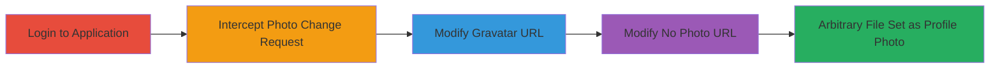

---
tags:
  - unrestricted-file-upload
  - web-vulnerability
  - parameter-tampering
type: attack_chain
tools:
  - '[[tools/Burp-Suite]]'
tactics:
  - '[[Initial Access]]'
commands: []
platforms:
  - Web
complexity: medium
procedures:
  - '[[procedures/Login-to-Web-Application]]'
  - '[[procedures/Intercept-Profile-Photo-Change-Request]]'
  - '[[procedures/Modify-Gravatar-URL-for-Arbitrary-Upload]]'
  - '[[procedures/Modify-No-Photo-URL-for-Arbitrary-Upload]]'
step_count: 4
techniques:
  - '[[Exploit Public-Facing Application]]'
description: >-
  Demonstrates exploitation of an unrestricted file upload vulnerability in the
  profile photo change feature by modifying the unchecked 'url' parameter in
  Gravatar and 'no photo' options to point to arbitrary non-image content.
skill_level: intermediate
impact_level: medium
id: 1582893c-5e6d-4631-a52b-fceb1e0bb855
created_at: '2025-12-14T05:32:13.262Z'
updated_at: '2025-12-14T05:32:13.262Z'
verified: false
validated: true
submitted: true
mitre_tactics:
  - '[[Initial Access]]'
mitre_techniques:
  - '[[Exploit Public-Facing Application]]'
---
# Unrestricted File Upload via Unvalidated Gravatar URL Parameter

Multi-stage attack chain demonstrating exploitation of a web application vulnerability allowing arbitrary file uploads through an unvalidated URL parameter in the profile photo feature.

## Chain Metrics Dashboard

| Metric | Value |
|--------|-------|
| Chain Status | Unverified |
| Total Steps | 4 |
| Execution Time | ~5 minutes |
| Skill Level | Intermediate |
| Complexity | Medium |
| Impact Level | Medium |

## Attack Flow Visualization

## Prerequisites & Requirements

### Required Tools

- [[tools/Burp-Suite]]

### Target Environment

- Web application platform
- Access to profile management features
- Valid user credentials

### Initial Access Requirements

- Valid login credentials for the target application
- Network access to https://auth.ratelimited.me
- Proxy tool configured for request interception

## Detailed Attack Procedures

### Step 1: Login to Application
procedure: [[procedures/Login-to-Web-Application]]

**Objective**: Authenticate to the application to access the profile photo change feature.

**Instructions**: Navigate to the login page and enter valid credentials to gain authenticated access.

**Expected Output**: Successful login redirect to the user dashboard or profile page.

**Success Indicators**:
- Authentication token or session established
- Access to user profile features granted

### Step 2: Intercept Profile Photo Change Request
procedure: [[procedures/Intercept-Profile-Photo-Change-Request]]

**Objective**: Capture the HTTP request for changing the profile photo using an interception tool.

**Instructions**: Configure Burp Suite as a proxy, navigate to the profile photo change section, and intercept the request when selecting photo options.

**Expected Output**: Intercepted POST or GET request visible in the proxy tool for modification.

**Success Indicators**:
- Request captured before submission
- Parameters like 'url' visible in the request body

### Step 3: Modify Gravatar URL for Arbitrary Upload
procedure: [[procedures/Modify-Gravatar-URL-for-Arbitrary-Upload]]

**Objective**: Alter the 'url' parameter to point to arbitrary non-image content, bypassing image restrictions.

**Instructions**: In the intercepted request for the Gravatar option, replace the 'url' value with a URL to non-image content (e.g., a .txt file) and forward the request.

**Expected Output**: The application fetches and sets the arbitrary file as the profile photo without validation errors.

**Success Indicators**:
- Profile photo updated to non-image content
- No rejection of the modified URL

### Step 4: Modify No Photo URL for Arbitrary Upload
procedure: [[procedures/Modify-No-Photo-URL-for-Arbitrary-Upload]]

**Objective**: Repeat the parameter modification for the 'no photo' option to confirm the vulnerability affects multiple paths.

**Instructions**: Intercept the 'no photo' option request, modify the 'url' parameter similarly to an arbitrary URL, and forward.

**Expected Output**: Arbitrary content set via the 'no photo' option, demonstrating broader impact.

**Success Indicators**:
- Vulnerability confirmed in multiple options
- Arbitrary file types accepted across features

## Attack Chain Summary

### Key Achievements

1. Bypassed image-only restrictions in direct uploads
2. Enabled setting of arbitrary file types as profile photos via URL fetching
3. Demonstrated lack of URL validation in Gravatar and 'no photo' options

## Technique & Tactic Coverage

### MITRE ATT&CK Techniques

- [[Exploit Public-Facing Application]]

### MITRE ATT&CK Tactics

- [[Initial Access]]

---
*Last updated: [TIMESTAMP]*
