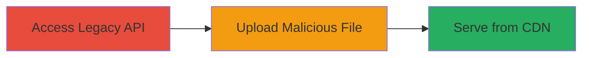

---
tags:
  - file-upload
  - unrestricted-upload
  - CWE-434
  - API
  - CDN
type: attack_chain
tools: []
tactics:
  - '[[Initial Access]]'
  - '[[Execution]]'
verified: false
platforms:
  - Web
submitted: true
complexity: low
created_at: '2023-10-01T00:00:00Z'
procedures:
  - '[[procedures/Access-Legacy-Image-Upload-API]]'
  - '[[procedures/Upload-Dangerous-File-Type-to-CDN]]'
step_count: 2
techniques:
  - '[[Exploit Public-Facing Application]]'
  - '[[Remote File Copy]]'
updated_at: '2025-12-14T05:32:13.158Z'
description: >-
  A multi-stage attack exploiting a legacy API endpoint lacking file type
  validation to upload malicious files directly to the organization's CDN,
  enabling public serving of dangerous content.
skill_level: intermediate
impact_level: high
id: 89f72297-d37b-4dd7-b762-703f01ebd989
validated: true
mitre_tactics:
  - '[[Initial Access]]'
  - '[[Execution]]'
mitre_techniques:
  - '[[Exploit Public-Facing Application]]'
  - '[[Remote File Copy]]'
---
# Unrestricted Upload of Dangerous File Type to Organizational CDN via Legacy Image API

Multi-stage attack chain demonstrating exploitation of a legacy API endpoint for unrestricted file uploads, leading to dangerous files being served from the CDN.

## Chain Metrics Dashboard

| Metric | Value |
|--------|-------|
| Chain Status | Unverified |
| Total Steps | 2 |
| Execution Time | ~5 minutes |
| Skill Level | Intermediate |
| Complexity | Low |
| Impact Level | High |

## Attack Flow Visualization



## Prerequisites & Requirements

### Required Tools

- None specific; standard HTTP client like curl.

### Target Environment

- Web platform with legacy API endpoint for image uploads.
- Access to CDN serving uploaded files publicly.
- No authentication required for the endpoint.

### Initial Access Requirements

- Public network access to the API endpoint.
- No prior credentials needed.

## Detailed Attack Procedures

### Step 1: Access Legacy Image Upload API

procedure: [[procedures/Access-Legacy-Image-Upload-API]]

**Objective**: Identify and interact with the legacy API endpoint designed for image uploads, which lacks file type restrictions.

**Instructions**: Use a tool like curl to probe the endpoint and confirm it accepts uploads without validation. Send a test request to the API URL, such as `https://api.example.com/upload-image`.

**Expected Output**: HTTP 200 response indicating successful access to the endpoint.

**Success Indicators**:
- Endpoint responds without errors.
- No MIME type checks are enforced in the response.

### Step 2: Upload Dangerous File Type to CDN

procedure: [[procedures/Upload-Dangerous-File-Type-to-CDN]]

**Objective**: Submit a file with a dangerous MIME type (e.g., executable or script) via the API, resulting in direct storage and public serving from the CDN.

**Instructions**: Prepare a malicious file (e.g., a PHP shell disguised as an image) and upload it using [[commands/curl-file-upload]]:

```bash
curl -X POST -F "file=@malicious.php" https://api.example.com/upload-image
```

Verify the upload by accessing the CDN URL provided in the response.

**Expected Output**: File uploaded successfully, with a CDN URL returned (e.g., https://cdn.example.com/malicious.php), and the file accessible publicly.

**Success Indicators**:
- File stored on CDN without rejection.
- Malicious file downloadable or executable from the public CDN link.

## Attack Chain Summary

### Key Achievements

1. Bypassed file type validation in legacy API.
2. Uploaded dangerous content directly to CDN.
3. Enabled potential execution of malicious files served publicly.

## Technique & Tactic Coverage

### MITRE ATT&CK Techniques

- [[Exploit Public-Facing Application]]
- [[Remote File Copy]]

### MITRE ATT&CK Tactics

- [[Initial Access]]
- [[Execution]]

---
*Last updated: 2023-10-01T00:00:00Z*
