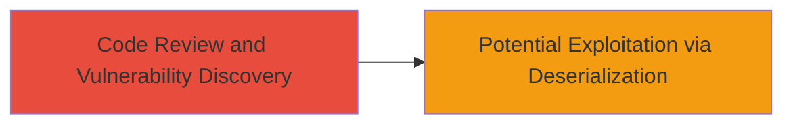

---
tags:
  - deserialization
  - yaml
  - rce
  - python
  - code-review
type: attack_chain
tools: []
tactics:
  - '[[Reconnaissance]]'
commands: []
platforms:
  - Web
  - Python
complexity: low
procedures:
  - '[[procedures/Identify-Unsafe-YAML-Deserialization]]'
step_count: 1
techniques:
  - '[[Hardware]]'
description: >-
  A vulnerability discovery and potential exploitation chain involving unsafe
  YAML deserialization in Liberapay's Python testing module, allowing arbitrary
  object construction and possible remote code execution.
skill_level: intermediate
impact_level: low
id: 1cce3879-a11a-4970-8fa3-b01407a78df4
created_at: '2025-12-14T17:23:54.021Z'
updated_at: '2025-12-14T17:23:54.021Z'
verified: false
validated: true
submitted: true
mitre_tactics:
  - '[[Reconnaissance]]'
mitre_techniques:
  - '[[Hardware]]'
---
# Unsafe YAML Deserialization Leading to Potential RCE in Liberapay

## Overview

This attack chain outlines the discovery of an unsafe deserialization vulnerability in the Liberapay project's Python codebase. The issue arises from using yaml.load() instead of the safer yaml.safe_load() in the testing module (liberapay/testing/vcr.py at line 40), which could allow arbitrary Python object construction from YAML data. If untrusted YAML were processed, this could lead to remote code execution (RCE). The vulnerability was identified through a manual code review of the GitHub repository. Due to the function only processing YAML files checked into the repository (trusted sources), the real-world impact is limited, resulting in low severity. The fix involved replacing yaml.load() with yaml.safe_load() to restrict deserialization to safe types like integers, lists, and strings.

## Chain Metrics Dashboard

| Metric | Value |
|--------|-------|
| Chain Status | Unverified |
| Total Steps | 1 |
| Execution Time | ~5 minutes |
| Skill Level | Intermediate |
| Complexity | Low |
| Impact Level | Low |

## Attack Flow Visualization

## Prerequisites & Requirements

### Required Tools

- GitHub access for repository review
- Basic text editor or IDE for code inspection

### Target Environment

- Python-based web application (e.g., Liberapay)
- Access to source code repository (public GitHub)
- PyYAML library in use

### Initial Access Requirements

- Public access to the GitHub repository
- No credentials needed for open-source review
- Knowledge of Python and YAML deserialization risks

## Detailed Attack Procedures

### Step 1: Code Review for Vulnerability Discovery
procedure: [[procedures/Identify-Unsafe-YAML-Deserialization]]

**Objective**: Review the target's codebase to identify unsafe deserialization patterns that could lead to arbitrary code execution.

**Instructions**: Access the Liberapay GitHub repository and navigate to the testing module at liberapay/testing/vcr.py. Inspect line 40 for the use of yaml.load(), which enables the construction of arbitrary Python objects. Compare against safe practices using yaml.safe_load(), which limits deserialization to basic types and prevents object instantiation.

**Expected Output**: Identification of vulnerable code snippet, such as `yaml.load(yaml_data)` in a context that processes YAML files.

**Success Indicators**:
- Vulnerable yaml.load() call confirmed
- Potential for RCE if untrusted input is introduced noted
- Recommendation to switch to yaml.safe_load() for mitigation

## Attack Chain Summary

### Key Achievements

1. Discovered unsafe deserialization in a production codebase via manual review
2. Assessed impact as potential RCE, though limited by trusted input sources
3. Highlighted fix via safer YAML loading function

## Technique & Tactic Coverage

### MITRE ATT&CK Techniques

- [[Hardware]]

### MITRE ATT&CK Tactics

- [[Reconnaissance]]

---
*Last updated: 2023-10-01*
