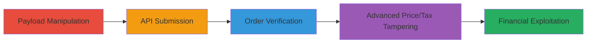

# Upserve OLO Total Price Manipulation via Negative Quantities and Arbitrary Prices

Multi-stage attack chain demonstrating exploitation of business logic errors in Upserve's Online Ordering (OLO) system, allowing attackers to reduce order totals through negative item quantities, arbitrary low prices, and zeroed taxes. Discovered via fuzzing and manual JSON payload modification, this leads to undercharging, financial losses for restaurants, and out-of-balance orders requiring manual reconciliation.

## Chain Metrics Dashboard

| Metric | Value |
|--------|-------|
| Chain Status | Unverified |
| Total Steps | 4 |
| Execution Time | ~5 minutes |
| Skill Level | Intermediate |
| Complexity | Medium |
| Impact Level | High |

## Attack Flow Visualization

## Prerequisites & Requirements

### Required Tools

- [[tools/order-py]]
- [[tools/order2-py]]

### Target Environment

- Web-based Upserve OLO platform
- Access to order submission API (e.g., via store_pretty_url like 'upserve-lounge-test-providence-2')
- No specific ports required; operates over HTTPS

### Initial Access Requirements

- Valid customer session or API access to place orders
- Network access to Upserve's OLO endpoints
- Basic knowledge of JSON structure for order payloads

## Detailed Attack Procedures

### Step 1: Payload Manipulation with Negative Quantity
procedure: [[procedures/Manipulate-Order-JSON-with-Negative-Quantity]]

**Objective**: Craft a tampered JSON payload by adding items with negative quantities to reduce the calculated total while maintaining client-side arithmetic consistency.

**Instructions**: Modify the order JSON in the 'charges.items' array to include a legitimate item (e.g., 2 ChickenBurgers at 1200 cents each) and a negative quantity item (e.g., BreadPudding at quantity -1 and price 900 cents). Adjust taxes to 290 cents and ensure the total is 1870 cents (2*1200 -1*900 + 290).

**Expected Output**: Validated JSON payload ready for submission, with manipulated total reflecting the discount.

**Success Indicators**:
- JSON parses without errors
- Client-side total calculation matches the tampered values

### Step 2: Submit Manipulated JSON to Order API
procedure: [[procedures/Submit-Manipulated-JSON-to-Order-API]]

**Objective**: Send the tampered payload to the Upserve OLO API endpoint to process the order with the reduced total.

**Instructions**: Use a Python script like [[tools/order-py]] to POST the JSON to the order submission endpoint, including store_pretty_url (e.g., 'upserve-lounge-test-providence-2'), submission_id, customer details, fulfillment_info for delivery, and a payments array.

**Expected Output**: API response confirming order placement with a confirmation_code (e.g., 'upserve-hacker-cafe-32870').

**Success Indicators**:
- HTTP 200/201 response
- Order ID generated without validation errors

### Step 3: Verify Order Acceptance and Reduced Charge
procedure: [[procedures/Verify-Order-Acceptance-and-Reduced-Charge]]

**Objective**: Confirm the system accepts the order and processes payment at the manipulated lower amount.

**Instructions**: Check the order history or confirmation details for the processed total (e.g., $18.70 charge) and ensure the negative quantity impacts the final billing without server-side rejection.

**Expected Output**: Order history screenshot or log showing the reduced total and out-of-balance items.

**Success Indicators**:
- Payment charged at manipulated amount
- Order stored in database with tampered values

### Step 4: Further Manipulate Prices and Taxes
procedure: [[procedures/Further-Manipulate-Prices-and-Taxes]]

**Objective**: Extend the exploitation by setting item prices to minimal values (e.g., 1 cent) and zeroing taxes to achieve even lower totals.

**Instructions**: Update the JSON in 'charges.items' to set prices to 1 cent, taxes to 0, and ensure the total matches client calculation. Submit via [[tools/order2-py]] to endpoints yielding orders like 'upserve-hacker-cafe-999999'.

**Expected Output**: Additional orders processed with near-zero charges, complicating restaurant reconciliation.

**Success Indicators**:
- Successful submission without tax/fee validation
- Database stores modified prices and zero taxes

## Attack Chain Summary

### Key Achievements

1. Successful reduction of order total using negative quantities, leading to undercharging.
2. API acceptance of arbitrary prices and zero taxes without server-side checks.
3. Creation of out-of-balance orders skewing analytics and requiring manual fixes.
4. Demonstration of scalable financial exploitation via repeated submissions.

## Technique & Tactic Coverage

### MITRE ATT&CK Techniques

- [[Exploit Public-Facing Application]]

### MITRE ATT&CK Tactics

- [[Initial Access]]

---
*Last updated: 2023-10-01T00:00:00Z*
