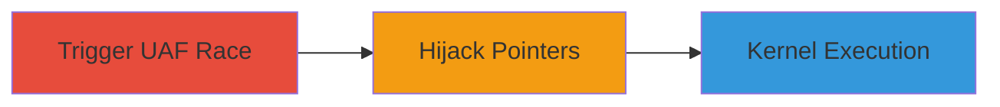

---
tags:
  - use-after-free
  - kernel-exploit
  - privilege-escalation
  - ipv6
  - race-condition
type: attack_chain
tools: []
tactics:
  - '[[Privilege Escalation]]'
  - '[[Execution]]'
commands: []
platforms:
  - FreeBSD
  - PlayStation 4
complexity: high
procedures:
  - '[[procedures/Trigger-Use-After-Free-via-Race-Condition-in-setsockopt]]'
  - '[[procedures/Hijack-Pointers-for-Kernel-Memory-Manipulation]]'
  - '[[procedures/Achieve-Kernel-Code-Execution-and-Privilege-Escalation]]'
step_count: 3
techniques:
  - '[[Exploitation for Privilege Escalation]]'
description: >-
  Exploitation of a use-after-free vulnerability in the IPV6_2292PKTOPTIONS
  setsockopt option leading to arbitrary kernel read/write and privilege
  escalation
skill_level: advanced
impact_level: high
id: ff95c3e1-79fc-4bcd-afcd-e0a1fc8cd755
created_at: '2025-12-11T06:10:28.822Z'
updated_at: '2025-12-11T06:10:28.822Z'
verified: false
validated: true
submitted: true
mitre_tactics:
  - '[[TA0004]]'
  - '[[TA0002]]'
mitre_techniques:
  - '[[T1068]]'
---
# Use-After-Free in IPV6_2292PKTOPTIONS for Kernel R/W and Privilege Escalation on PS4 and FreeBSD

Multi-stage attack chain demonstrating exploitation of a use-after-free vulnerability in the IPV6_2292PKTOPTIONS option of setsockopt on PS4 firmware 7.02 and FreeBSD systems. This leads to arbitrary kernel read/write primitives, kernel code execution, and local privilege escalation, potentially chainable with WebKit exploits for remote attacks.

## Chain Metrics Dashboard

| Metric | Value |
|--------|-------|
| Chain Status | Unverified |
| Total Steps | 3 |
| Execution Time | ~5 minutes |
| Skill Level | Advanced |
| Complexity | High |
| Impact Level | High |

## Attack Flow Visualization

## Prerequisites & Requirements

### Required Tools

- None explicitly required; custom PoC code needed for exploitation.

### Target Environment

- FreeBSD or PlayStation 4 (firmware 7.02)
- IPv6-enabled kernel
- Local access to execute code

### Initial Access Requirements

- Ability to run user-mode code on the target system
- No prior credentials needed beyond local execution

## Detailed Attack Procedures

### Step 1: Trigger Use-After-Free Race - [[procedures/Trigger-Use-After-Free-via-Race-Condition-in-setsockopt]]

**Procedure**: [[procedures/Trigger-Use-After-Free-via-Race-Condition-in-setsockopt]]

**Objective**: Identify and exploit the race condition in setsockopt with IPV6_2292PKTOPTIONS to trigger the use-after-free vulnerability.

**Expected Output**: Successful freeing of the struct ip6_pktopts buffer while it is being processed, leading to a dangling pointer.

**Success Indicators**:
- Race condition triggered without kernel panic
- Pointer to freed memory accessible for hijacking

First, set up a race between setsockopt calls to free the struct ip6_pktopts while it's handled by ip6_setpktopt. This exploits missing locks in the kernel.

Use a PoC that creates multiple threads or processes to call setsockopt concurrently with IPV6_2292PKTOPTIONS, timing the free operation during processing.

### Step 2: Hijack Pointers for Kernel R/W - [[procedures/Hijack-Pointers-for-Kernel-Memory-Manipulation]]

**Procedure**: [[procedures/Hijack-Pointers-for-Kernel-Memory-Manipulation]]

**Objective**: Manipulate pointers in the freed structure to gain arbitrary kernel read/write access.

**Expected Output**: Control over kernel memory via hijacked pointers like ip6po_pktinfo.

**Success Indicators**:
- Ability to read/write arbitrary kernel addresses
- No immediate system crash

Once the structure is freed, allocate new memory in its place and hijack pointers such as ip6po_pktinfo to point to attacker-controlled data. This allows reading and writing kernel memory primitives.

In the PoC, overwrite the freed slab with crafted data to redirect the pointer for R/W operations.

### Step 3: Execute Kernel Code and Escalate Privileges - [[procedures/Achieve-Kernel-Code-Execution-and-Privilege-Escalation]]

**Procedure**: [[procedures/Achieve-Kernel-Code-Execution-and-Privilege-Escalation]]

**Objective**: Leverage kernel R/W primitives to execute code in kernel mode and achieve local privilege escalation.

**Expected Output**: Root shell or kernel-level code execution, enabling further attacks like running pirated games or data manipulation.

**Success Indicators**:
- Successful privilege escalation to root
- Kernel code execution verified via PoC

Use the R/W primitives to patch kernel structures, inject code, or overwrite credentials for escalation. On PS4, chain with WebKit exploits for remote jailbreak.

## Attack Chain Summary

### Key Achievements

1. Triggered use-after-free for kernel memory control
2. Achieved arbitrary kernel R/W primitives
3. Executed kernel code leading to full system compromise

## Technique & Tactic Coverage

### MITRE ATT&CK Techniques

- [[Exploitation for Privilege Escalation]]

### MITRE ATT&CK Tactics

- [[Privilege Escalation]]
- [[Execution]]

*Last updated: 2023-10-01*
