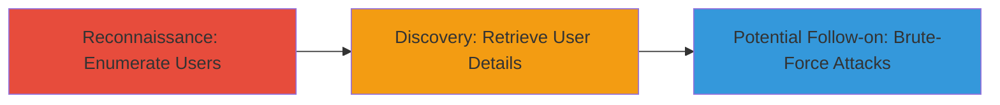

# User Enumeration via WordPress REST API Information Disclosure

Multi-stage attack chain demonstrating the exploitation of a WordPress REST API vulnerability to disclose user information without authentication. This chain targets sites running vulnerable versions of WordPress (e.g., 4.7), where the API exposes user data for those who have published posts, including admins. The narrative involves anonymous reconnaissance to list users and fetch details, which can lead to brute-force attacks or social engineering.

## Chain Metrics Dashboard

| Metric | Value |
|--------|-------|
| Chain Status | Unverified |
| Total Steps | 2 |
| Execution Time | ~1 minutes |
| Skill Level | Beginner |
| Complexity | Low |
| Impact Level | Medium |

## Attack Flow Visualization



## Prerequisites & Requirements

### Required Tools

- [[commands/curl-get-users]]
- [[commands/curl-get-user-id]]

### Target Environment

- Web platform running WordPress 4.7 or similar vulnerable versions
- REST API enabled (default in WordPress)
- No authentication required for public endpoints

### Initial Access Requirements

- Public network access to the target site (e.g., https://owncloud.com)
- No credentials needed
- Basic HTTP knowledge

## Detailed Attack Procedures

### Step 1: Enumerate All Users
procedure: [[procedures/Enumerate-Users-via-WordPress-REST-API]]

**Objective**: Anonymously list all users who have published posts via the WordPress REST API, exposing usernames including the admin.

**Instructions**: Use [[commands/curl-get-users]] to send a GET request to the users endpoint:

```bash
curl -s https://owncloud.com/wp-json/wp/v2/users/
```

**Expected Output**: A JSON array of user objects, each containing id, name, url, description, link, slug, avatar_urls, and meta data.

**Success Indicators**:
- JSON response with user list (e.g., {"id":1,"name":"admin","slug":"admin",...})
- At least one user entry visible without errors

### Step 2: Retrieve Specific User Details
procedure: [[procedures/Retrieve-Specific-User-Details-via-WordPress-REST-API]]

**Objective**: Fetch detailed information for a specific user (e.g., admin with ID 1) to gather additional sensitive data like descriptions or links.

**Instructions**: Use [[commands/curl-get-user-id]] to target a user ID from the previous step:

```bash
curl -s https://owncloud.com/wp-json/wp/v2/users/1
```

**Expected Output**: Detailed JSON for the user, including full name, bio, and avatar URLs.

**Success Indicators**:
- JSON response with user details (e.g., {"id":1,"name":"Admin User","description":"Site administrator",...})
- No 404 or authentication error

## Attack Chain Summary

### Key Achievements

1. Anonymous enumeration of all publishing users, revealing admin usernames
2. Retrieval of admin user details for targeted follow-on exploitation
3. Exposure of sensitive information without any authentication

## Technique & Tactic Coverage

### MITRE ATT&CK Techniques

- [[Account Discovery]]

### MITRE ATT&CK Tactics

- [[Discovery]]

---
*Last updated: 2023-10-01T12:00:00Z*
