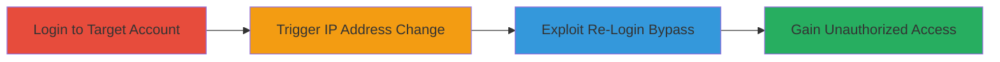

# VK.com 2FA Bypass via Insufficient IP Address Change Verification

Multi-stage attack chain demonstrating a complete attack workflow exploiting VK.com's re-login mechanism during IP address changes to bypass 2FA enforcement.

## Chain Metrics Dashboard

| Metric | Value |
|--------|-------|
| Chain Status | Unverified |
| Total Steps | 3 |
| Execution Time | ~5 minutes |
| Skill Level | Intermediate |
| Complexity | Medium |
| Impact Level | High |

## Attack Flow Visualization

## Prerequisites & Requirements

### Required Tools

- Web browser (e.g., Chrome with developer tools for session inspection)

### Target Environment

- VK.com web platform
- Active user account with 2FA enabled
- Ability to change IP address (e.g., via VPN or mobile hotspot)

### Initial Access Requirements

- Valid credentials for the target VK.com account
- Network access to VK.com
- No prior session hijacking needed, but session cookies from initial login

## Detailed Attack Procedures

### Step 1: Initial Account Login

procedure: [[procedures/Bypass-VK-2FA-via-IP-Change-Re-Login]]

**Objective**: Establish a valid session on the target VK.com account with 2FA enforced to set up the exploitation context.

**Instructions**: Navigate to VK.com in a web browser and log in using the target's credentials. Complete the 2FA verification process to obtain a full authenticated session. Inspect the session cookies using browser developer tools to note any IP-related session bindings.

**Expected Output**: Successful login with access to the account dashboard, 2FA code verified.

**Success Indicators**:
- Account dashboard accessible
- No immediate logout or verification prompts

### Step 2: Trigger IP Address Change

procedure: [[procedures/Bypass-VK-2FA-via-IP-Change-Re-Login]]

**Objective**: Force a session re-validation by changing the client's IP address, activating VK.com's re-login mechanism without proper user verification.

**Instructions**: While the session is active, switch your network to a different IP address (e.g., enable a VPN to a new location or switch to mobile data). Attempt to perform an action on VK.com that requires session validation, such as viewing profile settings. The platform will detect the IP change and prompt for re-login.

**Expected Output**: Re-login prompt appears due to IP mismatch, but without mandatory 2FA enforcement.

**Success Indicators**:
- IP change detected by VK.com
- Re-login interface loads without immediate 2FA code request

### Step 3: Exploit Re-Login to Bypass 2FA

procedure: [[procedures/Bypass-VK-2FA-via-IP-Change-Re-Login]]

**Objective**: Complete the re-login process by exploiting the verification loophole, gaining unauthorized access without providing a new 2FA code.

**Instructions**: On the re-login page triggered by the IP change, submit the known username and password without entering a 2FA code. The insufficient verification allows the session to be restored using existing credentials and partial session data, bypassing the full 2FA check.

**Expected Output**: Session restored with full account access, no 2FA prompt completed.

**Success Indicators**:
- Account access granted without 2FA
- Ability to perform sensitive actions (e.g., change email or post content)

## Attack Chain Summary

### Key Achievements

1. Successfully bypassed VK.com's 2FA during IP-induced re-login
2. Demonstrated improper authentication leading to unauthorized access
3. Highlighted a critical flaw in session validation for IP changes

## Technique & Tactic Coverage

### MITRE ATT&CK Techniques

- [[Valid Accounts]] Valid Accounts
- [[Exploit Public-Facing Application]] Exploit Public-Facing Application

### MITRE ATT&CK Tactics

- [[Initial Access]] Initial Access

---
*Last updated: 2023-10-01T12:00:00Z*
