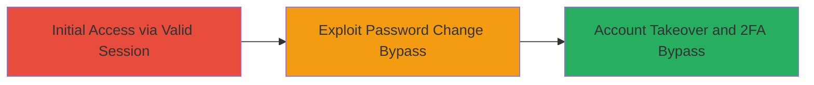

---
tags:
  - 2fa-bypass
  - authentication-bypass
  - session-hijacking
  - web-vuln
type: attack_chain
tools: []
tactics:
  - '[[Initial Access]]'
commands: []
platforms:
  - Web
complexity: low
procedures:
  - '[[procedures/Exploit-Session-Verification-Bypass-in-Password-Change]]'
step_count: 1
techniques:
  - '[[Valid Accounts]]'
description: >-
  A vulnerability in VK.com's password change function allows partial bypass of
  session verification, enabling attackers to change passwords without proper
  authentication and circumvent 2FA, leading to unauthorized account access.
skill_level: intermediate
impact_level: high
id: 2556c5c9-ee93-48dc-b992-62db9dbe4183
created_at: '2025-12-14T17:24:47.629Z'
updated_at: '2025-12-14T17:24:47.629Z'
verified: false
validated: true
submitted: true
mitre_tactics:
  - '[[Initial Access]]'
mitre_techniques:
  - '[[Valid Accounts]]'
---
# VK.com 2FA Bypass via Session Verification Flaw in Password Change

Multi-stage attack chain demonstrating a complete attack workflow.

## Chain Metrics Dashboard

| Metric | Value |
|--------|-------|
| Chain Status | Unverified |
| Total Steps | 1 |
| Execution Time | ~5 minutes |
| Skill Level | Intermediate |
| Complexity | Low |
| Impact Level | High |

## Attack Flow Visualization

## Prerequisites & Requirements

### Required Tools

- Browser developer tools for session manipulation
- Proxy tool like Burp Suite for request interception (optional but recommended)

### Target Environment

- Web platform (VK.com)
- Active user session (e.g., via phishing or stolen cookies)
- No specific ports or services beyond standard HTTPS (443)

### Initial Access Requirements

- Valid session cookie from a logged-in user
- Network access to VK.com
- Basic understanding of HTTP requests and session handling

## Detailed Attack Procedures

### Step 1: Exploit Session Verification Bypass
procedure: [[procedures/Exploit-Session-Verification-Bypass-in-Password-Change]]

**Objective**: Leverage the partial session verification flaw in the password change endpoint to update the account password without full authentication, bypassing 2FA.

**Instructions**: Obtain a valid session cookie (e.g., via prior access or interception). Initiate a password change request to the vulnerable endpoint. Modify or replay the request to skip the full session check, allowing the password update to proceed without 2FA verification. Use browser tools or a proxy to inspect and alter the session headers as needed.

**Expected Output**: Successful password change confirmation from VK.com, granting control over the account without 2FA prompts.

**Success Indicators**:
- Password updated without 2FA challenge
- Ability to log in with new credentials
- No authentication errors during the process

## Attack Chain Summary

### Key Achievements

1. Bypassed 2FA during password change
2. Achieved unauthorized account access
3. Demonstrated session manipulation weakness

## Technique & Tactic Coverage

### MITRE ATT&CK Techniques

- [[Valid Accounts]]

### MITRE ATT&CK Tactics

- [[Initial Access]]

---
*Last updated: 2023-10-01*
