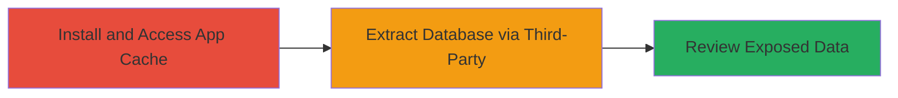

# VK.com Android App Database Cache Exposure via Third-Party Access

Multi-stage attack chain demonstrating a complete attack workflow for exposing cached database information in the VK.com Android application.

## Chain Metrics Dashboard

| Metric | Value |
|--------|-------|
| Chain Status | Unverified |
| Total Steps | 1 |
| Execution Time | ~5 minutes |
| Skill Level | Beginner |
| Complexity | Low |
| Impact Level | Low |

## Attack Flow Visualization



## Prerequisites & Requirements

### Required Tools

- Android device with developer options enabled
- Third-party file manager app (e.g., ES File Explorer)

### Target Environment

- Android OS (tested on versions supporting VK.com app)
- VK.com Android application installed
- No specific services/ports required; local device access

### Initial Access Requirements

- Physical or emulated access to the Android device
- No network credentials needed; local file system access
- App must be installed and have generated cache data

## Detailed Attack Procedures

### Step 1: Access and Extract App Cache
procedure: [[procedures/Access-VK-Android-App-DB-Cache]]

**Objective**: Gain access to the VK.com app's database cache files, which contain debug information and potentially sensitive cached data, by leveraging third-party applications to bypass standard file protections.

**Instructions**: Enable developer options on the Android device to allow USB debugging if using ADB for verification. Install the VK.com app from the Google Play Store and interact with it to generate cache data (e.g., log in or browse). Then, use a third-party file manager to navigate to the app's data directory and extract the database files. For example, locate the cache at `/data/data/com.vkontakte.android/databases/` and copy the SQLite DB files.

If using ADB for scripted access (optional for validation):

```bash
adb shell
run-as com.vkontakte.android
cp databases/vk.db /sdcard/
exit
adb pull /sdcard/vk.db .
```

**Expected Output**: SQLite database file (e.g., vk.db) containing cached user data, debug logs, or session information.

**Success Indicators**:
- Database file successfully extracted and readable
- Presence of debug entries or cached sensitive data in the DB
- No app crashes or permission denials during access

## Attack Chain Summary

### Key Achievements

1. Successful access to protected app cache without root privileges
2. Extraction of database containing potentially sensitive cached information
3. Identification of debug information exposure for further analysis

## Technique & Tactic Coverage

### MITRE ATT&CK Techniques

- [[Data from Local System]]

### MITRE ATT&CK Tactics

- [[Collection]]

---
*Last updated: 2023-10-01T00:00:00Z*
