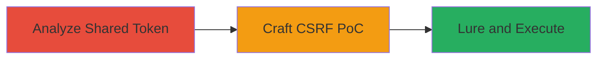

# VK.com Group IM CSRF Impersonation via Shared Token

Multi-stage attack chain demonstrating exploitation of a shared CSRF token in VK.com's Group IM to impersonate other users and perform actions like sending messages or deleting dialogs.

## Chain Metrics Dashboard

| Metric | Value |
|--------|-------|
| Chain Status | Unverified |
| Total Steps | 3 |
| Execution Time | ~15 minutes |
| Skill Level | Intermediate |
| Complexity | Medium |
| Impact Level | High |

## Attack Flow Visualization

## Prerequisites & Requirements

### Required Tools

- Web browser with developer tools
- Text editor for crafting HTML/JS

### Target Environment

- VK.com platform
- Access to a group with IM feature (/al_im.php?gid=XXX)
- PHP-based web application

### Initial Access Requirements

- Valid VK.com account with access to the target group
- Knowledge of group_id (gid)
- No special privileges needed beyond group access

## Detailed Attack Procedures

### Step 1: Analyze Group IM Functionality
procedure: [[procedures/Identify-Shared-CSRF-Token-in-Group-IM]]

**Objective**: Identify the shared CSRF token mechanism in the Group IM to confirm it's not user-specific.

**Instructions**: Log in to VK.com, navigate to the group's IM interface at /al_im.php?gid=XXX, and use browser developer tools to inspect network requests for actions like sending messages or deleting dialogs. Observe the 'hash' parameter in requests, noting it's tied only to group_id and identical across users.

**Expected Output**: Confirmation that the hash is shared and valid for approximately 7 hours (timehash) or static for persistent use.

**Success Indicators**:
- Hash parameter observed in multiple user sessions and found identical
- Token validity period confirmed via repeated testing

### Step 2: Craft CSRF Proof-of-Concept
procedure: [[procedures/Craft-Malicious-CSRF-Page-for-Group-IM-Actions]]

**Objective**: Create a malicious webpage that exploits the shared hash to perform unauthorized actions when visited by a victim.

**Instructions**: Using a text editor, build an HTML page with a form or JavaScript that submits a POST request to /al_im.php?gid=XXX, including the shared hash and desired action (e.g., sending a message to a specific peer_id). Host the page on a controllable server or use data URI for testing. Test locally by visiting the page while logged in to ensure it triggers the action.

**Expected Output**: Malicious page that, when loaded in a victim's browser, sends a message or performs another action from their account.

**Success Indicators**:
- Local test confirms action execution without direct interaction
- Request includes correct shared hash and group_id

### Step 3: Lure Target User
procedure: [[procedures/Execute-CSRF-by-Luring-Victim-to-Malicious-Page]]

**Objective**: Trick an authorized group user into visiting the malicious page to execute the CSRF attack under their session.

**Instructions**: Share the malicious page URL with the target (e.g., via email, chat, or social engineering as a fellow editor). Monitor for execution by checking if the action (e.g., sent message) appears in the group IM from the victim's account. For persistent attacks, use the static hash variant if discovered.

**Expected Output**: Unauthorized action performed from the victim's account, such as a framed message sent to a peer_id.

**Success Indicators**:
- Action logged in group IM under victim's identity
- No alerts or blocks during execution

## Attack Chain Summary

### Key Achievements

1. Identified shared CSRF token vulnerability in Group IM
2. Crafted exploitable PoC for impersonation
3. Enabled revenge or framing scenarios post-access loss

## Technique & Tactic Coverage

### MITRE ATT&CK Techniques

- [[Exploit Public-Facing Application]] Exploit Public-Facing Application
- [[Drive-by Compromise]] Drive-by Compromise

### MITRE ATT&CK Tactics

- [[Initial Access]] Initial Access

---
*Last updated: 2023-10-01T00:00:00Z*
