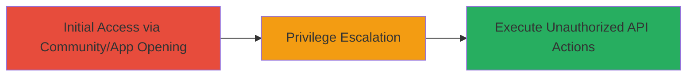

# VK.com Privilege Escalation via Unauthorized API Method Execution

Multi-stage attack chain demonstrating a complete attack workflow exploiting insufficient validation in VK.com's API handling during community or application opening, leading to high-severity privilege escalation.

## Chain Metrics Dashboard

| Metric | Value |
|--------|-------|
| Chain Status | Unverified |
| Total Steps | 1 |
| Execution Time | ~5 minutes |
| Skill Level | Intermediate |
| Complexity | Medium |
| Impact Level | High |

## Attack Flow Visualization



## Prerequisites & Requirements

### Required Tools

- Browser Developer Tools
- [[curl]]

### Target Environment

- Target Platform: Web (VK.com)
- Required Services/Ports: HTTPS (443)
- Network Access Requirements: Internet access to VK.com

### Initial Access Requirements

- Credential Requirements: Valid VK.com user account (low-privilege)
- Network Position: External
- Prior Access Needed: Ability to open communities or applications on VK.com

## Detailed Attack Procedures

### Step 1: Exploit API Validation Bypass
procedure: [[procedures/Exploit-VK-API-Validation-Bypass]]

**Objective**: Trigger unauthorized execution of sensitive API methods by opening a community or application, bypassing validation checks to escalate privileges and perform restricted actions.

**Instructions**: Log in to VK.com with a low-privilege account. Navigate to a target community or application URL. Use browser developer tools to monitor network requests during the opening process. Identify API calls that execute without proper context validation. Simulate or trigger additional API methods (e.g., via JavaScript console) to escalate privileges, such as accessing admin functions or user data.

For verification, use [[curl]] to replicate API calls:

```bash
curl -X POST 'https://api.vk.com/method/[sensitive.method]' \
  -H 'Authorization: Bearer [access_token]' \
  -d 'params=unauthorized'
```

Replace `[sensitive.method]` with a method like `groups.edit` or similar restricted API, and `[access_token]` with the victim's token obtained during the opening process.

**Expected Output**: Successful API response indicating privilege escalation, such as modified community settings or accessed restricted data.

**Success Indicators**:
- API method executes with elevated permissions
- Unauthorized actions (e.g., group admin changes) succeed
- No validation errors in response

## Attack Chain Summary

### Key Achievements

1. Bypassed API validation during community/application opening
2. Achieved unauthorized execution of sensitive methods
3. Escalated privileges to perform high-impact actions on VK.com

## Technique & Tactic Coverage

### MITRE ATT&CK Techniques

- [[Exploitation for Privilege Escalation]]

### MITRE ATT&CK Tactics

- [[Privilege Escalation]]

---
*Last updated: 2023-10-01T00:00:00Z*
