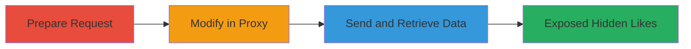

# View Hidden Likes of X Premium Users via GraphQL API Access Control Bypass

Multi-stage attack chain demonstrating exploitation of improper access control in the X (Twitter) GraphQL API, allowing any authenticated user to retrieve hidden likes of X Premium users.

## Chain Metrics Dashboard

| Metric | Value |
|--------|-------|
| Chain Status | Unverified |
| Total Steps | 3 |
| Execution Time | ~2 minutes |
| Skill Level | Intermediate |
| Complexity | Low |
| Impact Level | High |

## Attack Flow Visualization

## Prerequisites & Requirements

### Required Tools

- [[tools/HTTP-Proxy]]

### Target Environment

- Web platform
- X (Twitter) GraphQL API service
- HTTP/2 protocol

### Initial Access Requirements

- Authenticated X account (any user, not necessarily Premium)
- Valid session cookies and CSRF token from X
- Target user's X ID (publicly discoverable via profile)

## Detailed Attack Procedures

### Step 1: Prepare GraphQL Likes Request
procedure: [[procedures/Prepare-GraphQL-Likes-Request]]

**Objective**: Obtain the base HTTP request structure for querying likes via the GraphQL API.

**Instructions**: Copy the raw GET request to the /i/api/graphql/lVf2NuhLoYVrpN4nO7uw0Q/Likes endpoint, including URL-encoded variables with a placeholder userId, features flags, and authentication headers.

**Expected Output**: A raw HTTP request template ready for modification.

**Success Indicators**:
- Request template captured with all required parameters
- Authentication headers (Cookie, Authorization, X-Csrf-Token) validated as active

### Step 2: Modify Request for Target User
procedure: [[procedures/Modify-and-Send-Proxy-Request-for-Hidden-Likes]]

**Objective**: Update the request with the target Premium user's ID to query their hidden likes.

**Instructions**: Load the request into an HTTP proxy tool and replace the userId in the variables parameter (URL-encoded) with the target user's X ID. Ensure features include flags like "hiddenLikesEnabled":true.

**Expected Output**: Modified request with target-specific userId.

**Success Indicators**:
- userId successfully updated in variables (e.g., %22userId%22%3A%22target_id%22)
- No syntax errors in URL encoding

### Step 3: Send Request and Retrieve Data
procedure: [[procedures/Modify-and-Send-Proxy-Request-for-Hidden-Likes]]

**Objective**: Execute the request to bypass UI privacy controls and fetch hidden likes in JSON.

**Instructions**: Send the modified GET request via the proxy. The API will return JSON with tweet data from the target user's hidden likes.

**Expected Output**: JSON response containing an array of liked tweets, including metadata, despite being hidden in the profile UI.

**Success Indicators**:
- HTTP 200 response with likes data
- Confirmation that likes are not visible in the target's profile UI but accessible via API

## Attack Chain Summary

### Key Achievements

1. Bypassed privacy feature for X Premium hidden likes using authenticated API access
2. Retrieved private user activity (likes) in structured JSON format
3. Demonstrated violation of user privacy expectations with minimal effort

## Technique & Tactic Coverage

### MITRE ATT&CK Techniques

- [[Valid Accounts]] Valid Accounts
- [[Account Discovery]] Account Discovery

### MITRE ATT&CK Tactics

- [[Discovery]] Discovery
- [[Collection]] Collection

---

*Last updated: 2024-01-01T00:00:00Z*
